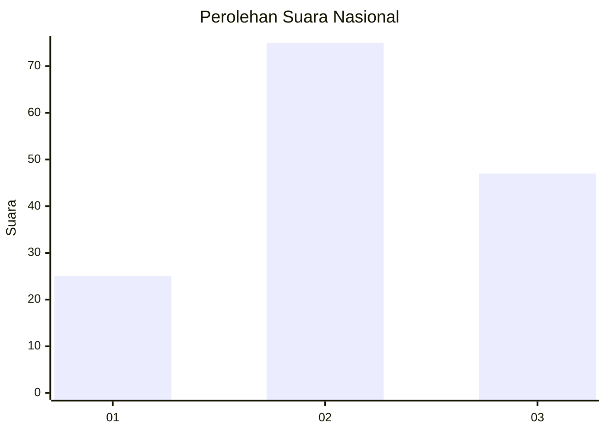
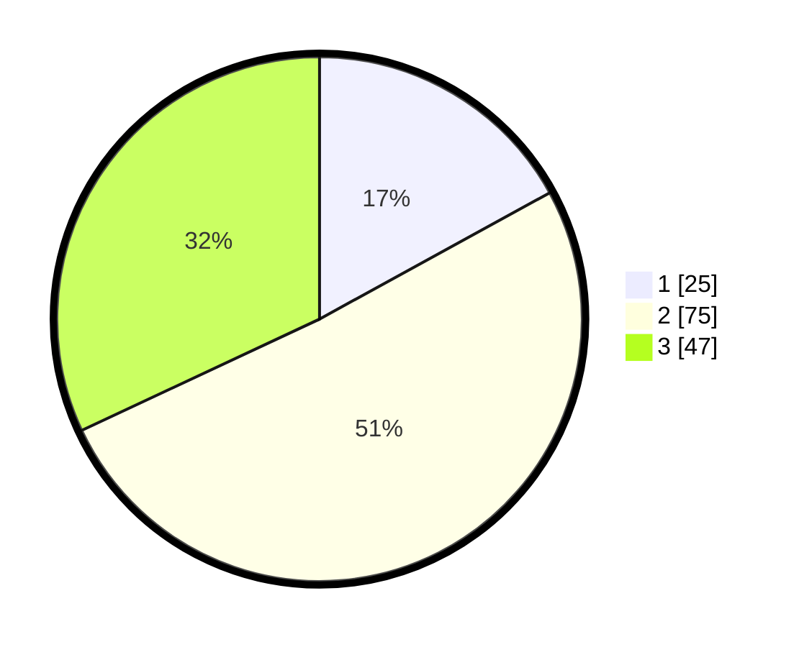

# Hasil

## Grafik

## Tabel

| No. | Nama Paslon    | Suara | Suara (raw) | Persentase |
|:--- |:-------------- | -----:| -----------:| ----------:|
| 1   | ANIES MUHAIMIN | 25    | [25][p-1]   | 17,01      |
| 2   | PRABOWO GIBRAN | 75    | [75][p-2]   | 51,02      |
| 3   | GANJAR MAHFUD  | 47    | [47][p-3]   | 31,97      |

[p-1]: https://github.com/gigit-pemilu/pemilu-2024/blob/main/pilpres/hitung-suara/sub/16-sumatera-selatan/sub/11-empat-lawang/sub/05-lintang-kanan/sub/2012-lesung-batu/sub/003-tps/sub/paslon-1.txt
[p-2]: https://github.com/gigit-pemilu/pemilu-2024/blob/main/pilpres/hitung-suara/sub/16-sumatera-selatan/sub/11-empat-lawang/sub/05-lintang-kanan/sub/2012-lesung-batu/sub/003-tps/sub/paslon-2.txt
[p-3]: https://github.com/gigit-pemilu/pemilu-2024/blob/main/pilpres/hitung-suara/sub/16-sumatera-selatan/sub/11-empat-lawang/sub/05-lintang-kanan/sub/2012-lesung-batu/sub/003-tps/sub/paslon-3.txt

## Foto C Plano

https://sirekap-obj-formc.kpu.go.id/1698/pemilu/ppwp/16/11/05/20/12/1611052012003-20240222-225317--1e4a62c3-1367-4397-85b6-c757e01b97df.jpg

https://sirekap-obj-formc.kpu.go.id/1698/pemilu/ppwp/16/11/05/20/12/1611052012003-20240222-225522--fe3e531d-c5a6-4db0-8f68-2c23019ff419.jpg

https://sirekap-obj-formc.kpu.go.id/1698/pemilu/ppwp/16/11/05/20/12/1611052012003-20240222-225409--7ac2c771-53aa-42f1-beb7-872097ecbee4.jpg

## Metadata

| Key        | Value               |
| ---------- | ------------------- |
| Time Stamp | 2024-02-25 17:00:00 |

