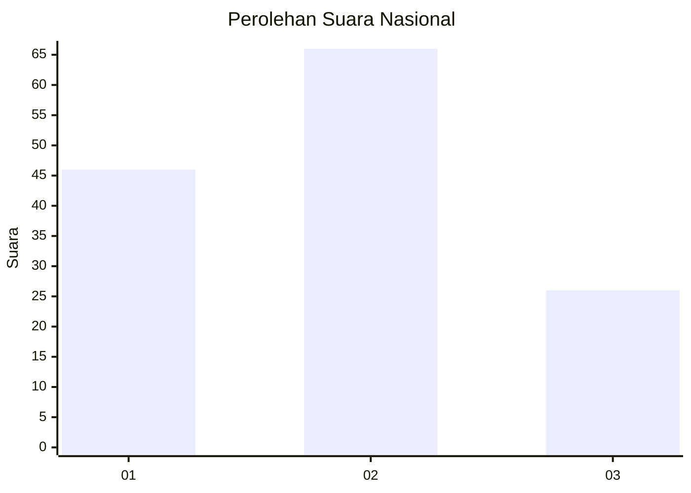
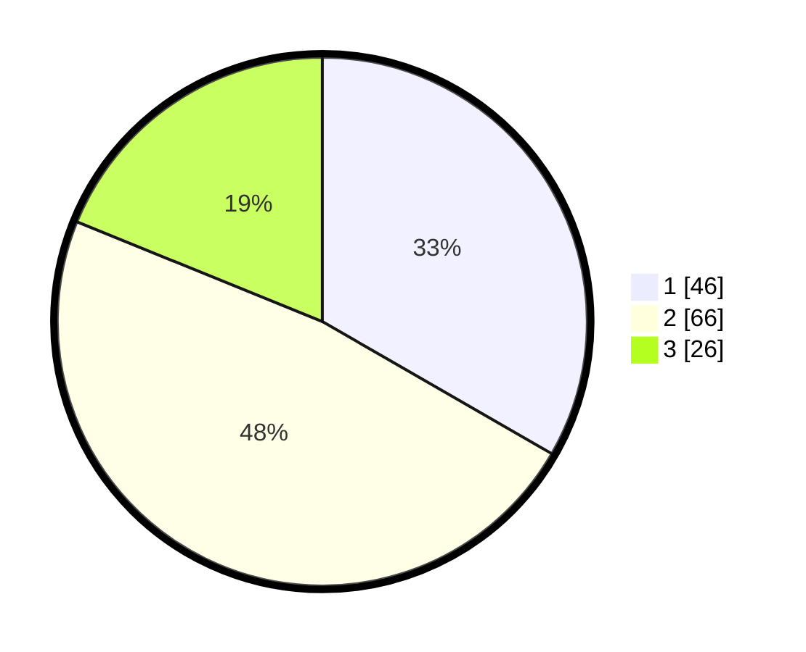

# Hasil

## Grafik

## Tabel

| No. | Nama Paslon    | Suara | Suara (raw) | Persentase |
|:--- |:-------------- | -----:| -----------:| ----------:|
| 1   | ANIES MUHAIMIN | 46    | [46][p-1]   | 33,33      |
| 2   | PRABOWO GIBRAN | 66    | [66][p-2]   | 47,83      |
| 3   | GANJAR MAHFUD  | 26    | [26][p-3]   | 18,84      |

[p-1]: https://github.com/gigit-pemilu/pemilu-2024/blob/main/pilpres/hitung-suara/sub/16-sumatera-selatan/sub/11-empat-lawang/sub/05-lintang-kanan/sub/2012-lesung-batu/sub/004-tps/sub/paslon-1.txt
[p-2]: https://github.com/gigit-pemilu/pemilu-2024/blob/main/pilpres/hitung-suara/sub/16-sumatera-selatan/sub/11-empat-lawang/sub/05-lintang-kanan/sub/2012-lesung-batu/sub/004-tps/sub/paslon-2.txt
[p-3]: https://github.com/gigit-pemilu/pemilu-2024/blob/main/pilpres/hitung-suara/sub/16-sumatera-selatan/sub/11-empat-lawang/sub/05-lintang-kanan/sub/2012-lesung-batu/sub/004-tps/sub/paslon-3.txt

## Foto C Plano

https://sirekap-obj-formc.kpu.go.id/75b3/pemilu/ppwp/16/11/05/20/12/1611052012004-20240222-215214--64cc430a-ed1e-4fde-b81b-0f4e51e8b3ef.jpg

https://sirekap-obj-formc.kpu.go.id/75b3/pemilu/ppwp/16/11/05/20/12/1611052012004-20240222-215331--46e0c7e9-5157-4881-83fc-d5872dde3a6f.jpg

https://sirekap-obj-formc.kpu.go.id/75b3/pemilu/ppwp/16/11/05/20/12/1611052012004-20240222-215559--4ce8e5d9-3485-443d-9729-7f6eb2770f29.jpg

## Metadata

| Key        | Value               |
| ---------- | ------------------- |
| Time Stamp | 2024-02-25 04:00:00 |

