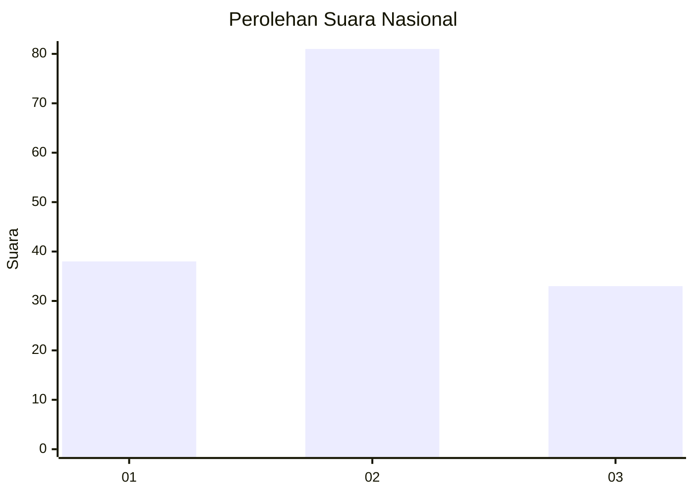
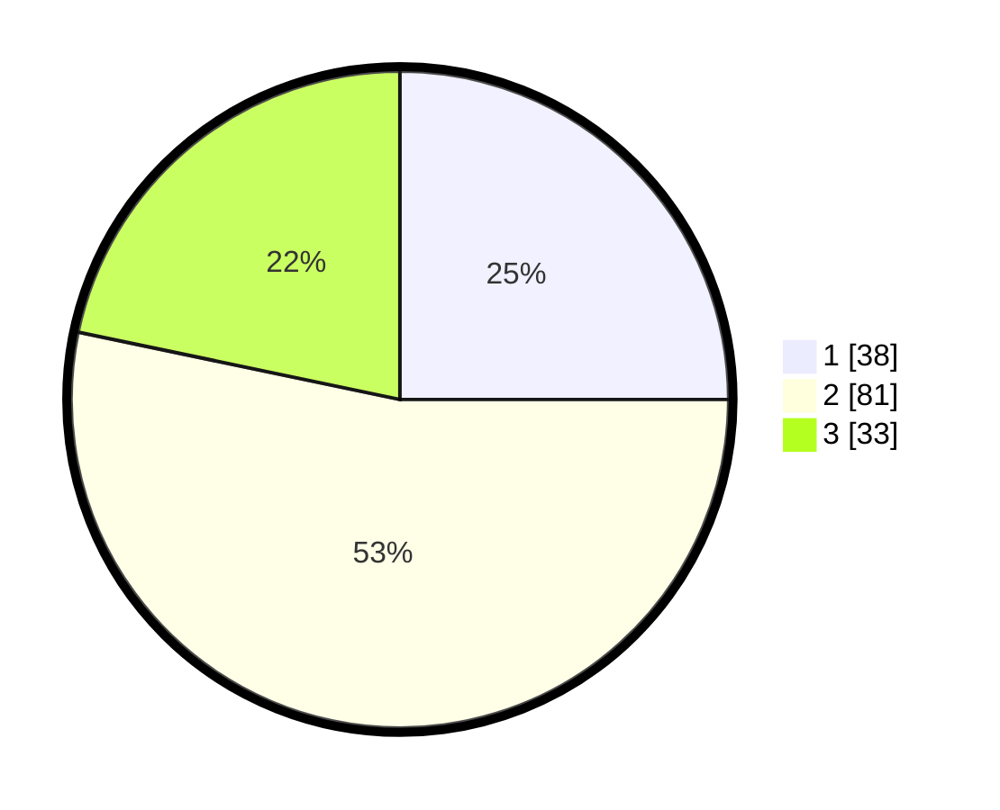

# Hasil

## Grafik

## Tabel

| No. | Nama Paslon    | Suara | Suara (raw) | Persentase |
|:--- |:-------------- | -----:| -----------:| ----------:|
| 1   | ANIES MUHAIMIN | 38    | [38][p-1]   | 25,00      |
| 2   | PRABOWO GIBRAN | 81    | [81][p-2]   | 53,29      |
| 3   | GANJAR MAHFUD  | 33    | [33][p-3]   | 21,71      |

[p-1]: https://github.com/gigit-pemilu/pemilu-2024/blob/main/pilpres/hitung-suara/sub/16-sumatera-selatan/sub/11-empat-lawang/sub/05-lintang-kanan/sub/2012-lesung-batu/sub/005-tps/sub/paslon-1.txt
[p-2]: https://github.com/gigit-pemilu/pemilu-2024/blob/main/pilpres/hitung-suara/sub/16-sumatera-selatan/sub/11-empat-lawang/sub/05-lintang-kanan/sub/2012-lesung-batu/sub/005-tps/sub/paslon-2.txt
[p-3]: https://github.com/gigit-pemilu/pemilu-2024/blob/main/pilpres/hitung-suara/sub/16-sumatera-selatan/sub/11-empat-lawang/sub/05-lintang-kanan/sub/2012-lesung-batu/sub/005-tps/sub/paslon-3.txt

## Foto C Plano

https://sirekap-obj-formc.kpu.go.id/5778/pemilu/ppwp/16/11/05/20/12/1611052012005-20240222-215822--724dee6b-d2ec-4bdf-9b95-f4f54432a50b.jpg

https://sirekap-obj-formc.kpu.go.id/5778/pemilu/ppwp/16/11/05/20/12/1611052012005-20240222-220026--b7076e18-28a6-4673-8b03-fbe494be1552.jpg

https://sirekap-obj-formc.kpu.go.id/5778/pemilu/ppwp/16/11/05/20/12/1611052012005-20240222-220121--4e7d4da5-16a3-4ce5-9861-fdafadb299e7.jpg

## Metadata

| Key        | Value               |
| ---------- | ------------------- |
| Time Stamp | 2024-02-25 01:00:00 |

