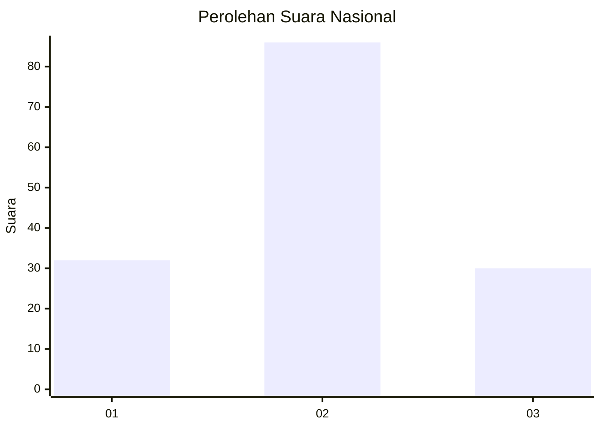
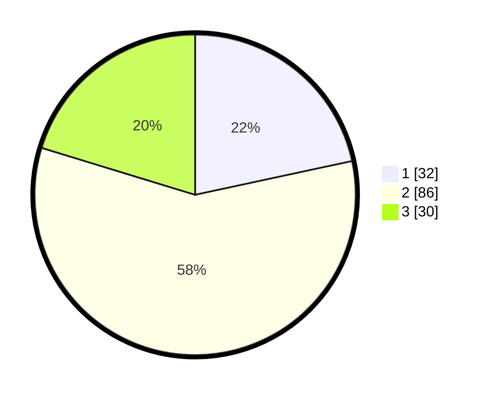

# Hasil

## Grafik

## Tabel

| No. | Nama Paslon    | Suara | Suara (raw) | Persentase |
|:--- |:-------------- | -----:| -----------:| ----------:|
| 1   | ANIES MUHAIMIN | 32    | [32][p-1]   | 21,62      |
| 2   | PRABOWO GIBRAN | 86    | [86][p-2]   | 58,11      |
| 3   | GANJAR MAHFUD  | 30    | [30][p-3]   | 20,27      |

[p-1]: https://github.com/gigit-pemilu/pemilu-2024/blob/main/pilpres/hitung-suara/sub/16-sumatera-selatan/sub/11-empat-lawang/sub/05-lintang-kanan/sub/2012-lesung-batu/sub/006-tps/sub/paslon-1.txt
[p-2]: https://github.com/gigit-pemilu/pemilu-2024/blob/main/pilpres/hitung-suara/sub/16-sumatera-selatan/sub/11-empat-lawang/sub/05-lintang-kanan/sub/2012-lesung-batu/sub/006-tps/sub/paslon-2.txt
[p-3]: https://github.com/gigit-pemilu/pemilu-2024/blob/main/pilpres/hitung-suara/sub/16-sumatera-selatan/sub/11-empat-lawang/sub/05-lintang-kanan/sub/2012-lesung-batu/sub/006-tps/sub/paslon-3.txt

## Foto C Plano

https://sirekap-obj-formc.kpu.go.id/98da/pemilu/ppwp/16/11/05/20/12/1611052012006-20240222-221317--585d55da-e0d8-4bb1-8a3e-619e9d9b4e87.jpg

https://sirekap-obj-formc.kpu.go.id/98da/pemilu/ppwp/16/11/05/20/12/1611052012006-20240222-221544--bab91073-6604-48d5-bd9d-70bc085d58a4.jpg

https://sirekap-obj-formc.kpu.go.id/98da/pemilu/ppwp/16/11/05/20/12/1611052012006-20240222-221703--82cdc48b-6960-4f44-9824-65f8485df54b.jpg

## Metadata

| Key        | Value               |
| ---------- | ------------------- |
| Time Stamp | 2024-02-25 11:00:00 |

