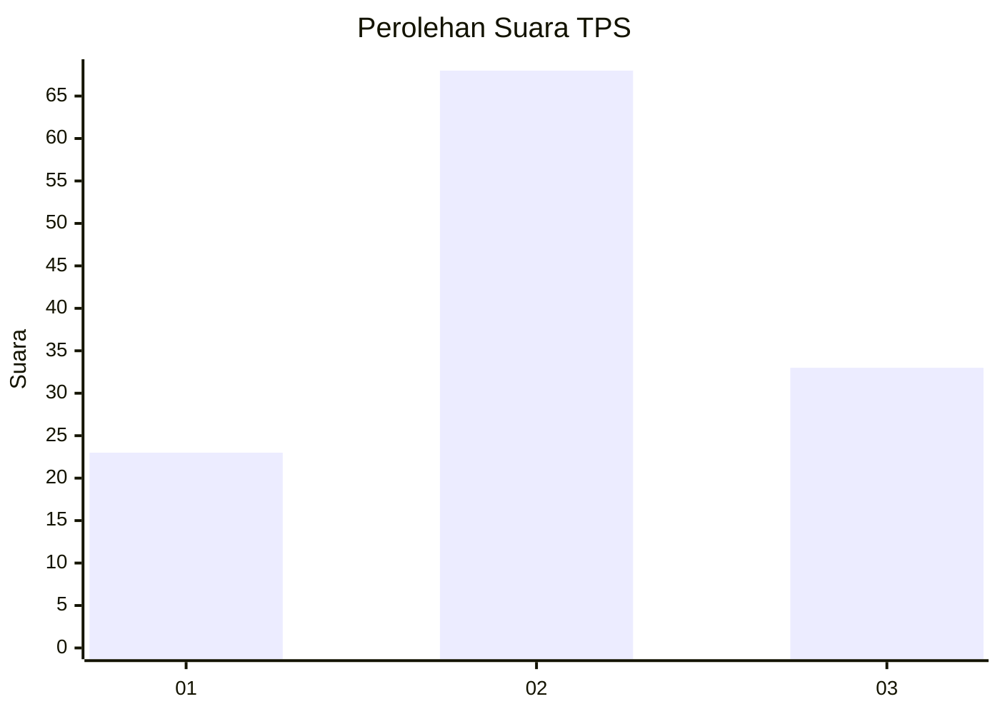
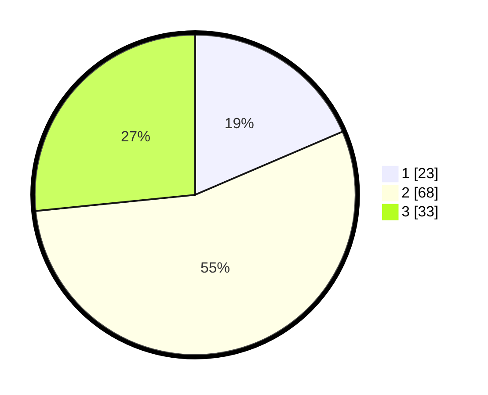

# Hasil

## Grafik

## Tabel

| No. | Nama Paslon    | Suara | Suara (raw) | Persentase |
|:--- |:-------------- | -----:| -----------:| ----------:|
| 1   | ANIES MUHAIMIN | 23    | [23][p-1]   | 18,55      |
| 2   | PRABOWO GIBRAN | 68    | [68][p-2]   | 54,84      |
| 3   | GANJAR MAHFUD  | 33    | [33][p-3]   | 26,61      |

[p-1]: https://github.com/gigit-pemilu/pemilu-2024-16-sumatera-selatan/blob/main/pilpres/hitung-suara/sub/16-sumatera-selatan/sub/11-empat-lawang/sub/05-lintang-kanan/sub/2012-lesung-batu/sub/008-tps/sub/paslon-1.txt
[p-2]: https://github.com/gigit-pemilu/pemilu-2024-16-sumatera-selatan/blob/main/pilpres/hitung-suara/sub/16-sumatera-selatan/sub/11-empat-lawang/sub/05-lintang-kanan/sub/2012-lesung-batu/sub/008-tps/sub/paslon-2.txt
[p-3]: https://github.com/gigit-pemilu/pemilu-2024-16-sumatera-selatan/blob/main/pilpres/hitung-suara/sub/16-sumatera-selatan/sub/11-empat-lawang/sub/05-lintang-kanan/sub/2012-lesung-batu/sub/008-tps/sub/paslon-3.txt

## Foto C Plano

https://sirekap-obj-formc.kpu.go.id/d41f/pemilu/ppwp/16/11/05/20/12/1611052012008-20240222-224412--92c789c3-1555-4c64-bd69-a8693620537a.jpg

https://sirekap-obj-formc.kpu.go.id/d41f/pemilu/ppwp/16/11/05/20/12/1611052012008-20240222-224646--d04b8269-c3d5-4b27-9d42-89df11d205f2.jpg

https://sirekap-obj-formc.kpu.go.id/d41f/pemilu/ppwp/16/11/05/20/12/1611052012008-20240222-225149--1e7b8b85-f045-4348-af41-da1a3218ac2a.jpg

## Metadata

| Key        | Value               |
| ---------- | ------------------- |
| Time Stamp | 2024-02-25 15:00:00 |

