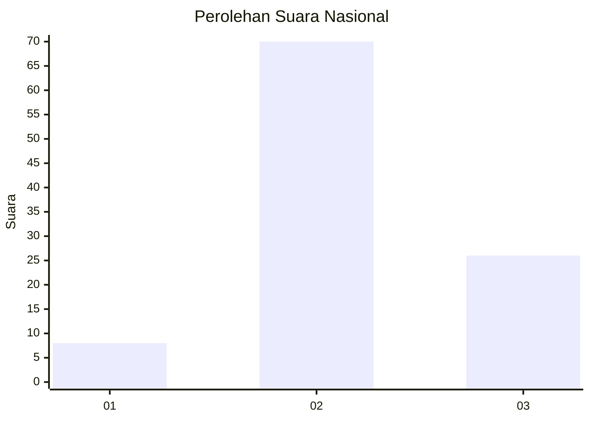
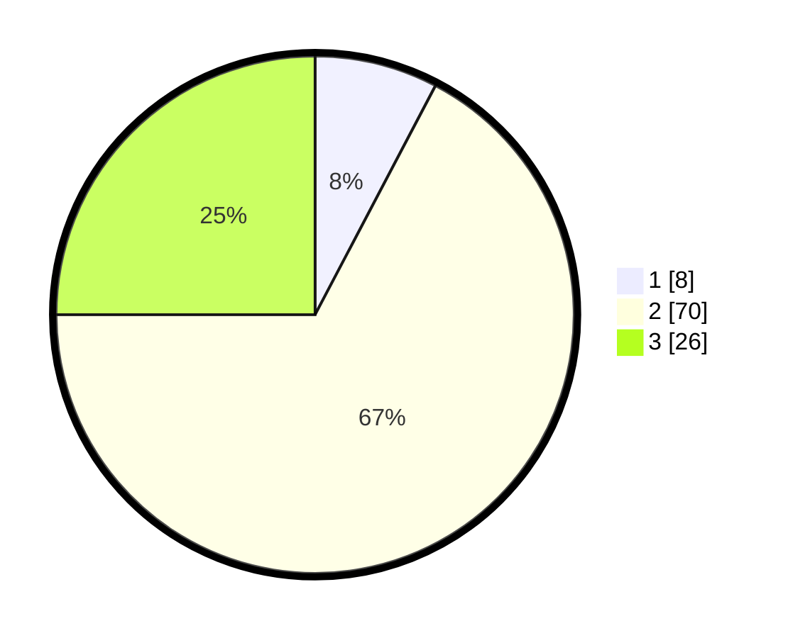

# Hasil

## Grafik

## Tabel

| No. | Nama Paslon    | Suara | Suara (raw) | Persentase |
|:--- |:-------------- | -----:| -----------:| ----------:|
| 1   | ANIES MUHAIMIN | 8     | [8][p-1]    | 7,69       |
| 2   | PRABOWO GIBRAN | 70    | [70][p-2]   | 67,31      |
| 3   | GANJAR MAHFUD  | 26    | [26][p-3]   | 25,00      |

[p-1]: https://github.com/gigit-pemilu/pemilu-2024/blob/main/pilpres/hitung-suara/sub/16-sumatera-selatan/sub/11-empat-lawang/sub/05-lintang-kanan/sub/2012-lesung-batu/sub/009-tps/sub/paslon-1.txt
[p-2]: https://github.com/gigit-pemilu/pemilu-2024/blob/main/pilpres/hitung-suara/sub/16-sumatera-selatan/sub/11-empat-lawang/sub/05-lintang-kanan/sub/2012-lesung-batu/sub/009-tps/sub/paslon-2.txt
[p-3]: https://github.com/gigit-pemilu/pemilu-2024/blob/main/pilpres/hitung-suara/sub/16-sumatera-selatan/sub/11-empat-lawang/sub/05-lintang-kanan/sub/2012-lesung-batu/sub/009-tps/sub/paslon-3.txt

## Foto C Plano

https://sirekap-obj-formc.kpu.go.id/4455/pemilu/ppwp/16/11/05/20/12/1611052012009-20240222-214511--cd6dda32-5b65-4062-8f55-620c5aab8f4d.jpg

https://sirekap-obj-formc.kpu.go.id/4455/pemilu/ppwp/16/11/05/20/12/1611052012009-20240222-214557--b0239e91-79fe-4795-94ee-1f24d5429e53.jpg

https://sirekap-obj-formc.kpu.go.id/4455/pemilu/ppwp/16/11/05/20/12/1611052012009-20240222-214705--45a15afa-bec0-4693-800d-28f1356172cf.jpg

## Metadata

| Key        | Value               |
| ---------- | ------------------- |
| Time Stamp | 2024-02-25 22:00:00 |

