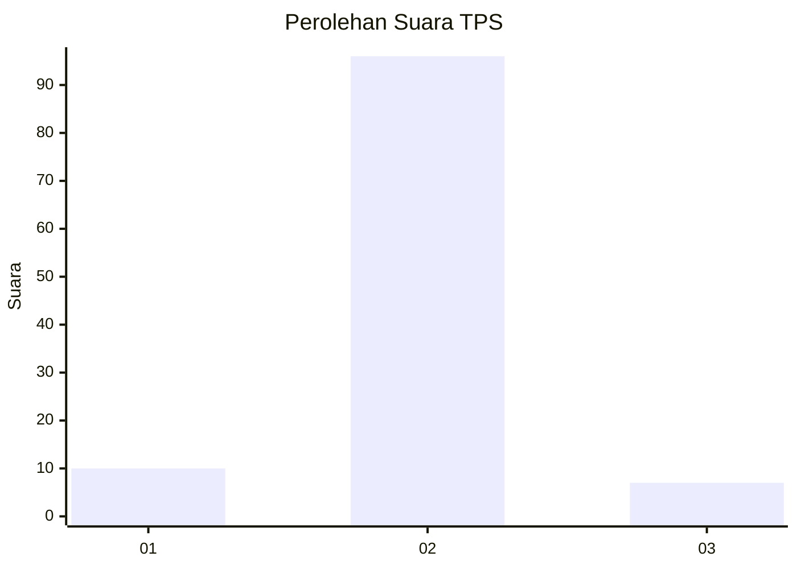
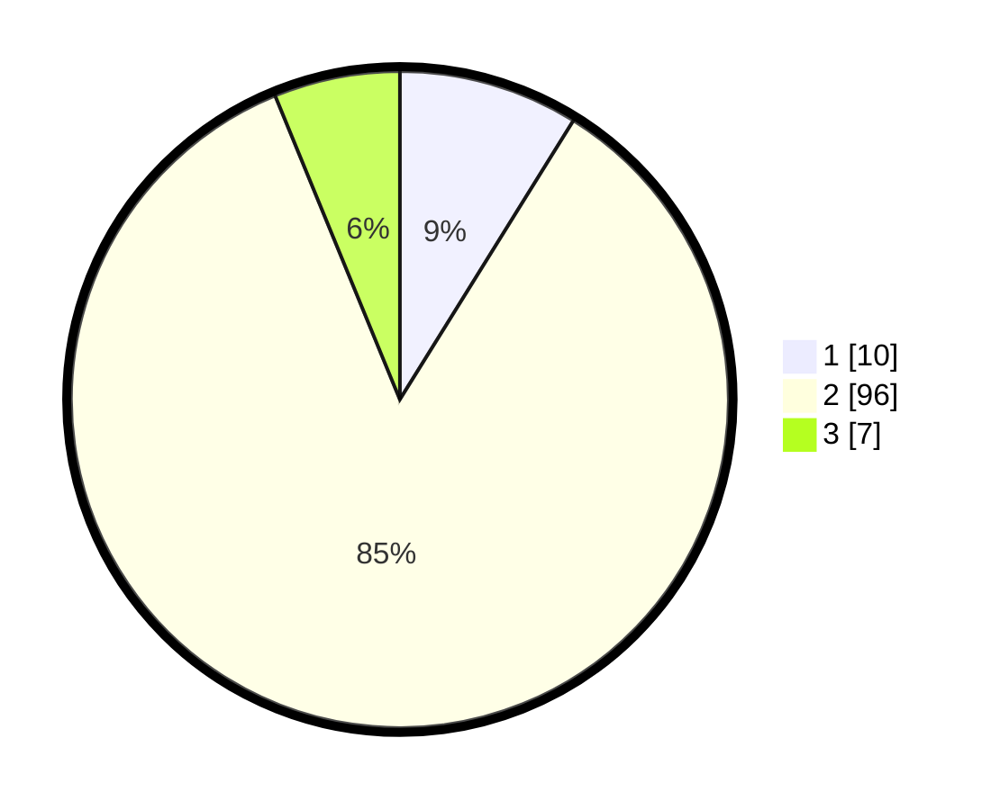

# Hasil

## Grafik

## Tabel

| No. | Nama Paslon    | Suara | Suara (raw) | Persentase |
|:--- |:-------------- | -----:| -----------:| ----------:|
| 1   | ANIES MUHAIMIN | 10    | [10][p-1]   | 8,85       |
| 2   | PRABOWO GIBRAN | 96    | [96][p-2]   | 84,96      |
| 3   | GANJAR MAHFUD  | 7     | [7][p-3]    | 6,19       |

[p-1]: https://github.com/gigit-pemilu/pemilu-2024-16-sumatera-selatan/blob/main/pilpres/hitung-suara/sub/16-sumatera-selatan/sub/11-empat-lawang/sub/05-lintang-kanan/sub/2012-lesung-batu/sub/011-tps/sub/paslon-1.txt
[p-2]: https://github.com/gigit-pemilu/pemilu-2024-16-sumatera-selatan/blob/main/pilpres/hitung-suara/sub/16-sumatera-selatan/sub/11-empat-lawang/sub/05-lintang-kanan/sub/2012-lesung-batu/sub/011-tps/sub/paslon-2.txt
[p-3]: https://github.com/gigit-pemilu/pemilu-2024-16-sumatera-selatan/blob/main/pilpres/hitung-suara/sub/16-sumatera-selatan/sub/11-empat-lawang/sub/05-lintang-kanan/sub/2012-lesung-batu/sub/011-tps/sub/paslon-3.txt

## Foto C Plano

https://sirekap-obj-formc.kpu.go.id/3836/pemilu/ppwp/16/11/05/20/12/1611052012011-20240222-222918--d001cb2b-0416-478b-b89d-a2a09b2f56a4.jpg

https://sirekap-obj-formc.kpu.go.id/3836/pemilu/ppwp/16/11/05/20/12/1611052012011-20240222-223208--a3b24d60-2999-48e7-b6d4-15cb25607b38.jpg

https://sirekap-obj-formc.kpu.go.id/3836/pemilu/ppwp/16/11/05/20/12/1611052012011-20240222-223429--d1d3f320-bf93-46ed-9ab3-fada3d32a9a1.jpg

## Metadata

| Key        | Value               |
| ---------- | ------------------- |
| Time Stamp | 2024-02-25 00:00:00 |

