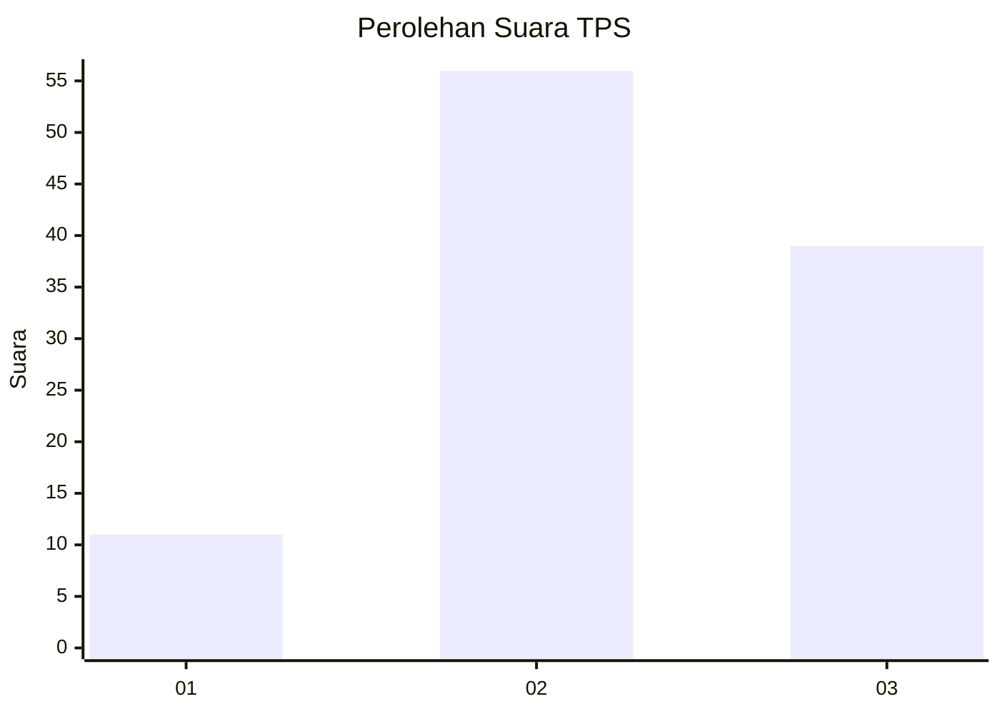
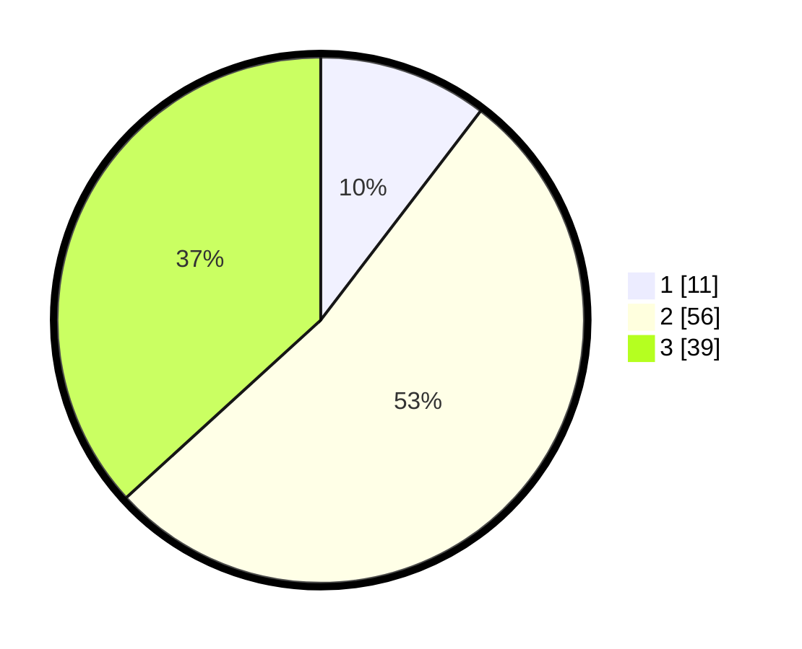

# Hasil

## Grafik

## Tabel

| No. | Nama Paslon    | Suara | Suara (raw) | Persentase |
|:--- |:-------------- | -----:| -----------:| ----------:|
| 1   | ANIES MUHAIMIN | 11    | [11][p-1]   | 10,38      |
| 2   | PRABOWO GIBRAN | 56    | [56][p-2]   | 52,83      |
| 3   | GANJAR MAHFUD  | 39    | [39][p-3]   | 36,79      |

[p-1]: https://github.com/gigit-pemilu/pemilu-2024-16-sumatera-selatan/blob/main/pilpres/hitung-suara/sub/16-sumatera-selatan/sub/11-empat-lawang/sub/05-lintang-kanan/sub/2013-babatan/sub/001-tps/sub/paslon-1.txt
[p-2]: https://github.com/gigit-pemilu/pemilu-2024-16-sumatera-selatan/blob/main/pilpres/hitung-suara/sub/16-sumatera-selatan/sub/11-empat-lawang/sub/05-lintang-kanan/sub/2013-babatan/sub/001-tps/sub/paslon-2.txt
[p-3]: https://github.com/gigit-pemilu/pemilu-2024-16-sumatera-selatan/blob/main/pilpres/hitung-suara/sub/16-sumatera-selatan/sub/11-empat-lawang/sub/05-lintang-kanan/sub/2013-babatan/sub/001-tps/sub/paslon-3.txt

## Foto C Plano

https://sirekap-obj-formc.kpu.go.id/12f3/pemilu/ppwp/16/11/05/20/13/1611052013001-20240223-015720--0175dc3e-ccb0-4cdd-8d27-4873d87186eb.jpg

https://sirekap-obj-formc.kpu.go.id/12f3/pemilu/ppwp/16/11/05/20/13/1611052013001-20240223-020449--beeff2e9-7726-4a25-b1bf-08f3b46a07c9.jpg

https://sirekap-obj-formc.kpu.go.id/12f3/pemilu/ppwp/16/11/05/20/13/1611052013001-20240223-021219--f789344d-b944-4d0c-984b-85187d3f0a2b.jpg

## Metadata

| Key        | Value               |
| ---------- | ------------------- |
| Time Stamp | 2024-02-25 12:00:00 |

