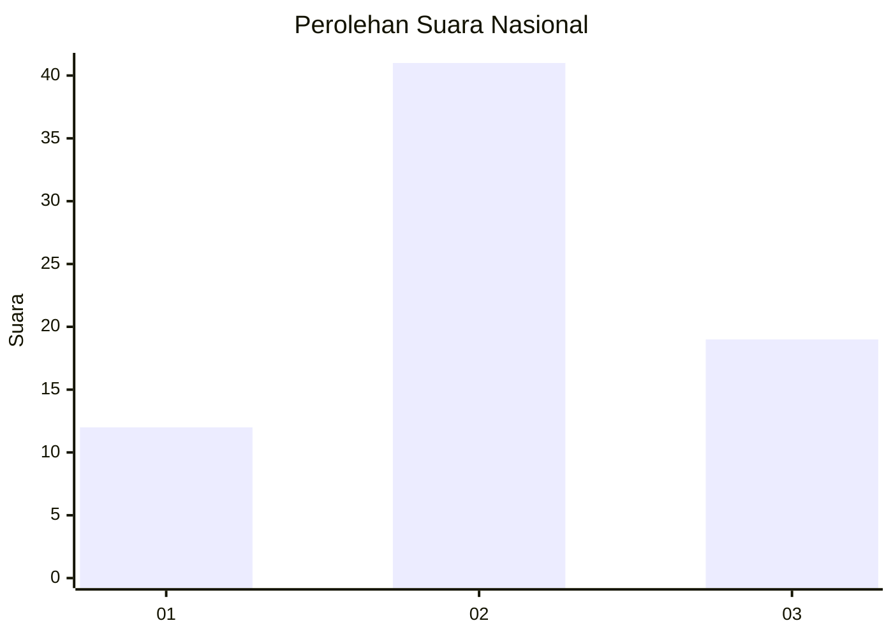
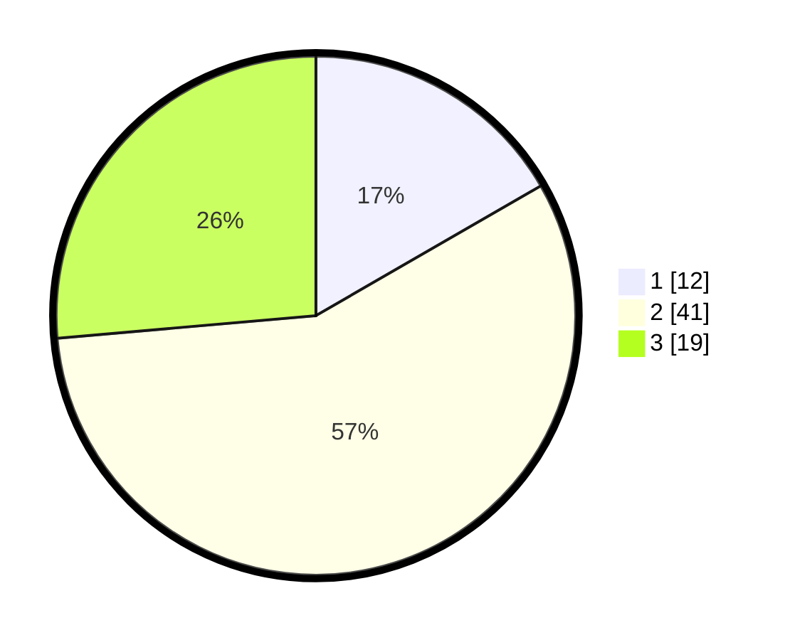

# Hasil

## Grafik

## Tabel

| No. | Nama Paslon    | Suara | Suara (raw) | Persentase |
|:--- |:-------------- | -----:| -----------:| ----------:|
| 1   | ANIES MUHAIMIN | 12    | [12][p-1]   | 16,67      |
| 2   | PRABOWO GIBRAN | 41    | [41][p-2]   | 56,94      |
| 3   | GANJAR MAHFUD  | 19    | [19][p-3]   | 26,39      |

[p-1]: https://github.com/gigit-pemilu/pemilu-2024/blob/main/pilpres/hitung-suara/sub/16-sumatera-selatan/sub/11-empat-lawang/sub/05-lintang-kanan/sub/2013-babatan/sub/003-tps/sub/paslon-1.txt
[p-2]: https://github.com/gigit-pemilu/pemilu-2024/blob/main/pilpres/hitung-suara/sub/16-sumatera-selatan/sub/11-empat-lawang/sub/05-lintang-kanan/sub/2013-babatan/sub/003-tps/sub/paslon-2.txt
[p-3]: https://github.com/gigit-pemilu/pemilu-2024/blob/main/pilpres/hitung-suara/sub/16-sumatera-selatan/sub/11-empat-lawang/sub/05-lintang-kanan/sub/2013-babatan/sub/003-tps/sub/paslon-3.txt

## Foto C Plano

https://sirekap-obj-formc.kpu.go.id/53be/pemilu/ppwp/16/11/05/20/13/1611052013003-20240223-011624--ec3f87c9-424d-40b3-8550-28fea68b1012.jpg

https://sirekap-obj-formc.kpu.go.id/53be/pemilu/ppwp/16/11/05/20/13/1611052013003-20240223-012056--c50f6a9c-ab78-40c2-9537-ff204e036bc6.jpg

https://sirekap-obj-formc.kpu.go.id/53be/pemilu/ppwp/16/11/05/20/13/1611052013003-20240223-013424--bbe4779b-3f6f-48c1-8f77-4eb7ecdeb8dd.jpg

## Metadata

| Key        | Value               |
| ---------- | ------------------- |
| Time Stamp | 2024-02-25 04:00:00 |

