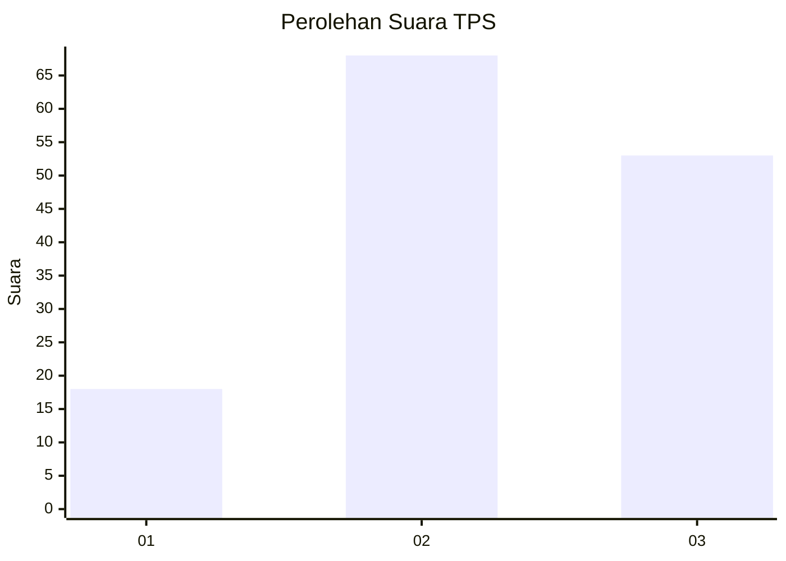
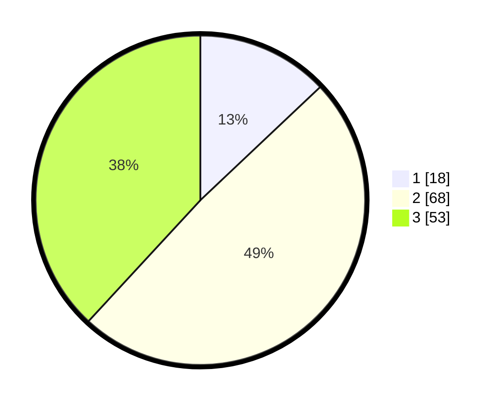

# Hasil

## Grafik

## Tabel

| No. | Nama Paslon    | Suara | Suara (raw) | Persentase |
|:--- |:-------------- | -----:| -----------:| ----------:|
| 1   | ANIES MUHAIMIN | 18    | [18][p-1]   | 12,95      |
| 2   | PRABOWO GIBRAN | 68    | [68][p-2]   | 48,92      |
| 3   | GANJAR MAHFUD  | 53    | [53][p-3]   | 38,13      |

[p-1]: https://github.com/gigit-pemilu/pemilu-2024-16-sumatera-selatan/blob/main/pilpres/hitung-suara/sub/16-sumatera-selatan/sub/11-empat-lawang/sub/05-lintang-kanan/sub/2013-babatan/sub/006-tps/sub/paslon-1.txt
[p-2]: https://github.com/gigit-pemilu/pemilu-2024-16-sumatera-selatan/blob/main/pilpres/hitung-suara/sub/16-sumatera-selatan/sub/11-empat-lawang/sub/05-lintang-kanan/sub/2013-babatan/sub/006-tps/sub/paslon-2.txt
[p-3]: https://github.com/gigit-pemilu/pemilu-2024-16-sumatera-selatan/blob/main/pilpres/hitung-suara/sub/16-sumatera-selatan/sub/11-empat-lawang/sub/05-lintang-kanan/sub/2013-babatan/sub/006-tps/sub/paslon-3.txt

## Foto C Plano

https://sirekap-obj-formc.kpu.go.id/21c4/pemilu/ppwp/16/11/05/20/13/1611052013006-20240223-023505--711d60a3-defd-4c80-8142-c69958bc5f58.jpg

https://sirekap-obj-formc.kpu.go.id/21c4/pemilu/ppwp/16/11/05/20/13/1611052013006-20240223-023603--dc73fa30-2960-4ad8-92a0-2d8f6cc2abf4.jpg

https://sirekap-obj-formc.kpu.go.id/21c4/pemilu/ppwp/16/11/05/20/13/1611052013006-20240223-023800--5b86fbe8-3222-4040-a826-1d86b3a1c559.jpg

## Metadata

| Key        | Value               |
| ---------- | ------------------- |
| Time Stamp | 2024-02-24 22:31:28 |

