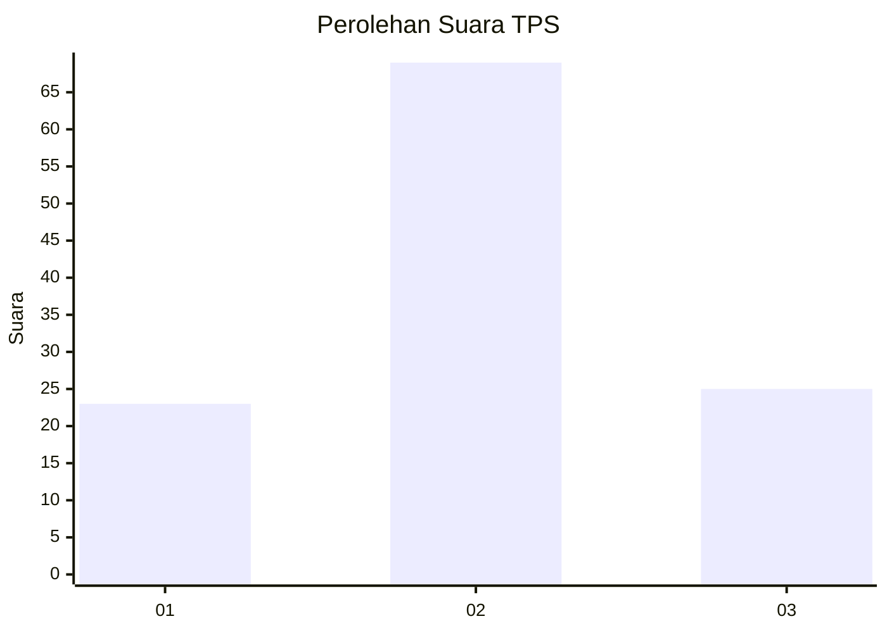
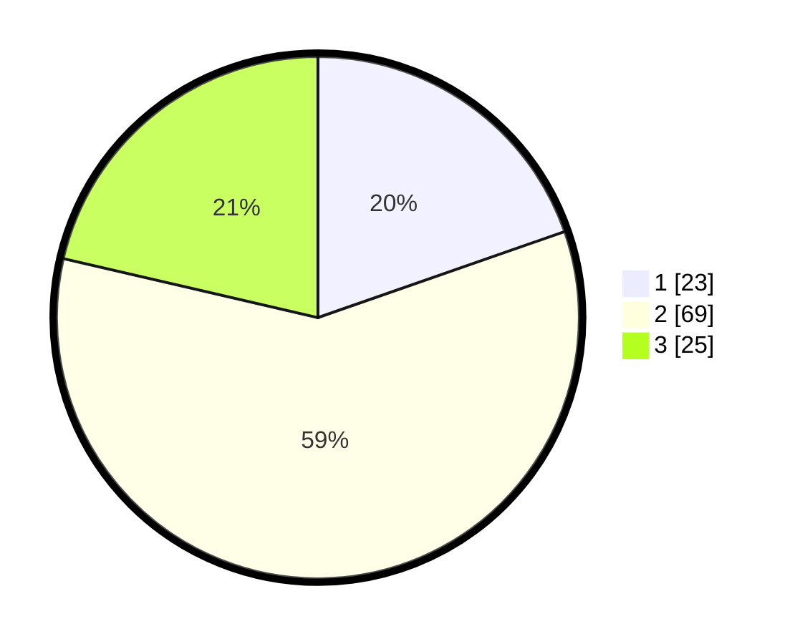

# Hasil

## Grafik

## Tabel

| No. | Nama Paslon    | Suara | Suara (raw) | Persentase |
|:--- |:-------------- | -----:| -----------:| ----------:|
| 1   | ANIES MUHAIMIN | 23    | [23][p-1]   | 19,66      |
| 2   | PRABOWO GIBRAN | 69    | [69][p-2]   | 58,97      |
| 3   | GANJAR MAHFUD  | 25    | [25][p-3]   | 21,37      |

[p-1]: https://github.com/gigit-pemilu/pemilu-2024-16-sumatera-selatan/blob/main/pilpres/hitung-suara/sub/16-sumatera-selatan/sub/11-empat-lawang/sub/05-lintang-kanan/sub/2013-babatan/sub/007-tps/sub/paslon-1.txt
[p-2]: https://github.com/gigit-pemilu/pemilu-2024-16-sumatera-selatan/blob/main/pilpres/hitung-suara/sub/16-sumatera-selatan/sub/11-empat-lawang/sub/05-lintang-kanan/sub/2013-babatan/sub/007-tps/sub/paslon-2.txt
[p-3]: https://github.com/gigit-pemilu/pemilu-2024-16-sumatera-selatan/blob/main/pilpres/hitung-suara/sub/16-sumatera-selatan/sub/11-empat-lawang/sub/05-lintang-kanan/sub/2013-babatan/sub/007-tps/sub/paslon-3.txt

## Foto C Plano

https://sirekap-obj-formc.kpu.go.id/28bb/pemilu/ppwp/16/11/05/20/13/1611052013007-20240223-012956--98593bc1-bf74-4304-aa08-8c945ee690f3.jpg

https://sirekap-obj-formc.kpu.go.id/28bb/pemilu/ppwp/16/11/05/20/13/1611052013007-20240223-013043--c518e8ec-d8b8-451b-be0c-330ea4b242d8.jpg

https://sirekap-obj-formc.kpu.go.id/28bb/pemilu/ppwp/16/11/05/20/13/1611052013007-20240223-013358--3eb74220-14f0-4e4b-a0b4-b2cd68f211af.jpg

## Metadata

| Key        | Value               |
| ---------- | ------------------- |
| Time Stamp | 2024-02-25 21:00:00 |

