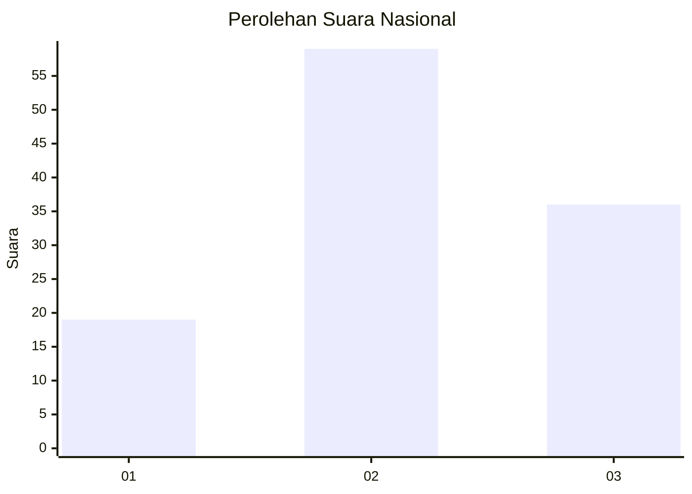
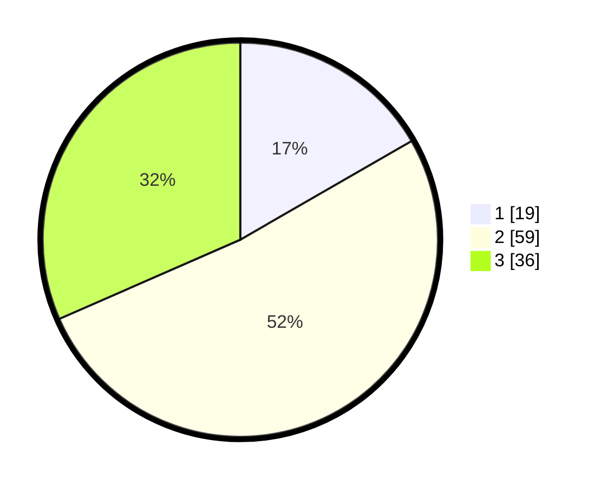

# Hasil

## Grafik

## Tabel

| No. | Nama Paslon    | Suara | Suara (raw) | Persentase |
|:--- |:-------------- | -----:| -----------:| ----------:|
| 1   | ANIES MUHAIMIN | 19    | [19][p-1]   | 16,67      |
| 2   | PRABOWO GIBRAN | 59    | [59][p-2]   | 51,75      |
| 3   | GANJAR MAHFUD  | 36    | [36][p-3]   | 31,58      |

[p-1]: https://github.com/gigit-pemilu/pemilu-2024/blob/main/pilpres/hitung-suara/sub/16-sumatera-selatan/sub/11-empat-lawang/sub/05-lintang-kanan/sub/2013-babatan/sub/012-tps/sub/paslon-1.txt
[p-2]: https://github.com/gigit-pemilu/pemilu-2024/blob/main/pilpres/hitung-suara/sub/16-sumatera-selatan/sub/11-empat-lawang/sub/05-lintang-kanan/sub/2013-babatan/sub/012-tps/sub/paslon-2.txt
[p-3]: https://github.com/gigit-pemilu/pemilu-2024/blob/main/pilpres/hitung-suara/sub/16-sumatera-selatan/sub/11-empat-lawang/sub/05-lintang-kanan/sub/2013-babatan/sub/012-tps/sub/paslon-3.txt

## Foto C Plano

https://sirekap-obj-formc.kpu.go.id/601b/pemilu/ppwp/16/11/05/20/13/1611052013012-20240223-015620--14bfb68b-5cf7-4553-8343-99e7b0931a2b.jpg

https://sirekap-obj-formc.kpu.go.id/601b/pemilu/ppwp/16/11/05/20/13/1611052013012-20240223-014757--ed7b681b-f57a-4508-a0f2-b49885092810.jpg

https://sirekap-obj-formc.kpu.go.id/601b/pemilu/ppwp/16/11/05/20/13/1611052013012-20240223-014852--cfc5cc59-bf24-40e5-86d1-bd89e7561e22.jpg

## Metadata

| Key        | Value               |
| ---------- | ------------------- |
| Time Stamp | 2024-02-25 16:00:00 |

