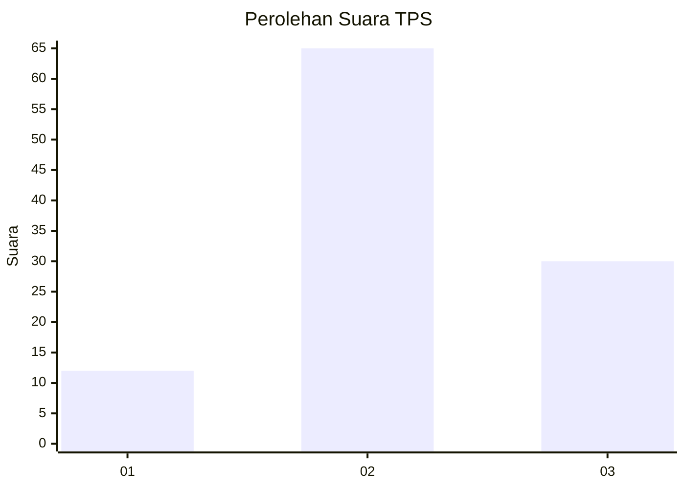
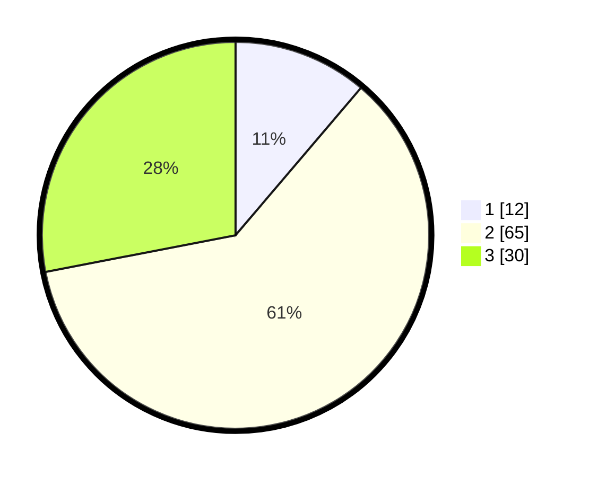

# Hasil

## Grafik

## Tabel

| No. | Nama Paslon    | Suara | Suara (raw) | Persentase |
|:--- |:-------------- | -----:| -----------:| ----------:|
| 1   | ANIES MUHAIMIN | 12    | [12][p-1]   | 11,21      |
| 2   | PRABOWO GIBRAN | 65    | [65][p-2]   | 60,75      |
| 3   | GANJAR MAHFUD  | 30    | [30][p-3]   | 28,04      |

[p-1]: https://github.com/gigit-pemilu/pemilu-2024-16-sumatera-selatan/blob/main/pilpres/hitung-suara/sub/16-sumatera-selatan/sub/11-empat-lawang/sub/05-lintang-kanan/sub/2013-babatan/sub/013-tps/sub/paslon-1.txt
[p-2]: https://github.com/gigit-pemilu/pemilu-2024-16-sumatera-selatan/blob/main/pilpres/hitung-suara/sub/16-sumatera-selatan/sub/11-empat-lawang/sub/05-lintang-kanan/sub/2013-babatan/sub/013-tps/sub/paslon-2.txt
[p-3]: https://github.com/gigit-pemilu/pemilu-2024-16-sumatera-selatan/blob/main/pilpres/hitung-suara/sub/16-sumatera-selatan/sub/11-empat-lawang/sub/05-lintang-kanan/sub/2013-babatan/sub/013-tps/sub/paslon-3.txt

## Foto C Plano

https://sirekap-obj-formc.kpu.go.id/e797/pemilu/ppwp/16/11/05/20/13/1611052013013-20240223-020724--14274e06-8e50-4d77-a7f3-94c08a735de8.jpg

https://sirekap-obj-formc.kpu.go.id/e797/pemilu/ppwp/16/11/05/20/13/1611052013013-20240223-020816--ba856405-d669-4a3e-a15b-fc1984b754fd.jpg

https://sirekap-obj-formc.kpu.go.id/e797/pemilu/ppwp/16/11/05/20/13/1611052013013-20240223-021746--189b8b5d-51d5-43de-9c21-dc0d739b0369.jpg

## Metadata

| Key        | Value               |
| ---------- | ------------------- |
| Time Stamp | 2024-02-25 15:00:00 |

