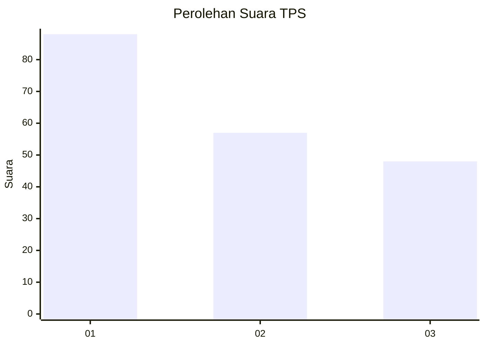
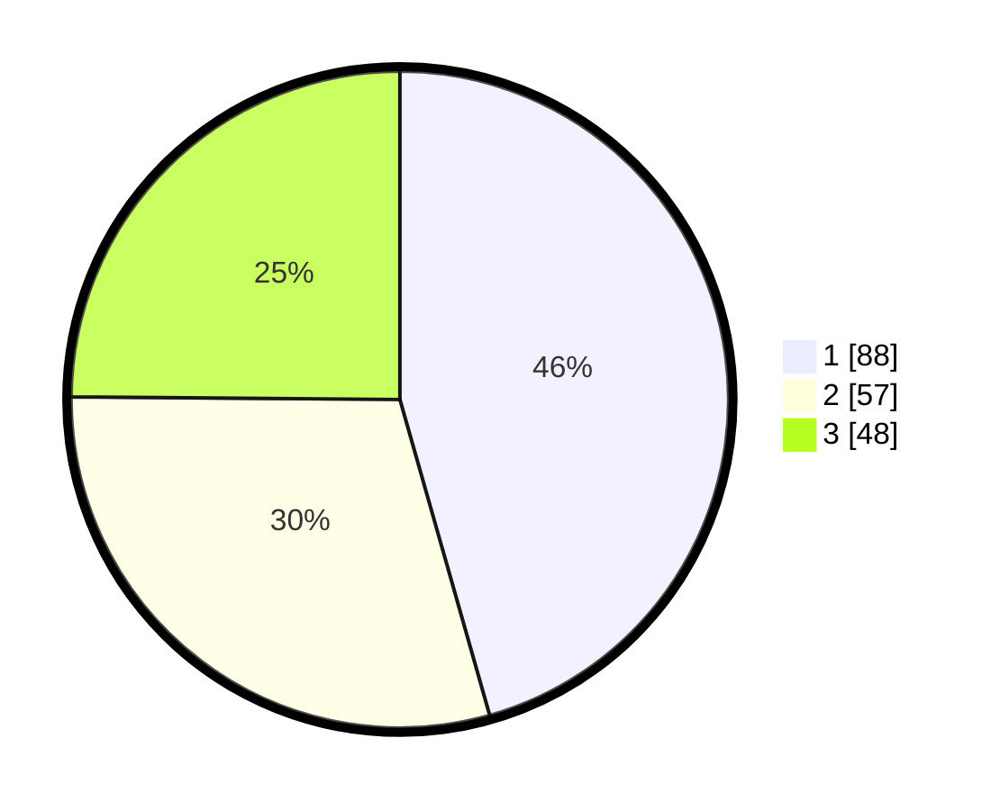

# Hasil

## Grafik

## Tabel

| No. | Nama Paslon    | Suara | Suara (raw) | Persentase |
|:--- |:-------------- | -----:| -----------:| ----------:|
| 1   | ANIES MUHAIMIN | 88    | [88][p-1]   | 45,60      |
| 2   | PRABOWO GIBRAN | 57    | [57][p-2]   | 29,53      |
| 3   | GANJAR MAHFUD  | 48    | [48][p-3]   | 24,87      |

[p-1]: https://github.com/gigit-pemilu/pemilu-2024-16-sumatera-selatan/blob/main/pilpres/hitung-suara/sub/16-sumatera-selatan/sub/11-empat-lawang/sub/05-lintang-kanan/sub/2013-babatan/sub/014-tps/sub/paslon-1.txt
[p-2]: https://github.com/gigit-pemilu/pemilu-2024-16-sumatera-selatan/blob/main/pilpres/hitung-suara/sub/16-sumatera-selatan/sub/11-empat-lawang/sub/05-lintang-kanan/sub/2013-babatan/sub/014-tps/sub/paslon-2.txt
[p-3]: https://github.com/gigit-pemilu/pemilu-2024-16-sumatera-selatan/blob/main/pilpres/hitung-suara/sub/16-sumatera-selatan/sub/11-empat-lawang/sub/05-lintang-kanan/sub/2013-babatan/sub/014-tps/sub/paslon-3.txt

## Foto C Plano

https://sirekap-obj-formc.kpu.go.id/a390/pemilu/ppwp/16/11/05/20/13/1611052013014-20240223-015238--56489559-6fa2-4332-82e8-e1cfe8d5a76b.jpg

https://sirekap-obj-formc.kpu.go.id/a390/pemilu/ppwp/16/11/05/20/13/1611052013014-20240223-015133--c2647646-2586-44f0-ac64-ba4f6c04db5b.jpg

https://sirekap-obj-formc.kpu.go.id/a390/pemilu/ppwp/16/11/05/20/13/1611052013014-20240223-015517--ee8fe629-bac6-4bfd-a284-504f139b1fa6.jpg

## Metadata

| Key        | Value               |
| ---------- | ------------------- |
| Time Stamp | 2024-02-25 17:00:00 |

