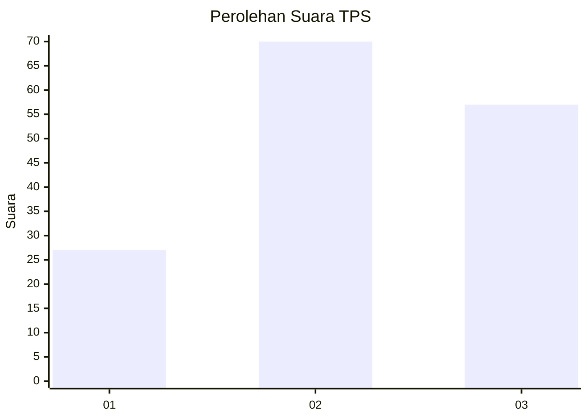
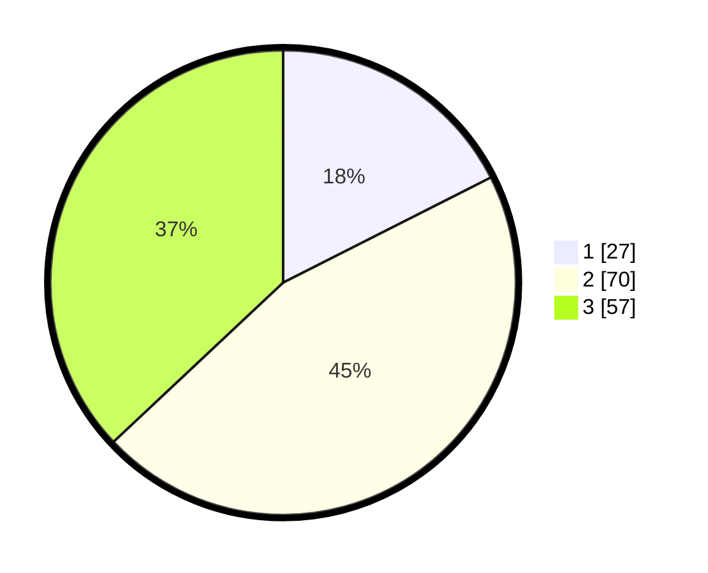

# Hasil

## Grafik

## Tabel

| No. | Nama Paslon    | Suara | Suara (raw) | Persentase |
|:--- |:-------------- | -----:| -----------:| ----------:|
| 1   | ANIES MUHAIMIN | 27    | [27][p-1]   | 17,53      |
| 2   | PRABOWO GIBRAN | 70    | [70][p-2]   | 45,45      |
| 3   | GANJAR MAHFUD  | 57    | [57][p-3]   | 37,01      |

[p-1]: https://github.com/gigit-pemilu/pemilu-2024-16-sumatera-selatan/blob/main/pilpres/hitung-suara/sub/16-sumatera-selatan/sub/11-empat-lawang/sub/05-lintang-kanan/sub/2013-babatan/sub/015-tps/sub/paslon-1.txt
[p-2]: https://github.com/gigit-pemilu/pemilu-2024-16-sumatera-selatan/blob/main/pilpres/hitung-suara/sub/16-sumatera-selatan/sub/11-empat-lawang/sub/05-lintang-kanan/sub/2013-babatan/sub/015-tps/sub/paslon-2.txt
[p-3]: https://github.com/gigit-pemilu/pemilu-2024-16-sumatera-selatan/blob/main/pilpres/hitung-suara/sub/16-sumatera-selatan/sub/11-empat-lawang/sub/05-lintang-kanan/sub/2013-babatan/sub/015-tps/sub/paslon-3.txt

## Foto C Plano

https://sirekap-obj-formc.kpu.go.id/9c51/pemilu/ppwp/16/11/05/20/13/1611052013015-20240223-022506--da6212f5-ed5c-422a-80eb-2e14e6251c8e.jpg

https://sirekap-obj-formc.kpu.go.id/9c51/pemilu/ppwp/16/11/05/20/13/1611052013015-20240223-022546--b98f3b8e-2ed5-4fe6-a583-78e128568247.jpg

https://sirekap-obj-formc.kpu.go.id/9c51/pemilu/ppwp/16/11/05/20/13/1611052013015-20240223-022635--a6d6238e-4174-4543-ba0c-3ce53a8e12ba.jpg

## Metadata

| Key        | Value               |
| ---------- | ------------------- |
| Time Stamp | 2024-02-25 19:00:00 |

