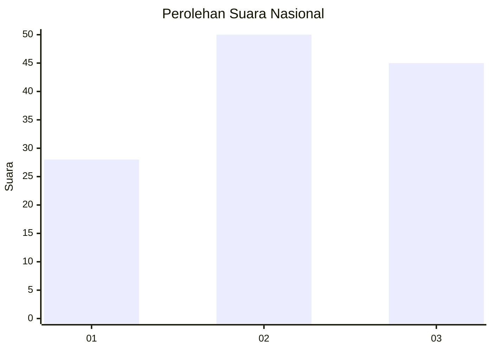
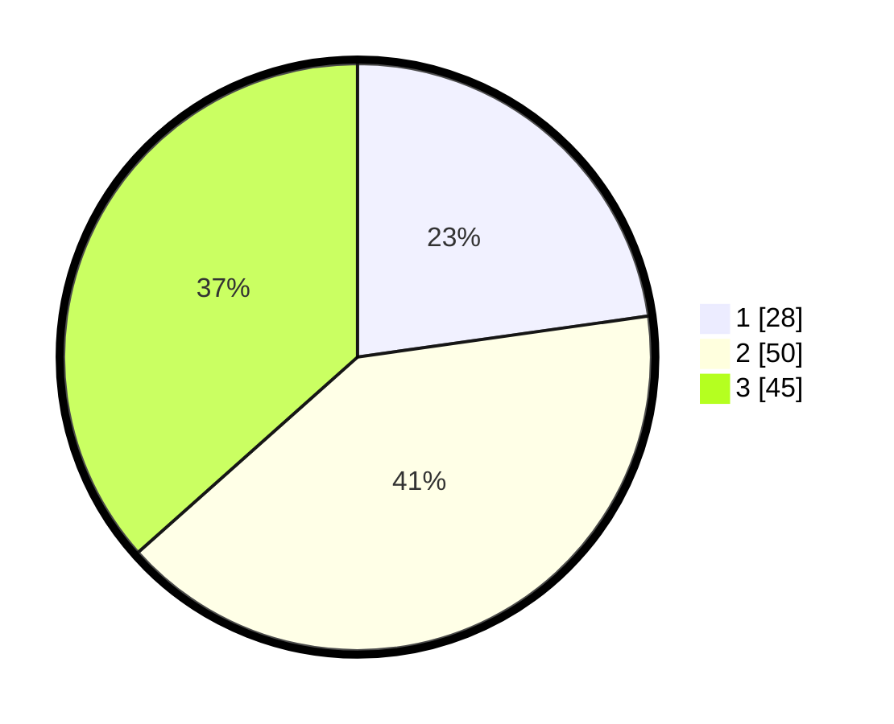

# Hasil

## Grafik

## Tabel

| No. | Nama Paslon    | Suara | Suara (raw) | Persentase |
|:--- |:-------------- | -----:| -----------:| ----------:|
| 1   | ANIES MUHAIMIN | 28    | [28][p-1]   | 22,76      |
| 2   | PRABOWO GIBRAN | 50    | [50][p-2]   | 40,65      |
| 3   | GANJAR MAHFUD  | 45    | [45][p-3]   | 36,59      |

[p-1]: https://github.com/gigit-pemilu/pemilu-2024/blob/main/pilpres/hitung-suara/sub/16-sumatera-selatan/sub/11-empat-lawang/sub/05-lintang-kanan/sub/2013-babatan/sub/016-tps/sub/paslon-1.txt
[p-2]: https://github.com/gigit-pemilu/pemilu-2024/blob/main/pilpres/hitung-suara/sub/16-sumatera-selatan/sub/11-empat-lawang/sub/05-lintang-kanan/sub/2013-babatan/sub/016-tps/sub/paslon-2.txt
[p-3]: https://github.com/gigit-pemilu/pemilu-2024/blob/main/pilpres/hitung-suara/sub/16-sumatera-selatan/sub/11-empat-lawang/sub/05-lintang-kanan/sub/2013-babatan/sub/016-tps/sub/paslon-3.txt

## Foto C Plano

https://sirekap-obj-formc.kpu.go.id/5807/pemilu/ppwp/16/11/05/20/13/1611052013016-20240223-012322--aa95cb5d-357c-48a7-a1cf-6a908d7e4efa.jpg

https://sirekap-obj-formc.kpu.go.id/5807/pemilu/ppwp/16/11/05/20/13/1611052013016-20240223-012730--8a32913a-80ee-40ac-b53c-fcc09a8d3bad.jpg

https://sirekap-obj-formc.kpu.go.id/5807/pemilu/ppwp/16/11/05/20/13/1611052013016-20240223-012825--682b6496-4c7d-4c08-899a-780ac35337de.jpg

## Metadata

| Key        | Value               |
| ---------- | ------------------- |
| Time Stamp | 2024-02-24 22:31:28 |

