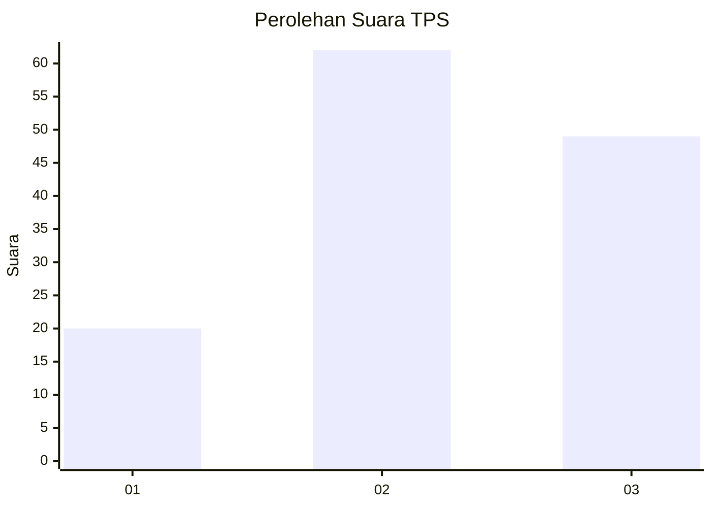
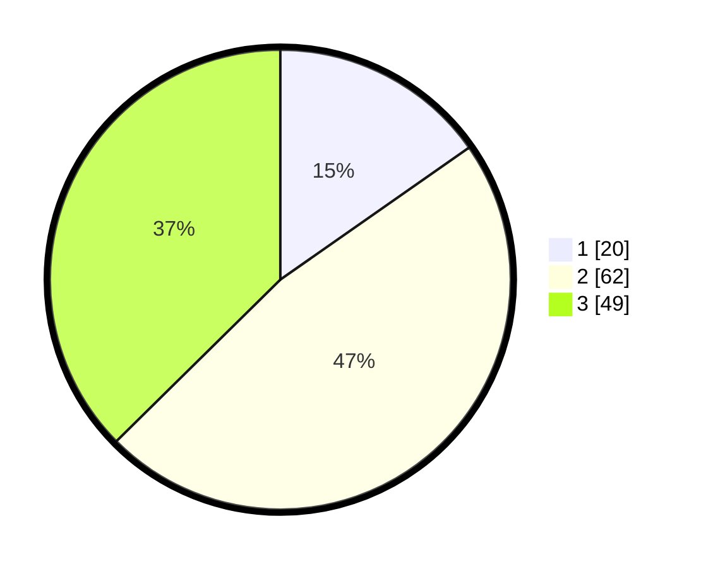

# Hasil

## Grafik

## Tabel

| No. | Nama Paslon    | Suara | Suara (raw) | Persentase |
|:--- |:-------------- | -----:| -----------:| ----------:|
| 1   | ANIES MUHAIMIN | 20    | [20][p-1]   | 15,27      |
| 2   | PRABOWO GIBRAN | 62    | [62][p-2]   | 47,33      |
| 3   | GANJAR MAHFUD  | 49    | [49][p-3]   | 37,40      |

[p-1]: https://github.com/gigit-pemilu/pemilu-2024-16-sumatera-selatan/blob/main/pilpres/hitung-suara/sub/16-sumatera-selatan/sub/11-empat-lawang/sub/05-lintang-kanan/sub/2013-babatan/sub/017-tps/sub/paslon-1.txt
[p-2]: https://github.com/gigit-pemilu/pemilu-2024-16-sumatera-selatan/blob/main/pilpres/hitung-suara/sub/16-sumatera-selatan/sub/11-empat-lawang/sub/05-lintang-kanan/sub/2013-babatan/sub/017-tps/sub/paslon-2.txt
[p-3]: https://github.com/gigit-pemilu/pemilu-2024-16-sumatera-selatan/blob/main/pilpres/hitung-suara/sub/16-sumatera-selatan/sub/11-empat-lawang/sub/05-lintang-kanan/sub/2013-babatan/sub/017-tps/sub/paslon-3.txt

## Foto C Plano

https://sirekap-obj-formc.kpu.go.id/c952/pemilu/ppwp/16/11/05/20/13/1611052013017-20240223-013827--a29b2ac3-e2f8-4162-a441-6a4b251fd467.jpg

https://sirekap-obj-formc.kpu.go.id/c952/pemilu/ppwp/16/11/05/20/13/1611052013017-20240223-013907--b8c50010-5ba6-4aa4-bc03-da35b3fd5ba5.jpg

https://sirekap-obj-formc.kpu.go.id/c952/pemilu/ppwp/16/11/05/20/13/1611052013017-20240223-014011--c7f47f6d-6a40-4c10-8908-b6f8b51a14d1.jpg

## Metadata

| Key        | Value               |
| ---------- | ------------------- |
| Time Stamp | 2024-02-25 16:00:00 |

