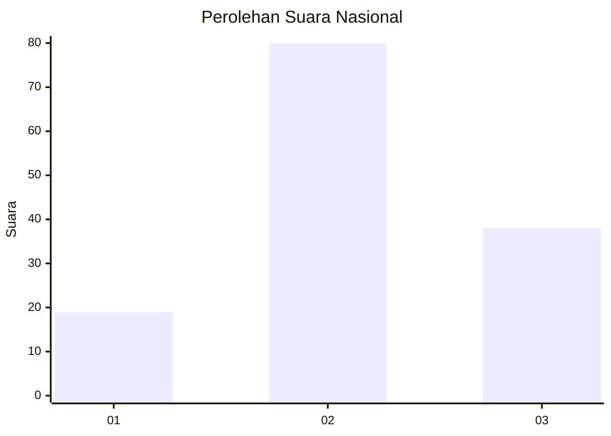
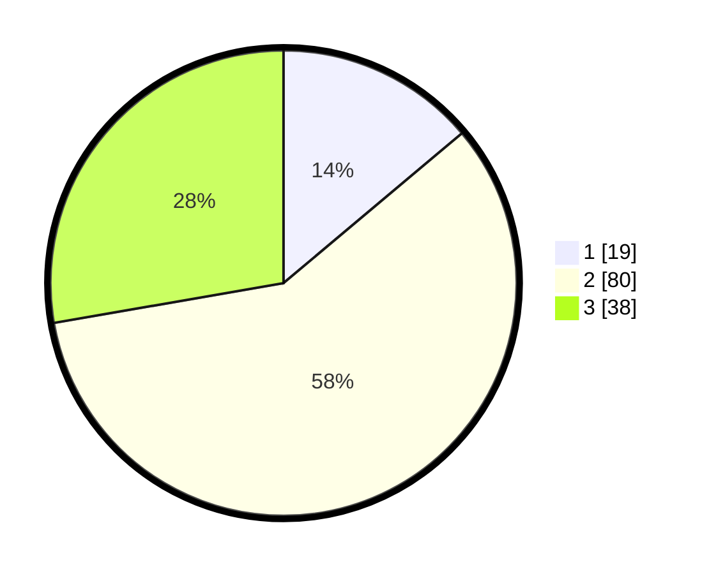

# Hasil

## Grafik

## Tabel

| No. | Nama Paslon    | Suara | Suara (raw) | Persentase |
|:--- |:-------------- | -----:| -----------:| ----------:|
| 1   | ANIES MUHAIMIN | 19    | [19][p-1]   | 13,87      |
| 2   | PRABOWO GIBRAN | 80    | [80][p-2]   | 58,39      |
| 3   | GANJAR MAHFUD  | 38    | [38][p-3]   | 27,74      |

[p-1]: https://github.com/gigit-pemilu/pemilu-2024/blob/main/pilpres/hitung-suara/sub/16-sumatera-selatan/sub/11-empat-lawang/sub/05-lintang-kanan/sub/2013-babatan/sub/018-tps/sub/paslon-1.txt
[p-2]: https://github.com/gigit-pemilu/pemilu-2024/blob/main/pilpres/hitung-suara/sub/16-sumatera-selatan/sub/11-empat-lawang/sub/05-lintang-kanan/sub/2013-babatan/sub/018-tps/sub/paslon-2.txt
[p-3]: https://github.com/gigit-pemilu/pemilu-2024/blob/main/pilpres/hitung-suara/sub/16-sumatera-selatan/sub/11-empat-lawang/sub/05-lintang-kanan/sub/2013-babatan/sub/018-tps/sub/paslon-3.txt

## Foto C Plano

https://sirekap-obj-formc.kpu.go.id/cebb/pemilu/ppwp/16/11/05/20/13/1611052013018-20240223-013936--538123f8-5c19-486b-beda-c33b28efadd9.jpg

https://sirekap-obj-formc.kpu.go.id/cebb/pemilu/ppwp/16/11/05/20/13/1611052013018-20240223-014034--db3240a0-e078-41da-aef4-8b1b7233875d.jpg

https://sirekap-obj-formc.kpu.go.id/cebb/pemilu/ppwp/16/11/05/20/13/1611052013018-20240223-014649--2c1e80a2-78e9-4039-b570-49d628c41978.jpg

## Metadata

| Key        | Value               |
| ---------- | ------------------- |
| Time Stamp | 2024-02-25 15:00:00 |

