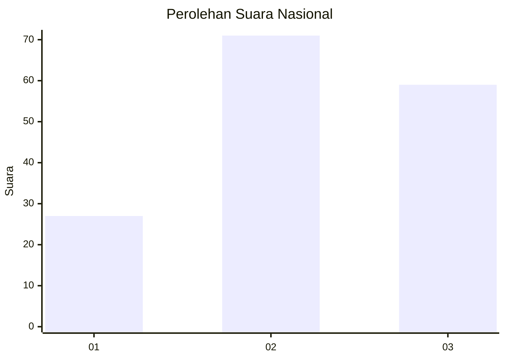
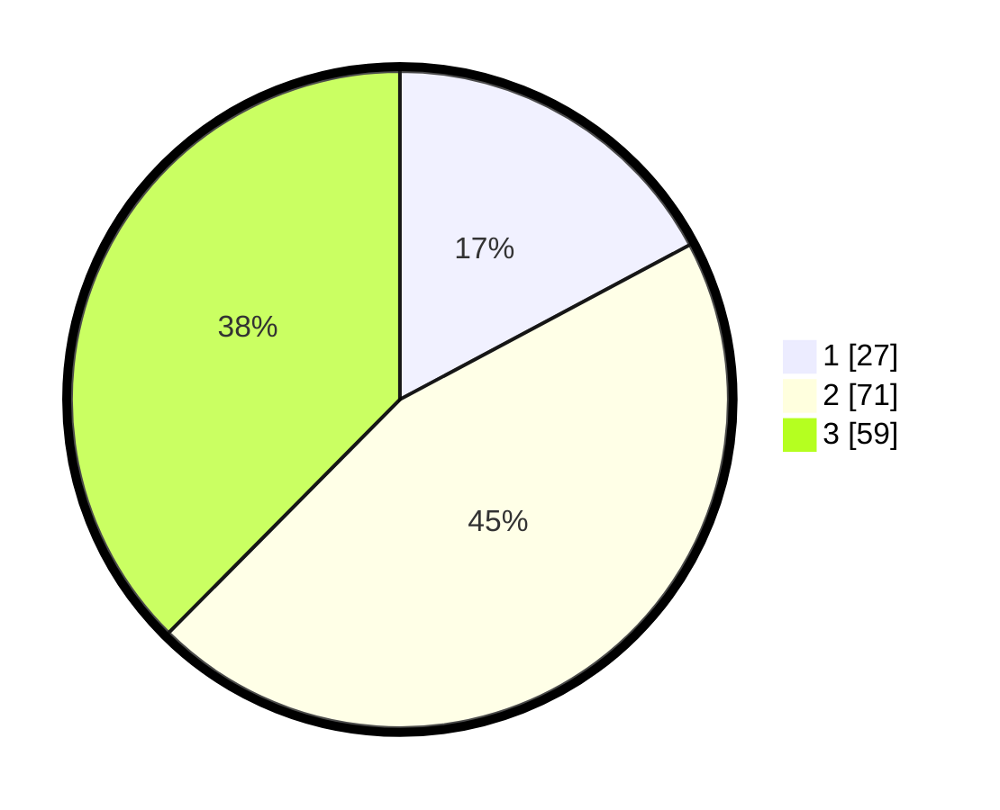

# Hasil

## Grafik

## Tabel

| No. | Nama Paslon    | Suara | Suara (raw) | Persentase |
|:--- |:-------------- | -----:| -----------:| ----------:|
| 1   | ANIES MUHAIMIN | 27    | [27][p-1]   | 17,20      |
| 2   | PRABOWO GIBRAN | 71    | [71][p-2]   | 45,22      |
| 3   | GANJAR MAHFUD  | 59    | [59][p-3]   | 37,58      |

[p-1]: https://github.com/gigit-pemilu/pemilu-2024/blob/main/pilpres/hitung-suara/sub/16-sumatera-selatan/sub/11-empat-lawang/sub/05-lintang-kanan/sub/2013-babatan/sub/020-tps/sub/paslon-1.txt
[p-2]: https://github.com/gigit-pemilu/pemilu-2024/blob/main/pilpres/hitung-suara/sub/16-sumatera-selatan/sub/11-empat-lawang/sub/05-lintang-kanan/sub/2013-babatan/sub/020-tps/sub/paslon-2.txt
[p-3]: https://github.com/gigit-pemilu/pemilu-2024/blob/main/pilpres/hitung-suara/sub/16-sumatera-selatan/sub/11-empat-lawang/sub/05-lintang-kanan/sub/2013-babatan/sub/020-tps/sub/paslon-3.txt

## Foto C Plano

https://sirekap-obj-formc.kpu.go.id/f443/pemilu/ppwp/16/11/05/20/13/1611052013020-20240223-013526--12878634-3a5e-4732-9ced-d2da32e76ce3.jpg

https://sirekap-obj-formc.kpu.go.id/f443/pemilu/ppwp/16/11/05/20/13/1611052013020-20240223-013604--ae921521-b186-43b0-ab75-ec856acea373.jpg

https://sirekap-obj-formc.kpu.go.id/f443/pemilu/ppwp/16/11/05/20/13/1611052013020-20240223-013721--1fa60cda-d609-4f00-8327-1abb740e7bac.jpg

## Metadata

| Key        | Value               |
| ---------- | ------------------- |
| Time Stamp | 2024-02-25 12:00:00 |

