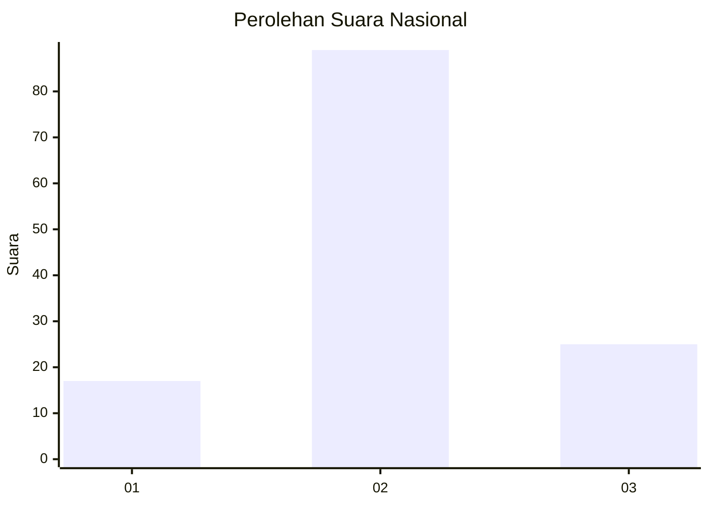
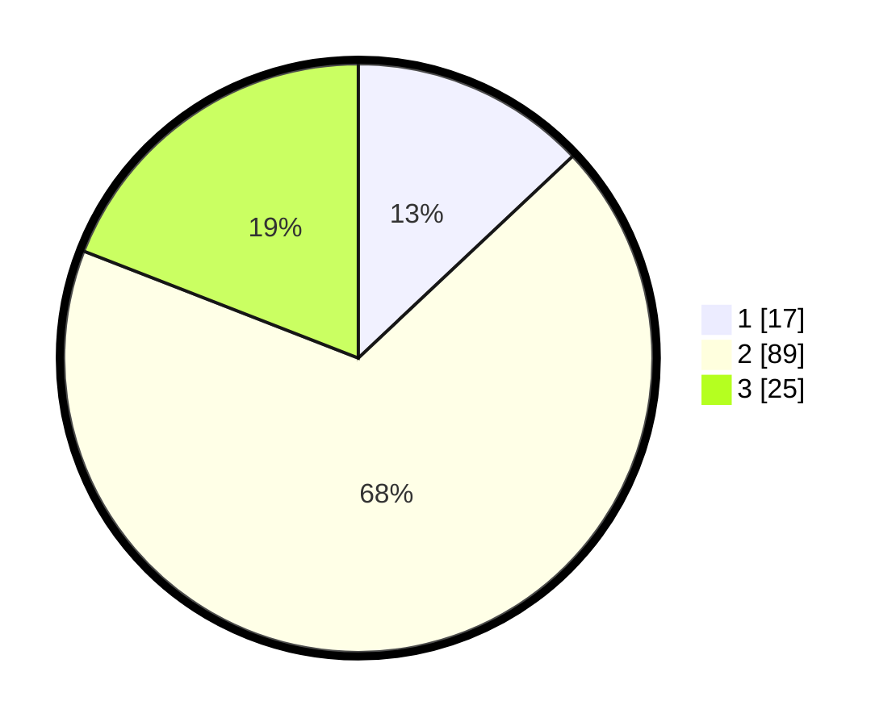

# Hasil

## Grafik

## Tabel

| No. | Nama Paslon    | Suara | Suara (raw) | Persentase |
|:--- |:-------------- | -----:| -----------:| ----------:|
| 1   | ANIES MUHAIMIN | 17    | [17][p-1]   | 12,98      |
| 2   | PRABOWO GIBRAN | 89    | [89][p-2]   | 67,94      |
| 3   | GANJAR MAHFUD  | 25    | [25][p-3]   | 19,08      |

[p-1]: https://github.com/gigit-pemilu/pemilu-2024/blob/main/pilpres/hitung-suara/sub/16-sumatera-selatan/sub/11-empat-lawang/sub/05-lintang-kanan/sub/2013-babatan/sub/025-tps/sub/paslon-1.txt
[p-2]: https://github.com/gigit-pemilu/pemilu-2024/blob/main/pilpres/hitung-suara/sub/16-sumatera-selatan/sub/11-empat-lawang/sub/05-lintang-kanan/sub/2013-babatan/sub/025-tps/sub/paslon-2.txt
[p-3]: https://github.com/gigit-pemilu/pemilu-2024/blob/main/pilpres/hitung-suara/sub/16-sumatera-selatan/sub/11-empat-lawang/sub/05-lintang-kanan/sub/2013-babatan/sub/025-tps/sub/paslon-3.txt

## Foto C Plano

https://sirekap-obj-formc.kpu.go.id/1467/pemilu/ppwp/16/11/05/20/13/1611052013025-20240223-014138--2a7ade27-4909-4b6a-bc81-e6693dbf1478.jpg

https://sirekap-obj-formc.kpu.go.id/1467/pemilu/ppwp/16/11/05/20/13/1611052013025-20240223-014344--9dfa53ce-b1e7-466d-ae50-281a06161f12.jpg

https://sirekap-obj-formc.kpu.go.id/1467/pemilu/ppwp/16/11/05/20/13/1611052013025-20240223-014521--44443350-69e5-46d0-aeb9-a2019c88a9dd.jpg

## Metadata

| Key        | Value               |
| ---------- | ------------------- |
| Time Stamp | 2024-02-25 11:00:00 |

