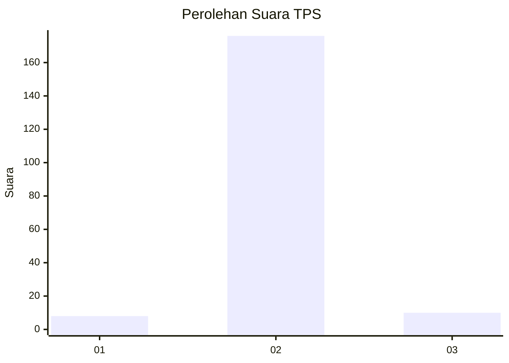
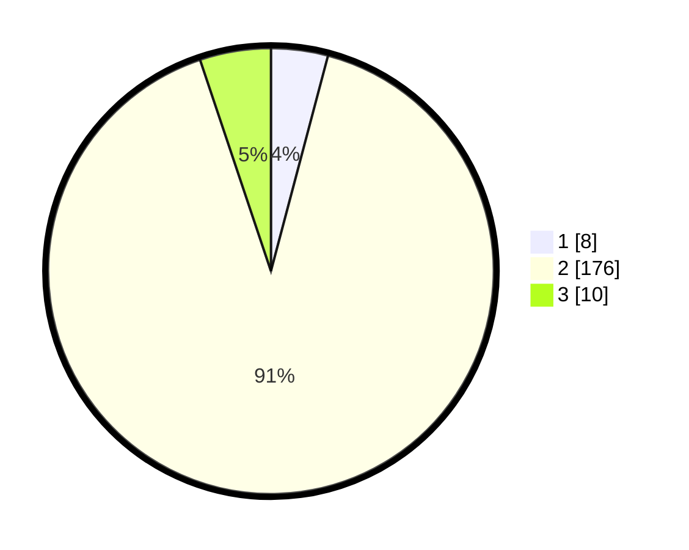

# Hasil

## Grafik

## Tabel

| No. | Nama Paslon    | Suara | Suara (raw) | Persentase |
|:--- |:-------------- | -----:| -----------:| ----------:|
| 1   | ANIES MUHAIMIN | 8     | [8][p-1]    | 4,12       |
| 2   | PRABOWO GIBRAN | 176   | [176][p-2]  | 90,72      |
| 3   | GANJAR MAHFUD  | 10    | [10][p-3]   | 5,15       |

[p-1]: https://github.com/gigit-pemilu/pemilu-2024-16-sumatera-selatan/blob/main/pilpres/hitung-suara/sub/16-sumatera-selatan/sub/11-empat-lawang/sub/05-lintang-kanan/sub/2014-muara-danau/sub/003-tps/sub/paslon-1.txt
[p-2]: https://github.com/gigit-pemilu/pemilu-2024-16-sumatera-selatan/blob/main/pilpres/hitung-suara/sub/16-sumatera-selatan/sub/11-empat-lawang/sub/05-lintang-kanan/sub/2014-muara-danau/sub/003-tps/sub/paslon-2.txt
[p-3]: https://github.com/gigit-pemilu/pemilu-2024-16-sumatera-selatan/blob/main/pilpres/hitung-suara/sub/16-sumatera-selatan/sub/11-empat-lawang/sub/05-lintang-kanan/sub/2014-muara-danau/sub/003-tps/sub/paslon-3.txt

## Foto C Plano

https://sirekap-obj-formc.kpu.go.id/547e/pemilu/ppwp/16/11/05/20/14/1611052014003-20240223-000507--026c3890-01d7-4a14-8ecd-1e97946bc4bb.jpg

https://sirekap-obj-formc.kpu.go.id/547e/pemilu/ppwp/16/11/05/20/14/1611052014003-20240223-000243--22ff3f8a-7aac-40cc-9f07-0b3a6231097f.jpg

https://sirekap-obj-formc.kpu.go.id/547e/pemilu/ppwp/16/11/05/20/14/1611052014003-20240223-000913--da0bb609-f1ba-4db5-83fd-5265f25e0a9d.jpg

## Metadata

| Key        | Value               |
| ---------- | ------------------- |
| Time Stamp | 2024-02-25 21:00:00 |

