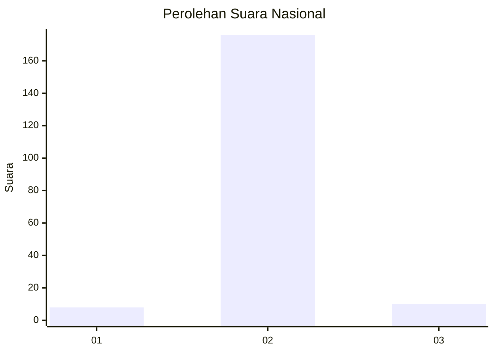
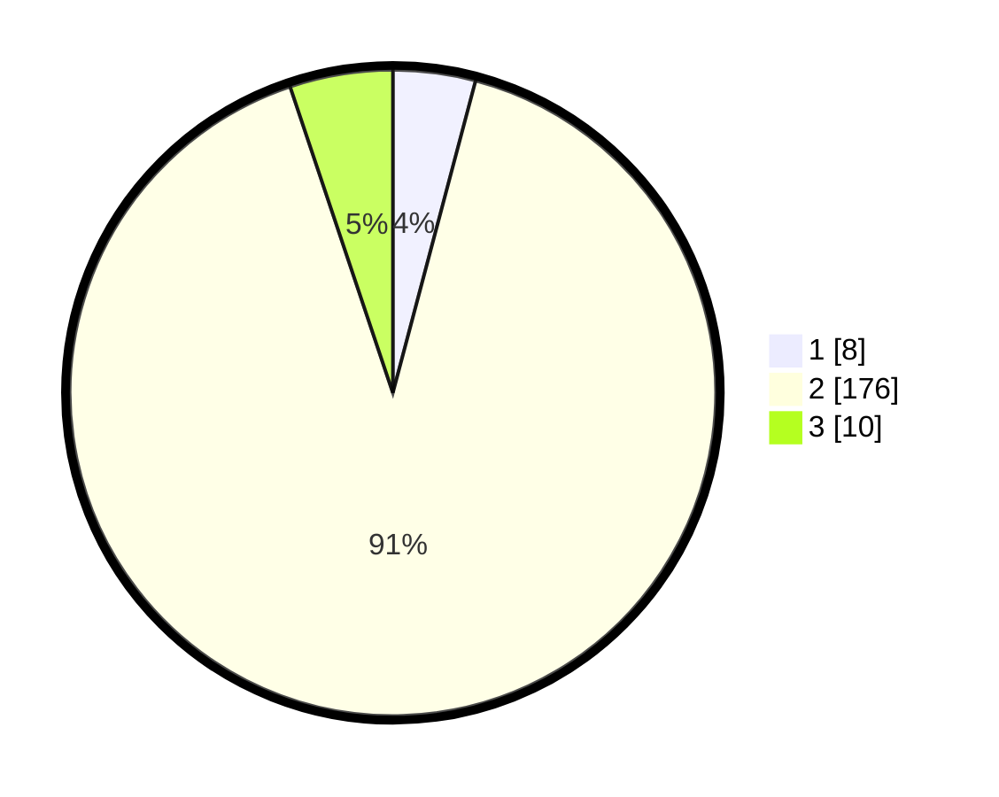

# Hasil

## Grafik

## Tabel

| No. | Nama Paslon    | Suara | Suara (raw) | Persentase |
|:--- |:-------------- | -----:| -----------:| ----------:|
| 1   | ANIES MUHAIMIN | 8     | [8][p-1]    | 4,12       |
| 2   | PRABOWO GIBRAN | 176   | [176][p-2]  | 90,72      |
| 3   | GANJAR MAHFUD  | 10    | [10][p-3]   | 5,15       |

[p-1]: https://github.com/gigit-pemilu/pemilu-2024/blob/main/pilpres/hitung-suara/sub/16-sumatera-selatan/sub/11-empat-lawang/sub/05-lintang-kanan/sub/2014-muara-danau/sub/004-tps/sub/paslon-1.txt
[p-2]: https://github.com/gigit-pemilu/pemilu-2024/blob/main/pilpres/hitung-suara/sub/16-sumatera-selatan/sub/11-empat-lawang/sub/05-lintang-kanan/sub/2014-muara-danau/sub/004-tps/sub/paslon-2.txt
[p-3]: https://github.com/gigit-pemilu/pemilu-2024/blob/main/pilpres/hitung-suara/sub/16-sumatera-selatan/sub/11-empat-lawang/sub/05-lintang-kanan/sub/2014-muara-danau/sub/004-tps/sub/paslon-3.txt

## Foto C Plano

https://sirekap-obj-formc.kpu.go.id/0b6b/pemilu/ppwp/16/11/05/20/14/1611052014004-20240223-001109--d044366c-cd00-4ac2-a3cd-3e2b9d312ca6.jpg

https://sirekap-obj-formc.kpu.go.id/0b6b/pemilu/ppwp/16/11/05/20/14/1611052014004-20240223-001144--5e8907b9-c7d8-4f21-a65a-0be67fac050b.jpg

https://sirekap-obj-formc.kpu.go.id/0b6b/pemilu/ppwp/16/11/05/20/14/1611052014004-20240223-001308--4595bc24-4eab-4c0b-9944-80aeb9bea293.jpg

## Metadata

| Key        | Value               |
| ---------- | ------------------- |
| Time Stamp | 2024-02-25 12:00:00 |

