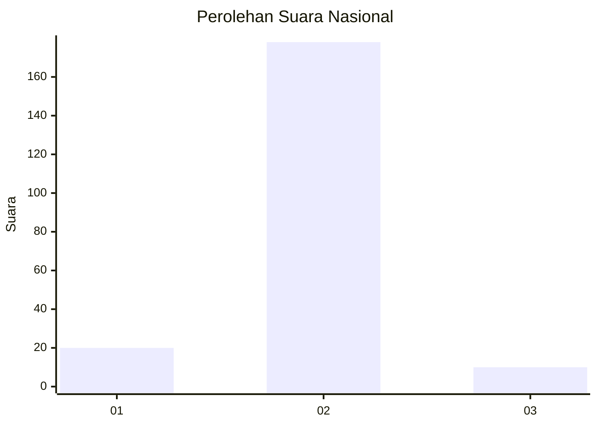
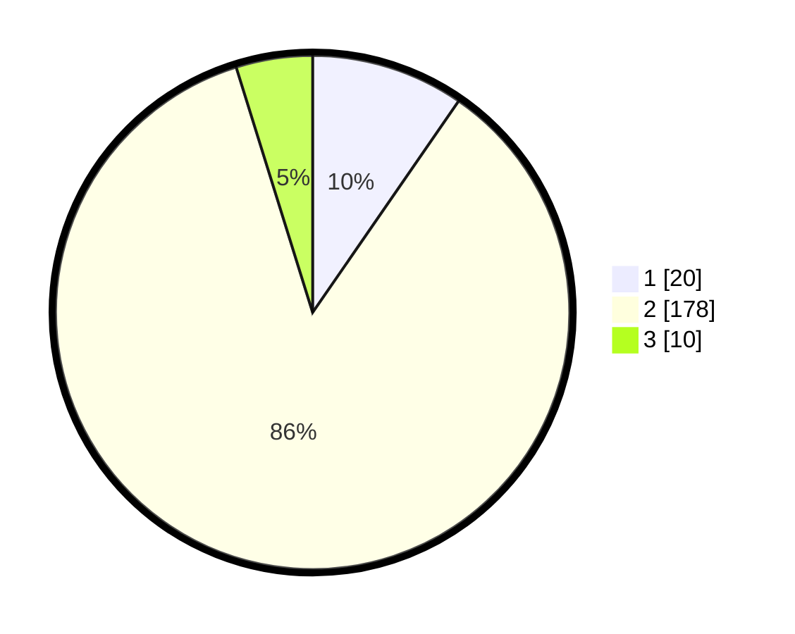

# Hasil

## Grafik

## Tabel

| No. | Nama Paslon    | Suara | Suara (raw) | Persentase |
|:--- |:-------------- | -----:| -----------:| ----------:|
| 1   | ANIES MUHAIMIN | 20    | [20][p-1]   | 9,62       |
| 2   | PRABOWO GIBRAN | 178   | [178][p-2]  | 85,58      |
| 3   | GANJAR MAHFUD  | 10    | [10][p-3]   | 4,81       |

[p-1]: https://github.com/gigit-pemilu/pemilu-2024/blob/main/pilpres/hitung-suara/sub/16-sumatera-selatan/sub/11-empat-lawang/sub/05-lintang-kanan/sub/2014-muara-danau/sub/005-tps/sub/paslon-1.txt
[p-2]: https://github.com/gigit-pemilu/pemilu-2024/blob/main/pilpres/hitung-suara/sub/16-sumatera-selatan/sub/11-empat-lawang/sub/05-lintang-kanan/sub/2014-muara-danau/sub/005-tps/sub/paslon-2.txt
[p-3]: https://github.com/gigit-pemilu/pemilu-2024/blob/main/pilpres/hitung-suara/sub/16-sumatera-selatan/sub/11-empat-lawang/sub/05-lintang-kanan/sub/2014-muara-danau/sub/005-tps/sub/paslon-3.txt

## Foto C Plano

https://sirekap-obj-formc.kpu.go.id/2279/pemilu/ppwp/16/11/05/20/14/1611052014005-20240223-001413--abab7819-5624-47e4-9cf3-d259caccdbeb.jpg

https://sirekap-obj-formc.kpu.go.id/2279/pemilu/ppwp/16/11/05/20/14/1611052014005-20240223-001502--2046b3f8-78fb-4061-9100-7d00b89f129e.jpg

https://sirekap-obj-formc.kpu.go.id/2279/pemilu/ppwp/16/11/05/20/14/1611052014005-20240223-001547--2fa49d7c-78fd-48cb-b00d-db403d50469c.jpg

## Metadata

| Key        | Value               |
| ---------- | ------------------- |
| Time Stamp | 2024-02-25 16:00:00 |

