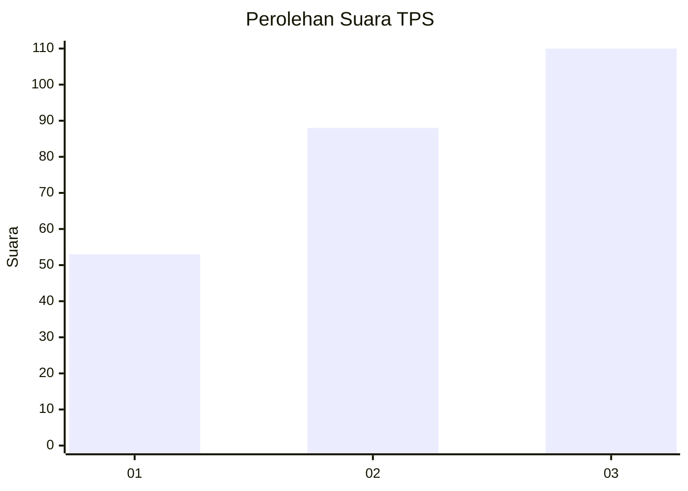
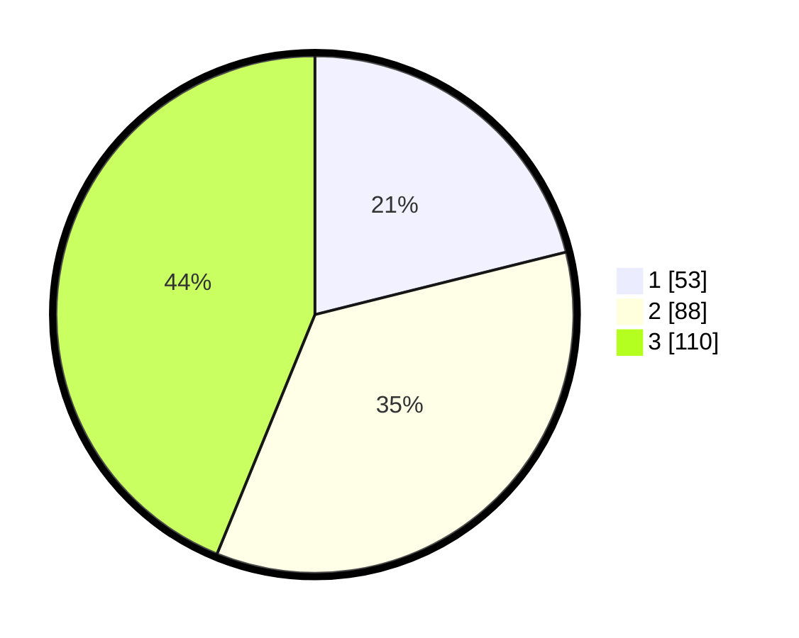

# Hasil

## Grafik

## Tabel

| No. | Nama Paslon    | Suara | Suara (raw) | Persentase |
|:--- |:-------------- | -----:| -----------:| ----------:|
| 1   | ANIES MUHAIMIN | 53    | [53][p-1]   | 21,12      |
| 2   | PRABOWO GIBRAN | 88    | [88][p-2]   | 35,06      |
| 3   | GANJAR MAHFUD  | 110   | [110][p-3]  | 43,82      |

[p-1]: https://github.com/gigit-pemilu/pemilu-2024-16-sumatera-selatan/blob/main/pilpres/hitung-suara/sub/16-sumatera-selatan/sub/11-empat-lawang/sub/05-lintang-kanan/sub/2015-endalo/sub/001-tps/sub/paslon-1.txt
[p-2]: https://github.com/gigit-pemilu/pemilu-2024-16-sumatera-selatan/blob/main/pilpres/hitung-suara/sub/16-sumatera-selatan/sub/11-empat-lawang/sub/05-lintang-kanan/sub/2015-endalo/sub/001-tps/sub/paslon-2.txt
[p-3]: https://github.com/gigit-pemilu/pemilu-2024-16-sumatera-selatan/blob/main/pilpres/hitung-suara/sub/16-sumatera-selatan/sub/11-empat-lawang/sub/05-lintang-kanan/sub/2015-endalo/sub/001-tps/sub/paslon-3.txt

## Foto C Plano

https://sirekap-obj-formc.kpu.go.id/d533/pemilu/ppwp/16/11/05/20/15/1611052015001-20240222-232314--f1bda7a8-3513-4109-94de-53a09719396a.jpg

https://sirekap-obj-formc.kpu.go.id/d533/pemilu/ppwp/16/11/05/20/15/1611052015001-20240222-233325--c0b64ad7-c436-4004-955d-2c33420c4cf1.jpg

https://sirekap-obj-formc.kpu.go.id/d533/pemilu/ppwp/16/11/05/20/15/1611052015001-20240222-232837--fe8c94a7-6158-4d69-89c4-349e4d26a808.jpg

## Metadata

| Key        | Value               |
| ---------- | ------------------- |
| Time Stamp | 2024-02-24 22:31:28 |

