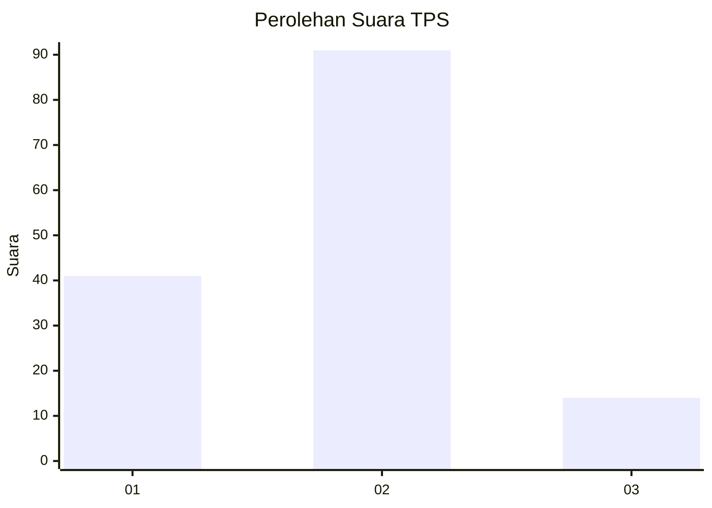
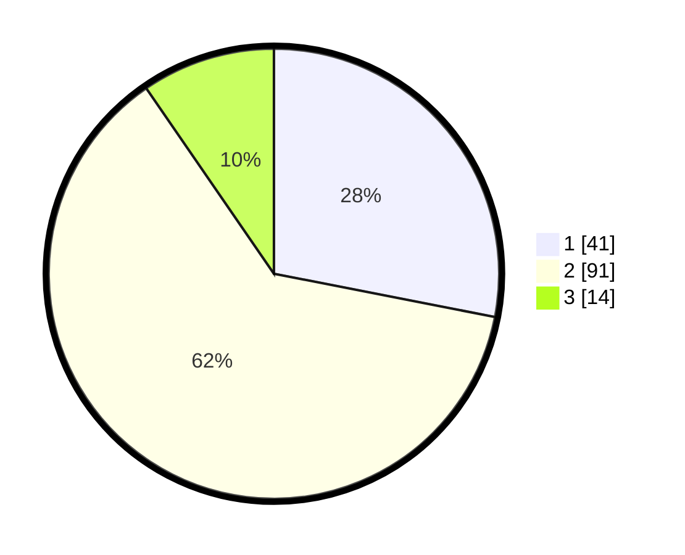

# Hasil

## Grafik

## Tabel

| No. | Nama Paslon    | Suara | Suara (raw) | Persentase |
|:--- |:-------------- | -----:| -----------:| ----------:|
| 1   | ANIES MUHAIMIN | 41    | [41][p-1]   | 28,08      |
| 2   | PRABOWO GIBRAN | 91    | [91][p-2]   | 62,33      |
| 3   | GANJAR MAHFUD  | 14    | [14][p-3]   | 9,59       |

[p-1]: https://github.com/gigit-pemilu/pemilu-2024-16-sumatera-selatan/blob/main/pilpres/hitung-suara/sub/16-sumatera-selatan/sub/11-empat-lawang/sub/05-lintang-kanan/sub/2015-endalo/sub/003-tps/sub/paslon-1.txt
[p-2]: https://github.com/gigit-pemilu/pemilu-2024-16-sumatera-selatan/blob/main/pilpres/hitung-suara/sub/16-sumatera-selatan/sub/11-empat-lawang/sub/05-lintang-kanan/sub/2015-endalo/sub/003-tps/sub/paslon-2.txt
[p-3]: https://github.com/gigit-pemilu/pemilu-2024-16-sumatera-selatan/blob/main/pilpres/hitung-suara/sub/16-sumatera-selatan/sub/11-empat-lawang/sub/05-lintang-kanan/sub/2015-endalo/sub/003-tps/sub/paslon-3.txt

## Foto C Plano

https://sirekap-obj-formc.kpu.go.id/4c46/pemilu/ppwp/16/11/05/20/15/1611052015003-20240222-233511--47a0dba6-20a3-4b2f-ad6b-c56545354c0b.jpg

https://sirekap-obj-formc.kpu.go.id/4c46/pemilu/ppwp/16/11/05/20/15/1611052015003-20240222-233702--5a4a1396-87bc-4a6c-a01e-d7deb9265fb0.jpg

https://sirekap-obj-formc.kpu.go.id/4c46/pemilu/ppwp/16/11/05/20/15/1611052015003-20240222-233828--ea436070-ef02-41bf-8854-00c14548fd1f.jpg

## Metadata

| Key        | Value               |
| ---------- | ------------------- |
| Time Stamp | 2024-02-25 13:00:00 |

