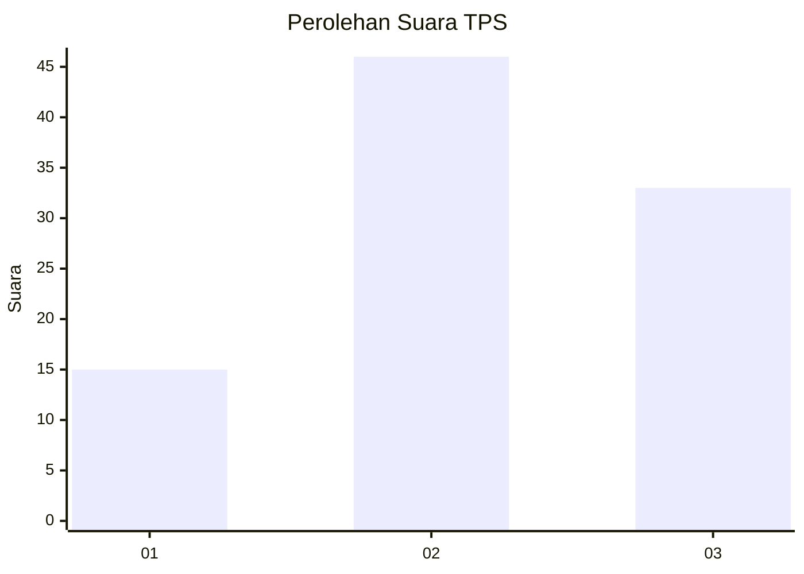
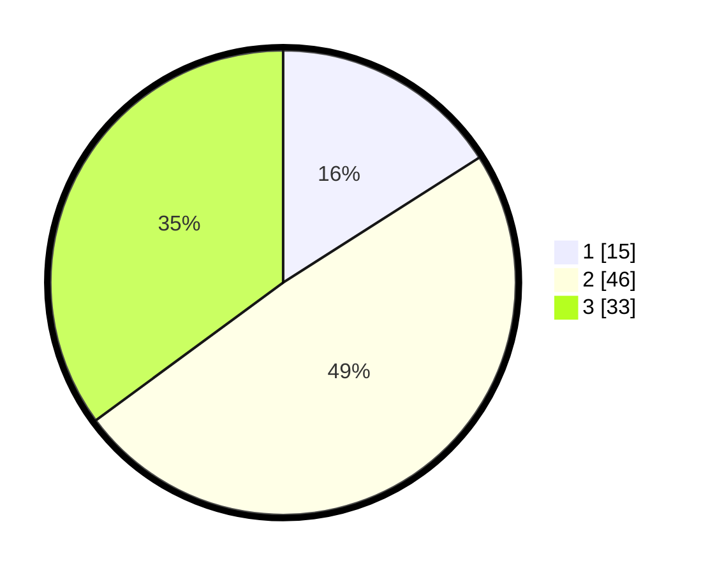

# Hasil

## Grafik

## Tabel

| No. | Nama Paslon    | Suara | Suara (raw) | Persentase |
|:--- |:-------------- | -----:| -----------:| ----------:|
| 1   | ANIES MUHAIMIN | 15    | [15][p-1]   | 15,96      |
| 2   | PRABOWO GIBRAN | 46    | [46][p-2]   | 48,94      |
| 3   | GANJAR MAHFUD  | 33    | [33][p-3]   | 35,11      |

[p-1]: https://github.com/gigit-pemilu/pemilu-2024-16-sumatera-selatan/blob/main/pilpres/hitung-suara/sub/16-sumatera-selatan/sub/11-empat-lawang/sub/05-lintang-kanan/sub/2015-endalo/sub/004-tps/sub/paslon-1.txt
[p-2]: https://github.com/gigit-pemilu/pemilu-2024-16-sumatera-selatan/blob/main/pilpres/hitung-suara/sub/16-sumatera-selatan/sub/11-empat-lawang/sub/05-lintang-kanan/sub/2015-endalo/sub/004-tps/sub/paslon-2.txt
[p-3]: https://github.com/gigit-pemilu/pemilu-2024-16-sumatera-selatan/blob/main/pilpres/hitung-suara/sub/16-sumatera-selatan/sub/11-empat-lawang/sub/05-lintang-kanan/sub/2015-endalo/sub/004-tps/sub/paslon-3.txt

## Foto C Plano

https://sirekap-obj-formc.kpu.go.id/0056/pemilu/ppwp/16/11/05/20/15/1611052015004-20240222-235104--c7a19841-23fa-4495-a580-7fe543af746e.jpg

https://sirekap-obj-formc.kpu.go.id/0056/pemilu/ppwp/16/11/05/20/15/1611052015004-20240222-234843--b3ab88d2-937d-4ed9-91d9-19abb4a523dc.jpg

https://sirekap-obj-formc.kpu.go.id/0056/pemilu/ppwp/16/11/05/20/15/1611052015004-20240222-235018--7003efa0-6708-45cc-8f01-64f542872ad0.jpg

## Metadata

| Key        | Value               |
| ---------- | ------------------- |
| Time Stamp | 2024-02-24 22:31:28 |

