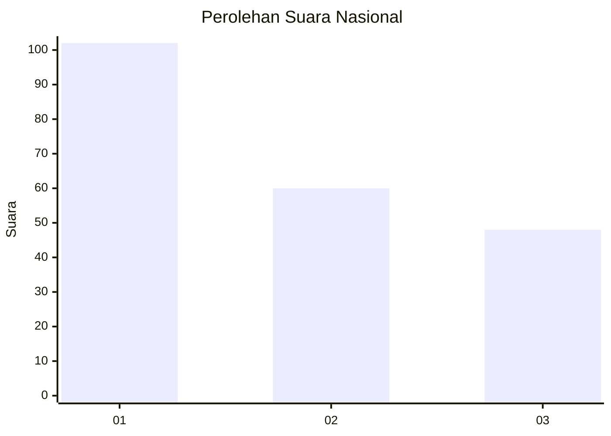
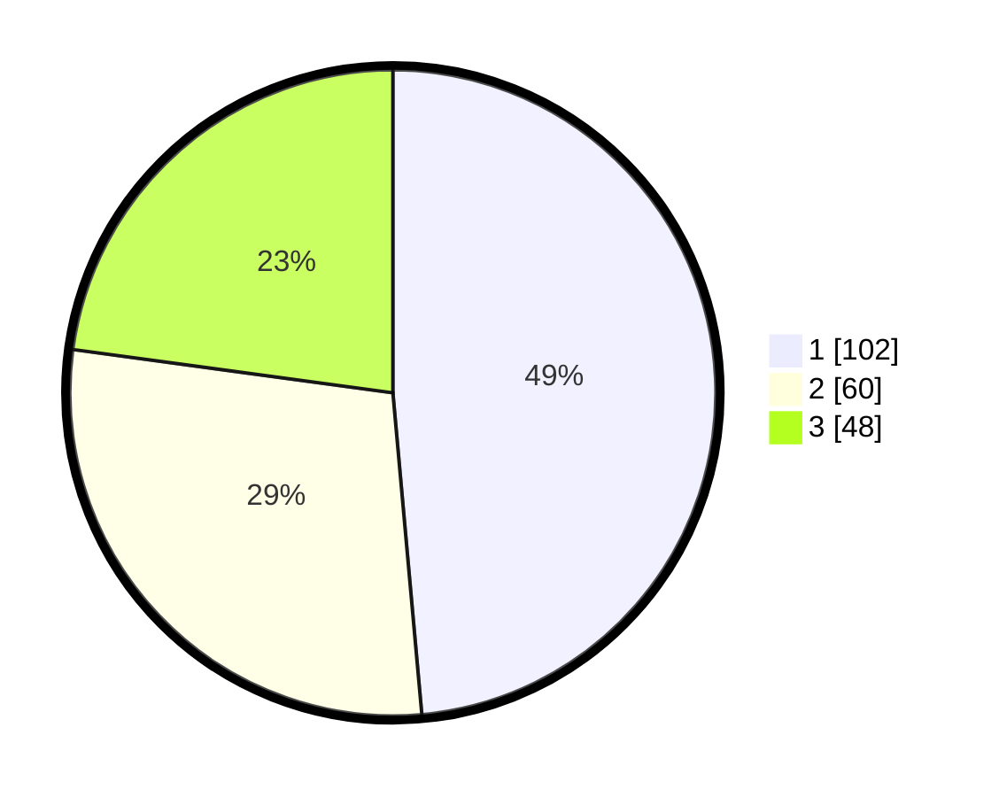

# Hasil

## Grafik

## Tabel

| No. | Nama Paslon    | Suara | Suara (raw) | Persentase |
|:--- |:-------------- | -----:| -----------:| ----------:|
| 1   | ANIES MUHAIMIN | 102   | [102][p-1]  | 48,57      |
| 2   | PRABOWO GIBRAN | 60    | [60][p-2]   | 28,57      |
| 3   | GANJAR MAHFUD  | 48    | [48][p-3]   | 22,86      |

[p-1]: https://github.com/gigit-pemilu/pemilu-2024/blob/main/pilpres/hitung-suara/sub/16-sumatera-selatan/sub/11-empat-lawang/sub/05-lintang-kanan/sub/2016-lubuk-tapang/sub/001-tps/sub/paslon-1.txt
[p-2]: https://github.com/gigit-pemilu/pemilu-2024/blob/main/pilpres/hitung-suara/sub/16-sumatera-selatan/sub/11-empat-lawang/sub/05-lintang-kanan/sub/2016-lubuk-tapang/sub/001-tps/sub/paslon-2.txt
[p-3]: https://github.com/gigit-pemilu/pemilu-2024/blob/main/pilpres/hitung-suara/sub/16-sumatera-selatan/sub/11-empat-lawang/sub/05-lintang-kanan/sub/2016-lubuk-tapang/sub/001-tps/sub/paslon-3.txt

## Foto C Plano

https://sirekap-obj-formc.kpu.go.id/80f5/pemilu/ppwp/16/11/05/20/16/1611052016001-20240222-234443--7b444dde-eb48-4c5b-b3ae-32a12f5660ed.jpg

https://sirekap-obj-formc.kpu.go.id/80f5/pemilu/ppwp/16/11/05/20/16/1611052016001-20240222-234408--221b338a-93f2-411b-b40f-81bb78291ce2.jpg

https://sirekap-obj-formc.kpu.go.id/80f5/pemilu/ppwp/16/11/05/20/16/1611052016001-20240222-234709--8b19dfb4-d955-4953-9148-f1a12575ca01.jpg

## Metadata

| Key        | Value               |
| ---------- | ------------------- |
| Time Stamp | 2024-02-25 13:00:00 |

