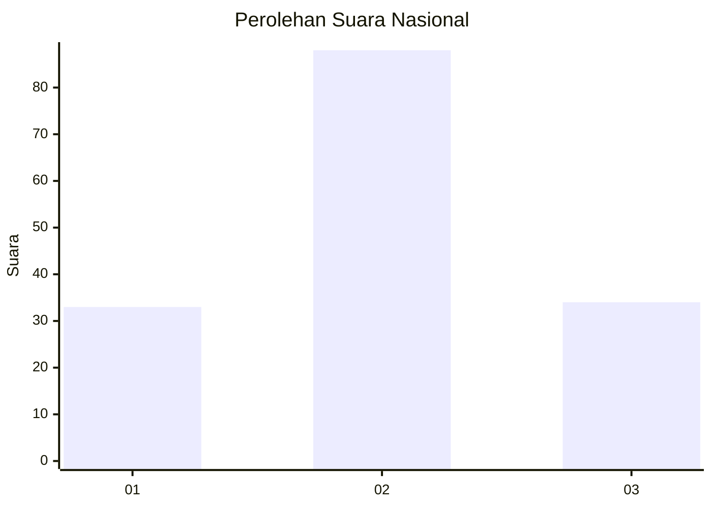
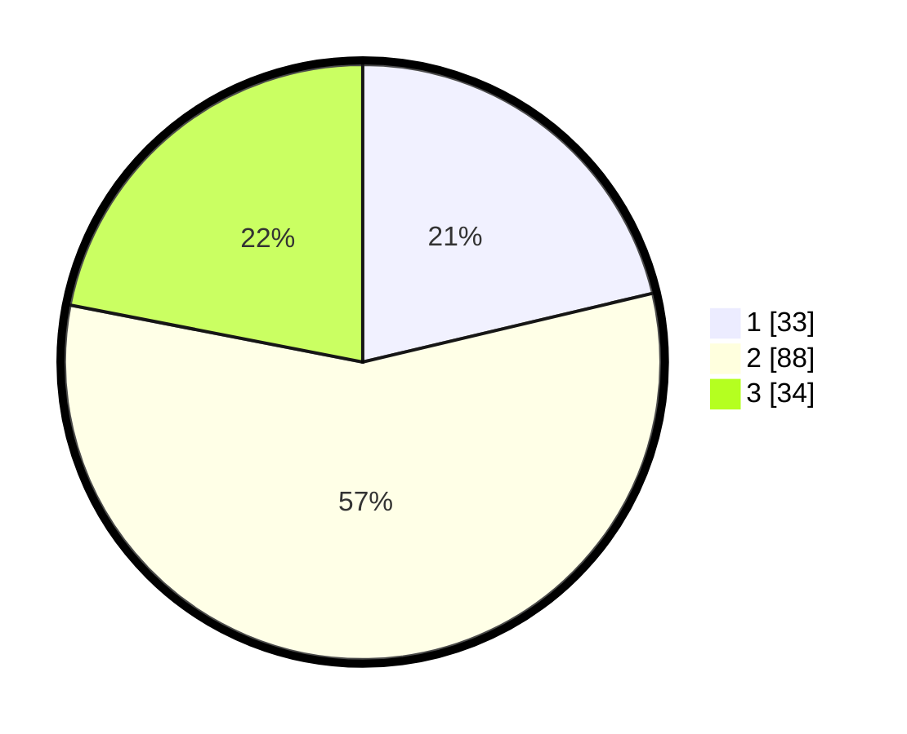

# Hasil

## Grafik

## Tabel

| No. | Nama Paslon    | Suara | Suara (raw) | Persentase |
|:--- |:-------------- | -----:| -----------:| ----------:|
| 1   | ANIES MUHAIMIN | 33    | [33][p-1]   | 21,29      |
| 2   | PRABOWO GIBRAN | 88    | [88][p-2]   | 56,77      |
| 3   | GANJAR MAHFUD  | 34    | [34][p-3]   | 21,94      |

[p-1]: https://github.com/gigit-pemilu/pemilu-2024/blob/main/pilpres/hitung-suara/sub/16-sumatera-selatan/sub/11-empat-lawang/sub/05-lintang-kanan/sub/2016-lubuk-tapang/sub/002-tps/sub/paslon-1.txt
[p-2]: https://github.com/gigit-pemilu/pemilu-2024/blob/main/pilpres/hitung-suara/sub/16-sumatera-selatan/sub/11-empat-lawang/sub/05-lintang-kanan/sub/2016-lubuk-tapang/sub/002-tps/sub/paslon-2.txt
[p-3]: https://github.com/gigit-pemilu/pemilu-2024/blob/main/pilpres/hitung-suara/sub/16-sumatera-selatan/sub/11-empat-lawang/sub/05-lintang-kanan/sub/2016-lubuk-tapang/sub/002-tps/sub/paslon-3.txt

## Foto C Plano

https://sirekap-obj-formc.kpu.go.id/e870/pemilu/ppwp/16/11/05/20/16/1611052016002-20240219-150114--15c6bb82-e8c2-46cc-8fd4-19c249313f1a.jpg

https://sirekap-obj-formc.kpu.go.id/e870/pemilu/ppwp/16/11/05/20/16/1611052016002-20240219-150147--e901f8da-fc8e-4852-8451-16b845cfb2b9.jpg

https://sirekap-obj-formc.kpu.go.id/e870/pemilu/ppwp/16/11/05/20/16/1611052016002-20240219-150218--b2d88680-04bd-4d29-a897-8598b2e90ed5.jpg

## Metadata

| Key        | Value               |
| ---------- | ------------------- |
| Time Stamp | 2024-02-25 12:00:00 |

