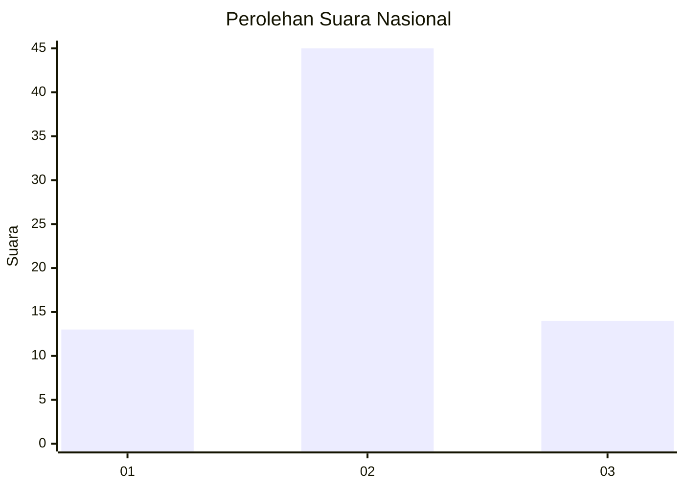
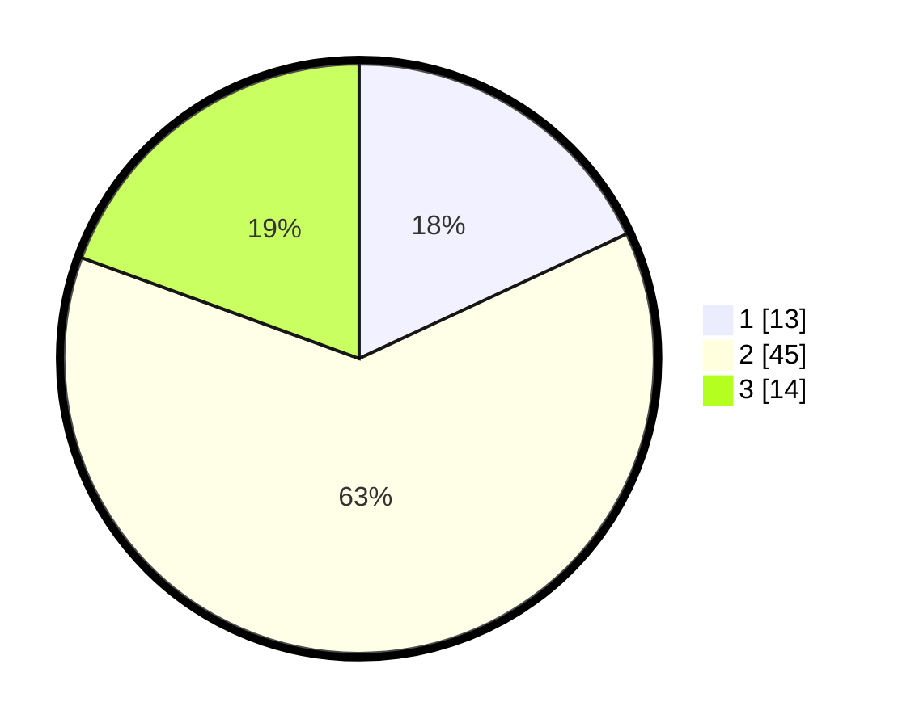

# Hasil

## Grafik

## Tabel

| No. | Nama Paslon    | Suara | Suara (raw) | Persentase |
|:--- |:-------------- | -----:| -----------:| ----------:|
| 1   | ANIES MUHAIMIN | 13    | [13][p-1]   | 18,06      |
| 2   | PRABOWO GIBRAN | 45    | [45][p-2]   | 62,50      |
| 3   | GANJAR MAHFUD  | 14    | [14][p-3]   | 19,44      |

[p-1]: https://github.com/gigit-pemilu/pemilu-2024/blob/main/pilpres/hitung-suara/sub/16-sumatera-selatan/sub/11-empat-lawang/sub/05-lintang-kanan/sub/2016-lubuk-tapang/sub/003-tps/sub/paslon-1.txt
[p-2]: https://github.com/gigit-pemilu/pemilu-2024/blob/main/pilpres/hitung-suara/sub/16-sumatera-selatan/sub/11-empat-lawang/sub/05-lintang-kanan/sub/2016-lubuk-tapang/sub/003-tps/sub/paslon-2.txt
[p-3]: https://github.com/gigit-pemilu/pemilu-2024/blob/main/pilpres/hitung-suara/sub/16-sumatera-selatan/sub/11-empat-lawang/sub/05-lintang-kanan/sub/2016-lubuk-tapang/sub/003-tps/sub/paslon-3.txt

## Foto C Plano

https://sirekap-obj-formc.kpu.go.id/371c/pemilu/ppwp/16/11/05/20/16/1611052016003-20240219-152244--2eb8e5f7-4b82-4505-8d5c-c108ab076fca.jpg

https://sirekap-obj-formc.kpu.go.id/371c/pemilu/ppwp/16/11/05/20/16/1611052016003-20240219-152316--b5205c15-ed3a-454a-975e-725075622d72.jpg

https://sirekap-obj-formc.kpu.go.id/371c/pemilu/ppwp/16/11/05/20/16/1611052016003-20240219-152349--4e61e62a-cebc-4d7c-9534-edd7eb4761fc.jpg

## Metadata

| Key        | Value               |
| ---------- | ------------------- |
| Time Stamp | 2024-02-24 22:31:28 |

