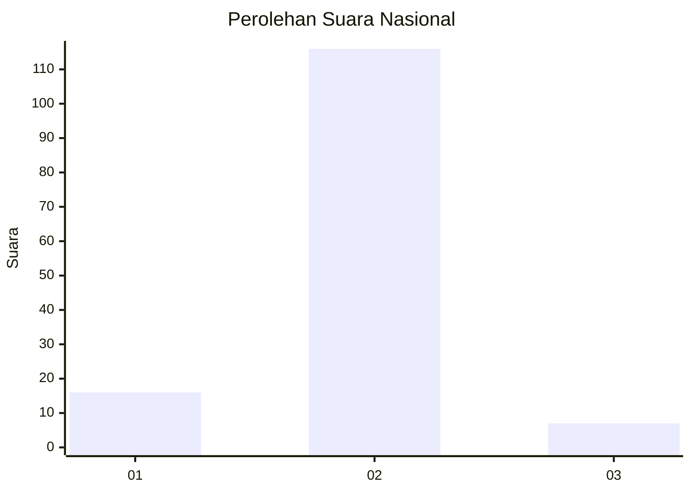
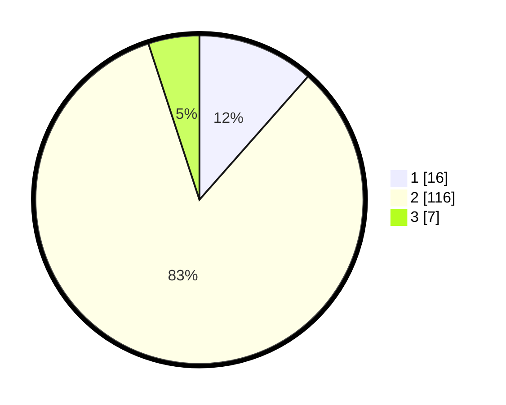

# Hasil

## Grafik

## Tabel

| No. | Nama Paslon    | Suara | Suara (raw) | Persentase |
|:--- |:-------------- | -----:| -----------:| ----------:|
| 1   | ANIES MUHAIMIN | 16    | [16][p-1]   | 11,51      |
| 2   | PRABOWO GIBRAN | 116   | [116][p-2]  | 83,45      |
| 3   | GANJAR MAHFUD  | 7     | [7][p-3]    | 5,04       |

[p-1]: https://github.com/gigit-pemilu/pemilu-2024/blob/main/pilpres/hitung-suara/sub/16-sumatera-selatan/sub/11-empat-lawang/sub/06-talang-padang/sub/2009-kembahang-baru/sub/003-tps/sub/paslon-1.txt
[p-2]: https://github.com/gigit-pemilu/pemilu-2024/blob/main/pilpres/hitung-suara/sub/16-sumatera-selatan/sub/11-empat-lawang/sub/06-talang-padang/sub/2009-kembahang-baru/sub/003-tps/sub/paslon-2.txt
[p-3]: https://github.com/gigit-pemilu/pemilu-2024/blob/main/pilpres/hitung-suara/sub/16-sumatera-selatan/sub/11-empat-lawang/sub/06-talang-padang/sub/2009-kembahang-baru/sub/003-tps/sub/paslon-3.txt

## Foto C Plano

https://sirekap-obj-formc.kpu.go.id/d75d/pemilu/ppwp/16/11/06/20/09/1611062009003-20240215-042028--a70e93af-c482-4295-8020-a2b9ab4b95a5.jpg

https://sirekap-obj-formc.kpu.go.id/d75d/pemilu/ppwp/16/11/06/20/09/1611062009003-20240215-085300--890da80a-3ec8-496c-94ff-fb9cfdfb5047.jpg

https://sirekap-obj-formc.kpu.go.id/d75d/pemilu/ppwp/16/11/06/20/09/1611062009003-20240214-202029--bb0b4bd0-7d3f-46fe-b3c2-c0b00d6cf06c.jpg

## Metadata

| Key        | Value               |
| ---------- | ------------------- |
| Time Stamp | 2024-02-24 22:31:28 |

