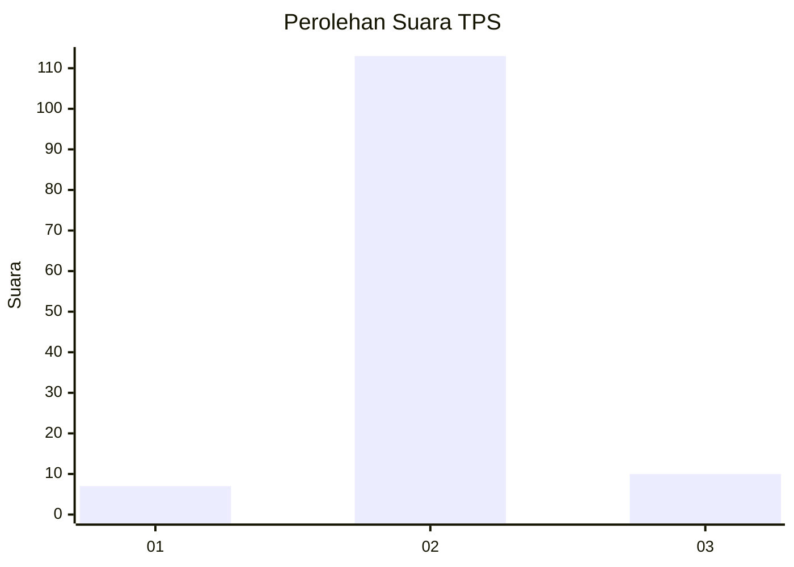
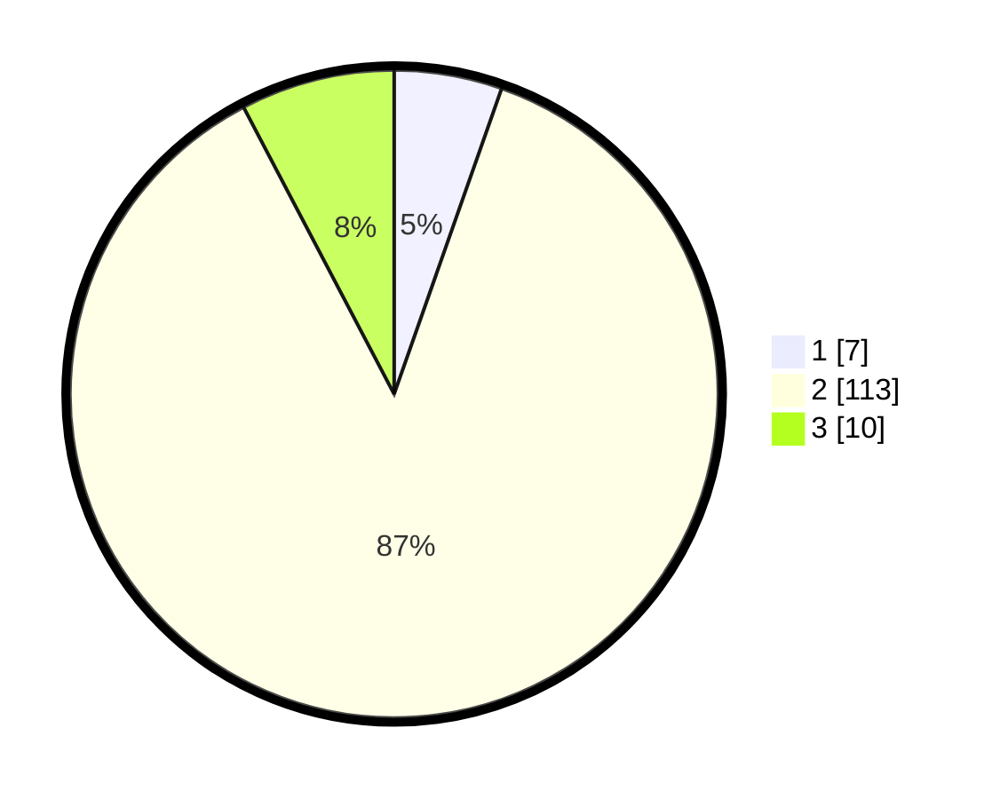

# Hasil

## Grafik

## Tabel

| No. | Nama Paslon    | Suara | Suara (raw) | Persentase |
|:--- |:-------------- | -----:| -----------:| ----------:|
| 1   | ANIES MUHAIMIN | 7     | [7][p-1]    | 5,38       |
| 2   | PRABOWO GIBRAN | 113   | [113][p-2]  | 86,92      |
| 3   | GANJAR MAHFUD  | 10    | [10][p-3]   | 7,69       |

[p-1]: https://github.com/gigit-pemilu/pemilu-2024-16-sumatera-selatan/blob/main/pilpres/hitung-suara/sub/16-sumatera-selatan/sub/11-empat-lawang/sub/06-talang-padang/sub/2010-canggu/sub/002-tps/sub/paslon-1.txt
[p-2]: https://github.com/gigit-pemilu/pemilu-2024-16-sumatera-selatan/blob/main/pilpres/hitung-suara/sub/16-sumatera-selatan/sub/11-empat-lawang/sub/06-talang-padang/sub/2010-canggu/sub/002-tps/sub/paslon-2.txt
[p-3]: https://github.com/gigit-pemilu/pemilu-2024-16-sumatera-selatan/blob/main/pilpres/hitung-suara/sub/16-sumatera-selatan/sub/11-empat-lawang/sub/06-talang-padang/sub/2010-canggu/sub/002-tps/sub/paslon-3.txt

## Foto C Plano

https://sirekap-obj-formc.kpu.go.id/3953/pemilu/ppwp/16/11/06/20/10/1611062010002-20240215-043227--7be7022e-1fe5-4bec-827a-e625ef23892d.jpg

https://sirekap-obj-formc.kpu.go.id/3953/pemilu/ppwp/16/11/06/20/10/1611062010002-20240215-043441--c2b9bf81-5948-4900-aa66-6c31f2d55cf5.jpg

https://sirekap-obj-formc.kpu.go.id/3953/pemilu/ppwp/16/11/06/20/10/1611062010002-20240215-043620--002ca41c-ebaa-4659-a4bb-25485dc3c0d3.jpg

## Metadata

| Key        | Value               |
| ---------- | ------------------- |
| Time Stamp | 2024-02-25 15:00:00 |

