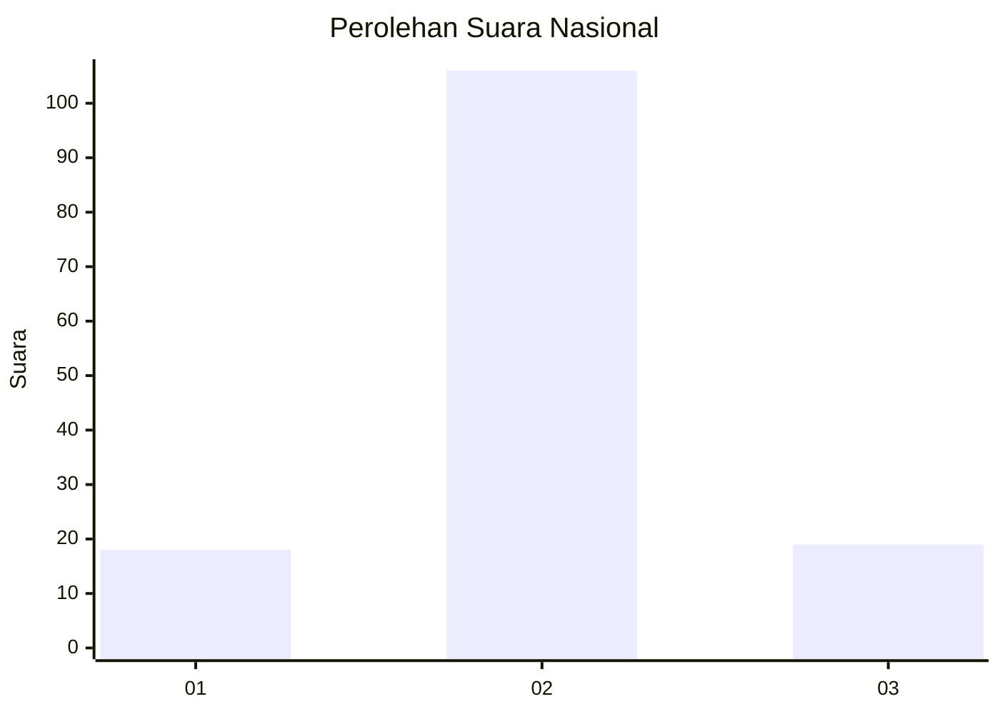
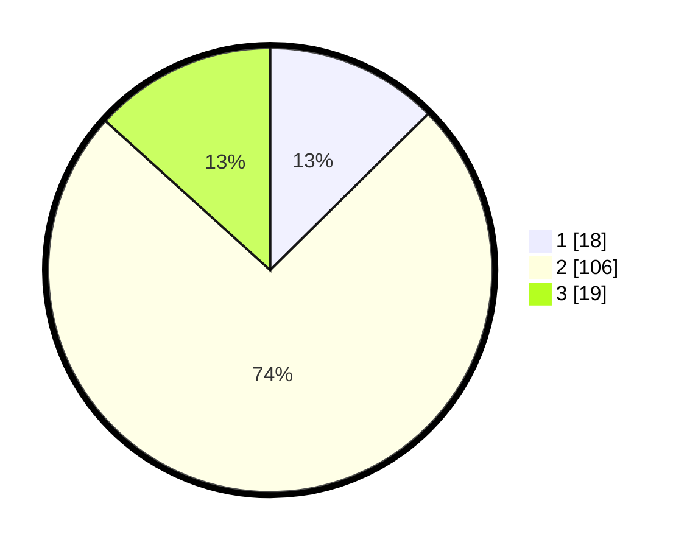

# Hasil

## Grafik

## Tabel

| No. | Nama Paslon    | Suara | Suara (raw) | Persentase |
|:--- |:-------------- | -----:| -----------:| ----------:|
| 1   | ANIES MUHAIMIN | 18    | [18][p-1]   | 12,59      |
| 2   | PRABOWO GIBRAN | 106   | [106][p-2]  | 74,13      |
| 3   | GANJAR MAHFUD  | 19    | [19][p-3]   | 13,29      |

[p-1]: https://github.com/gigit-pemilu/pemilu-2024/blob/main/pilpres/hitung-suara/sub/16-sumatera-selatan/sub/11-empat-lawang/sub/06-talang-padang/sub/2013-lampar-baru/sub/002-tps/sub/paslon-1.txt
[p-2]: https://github.com/gigit-pemilu/pemilu-2024/blob/main/pilpres/hitung-suara/sub/16-sumatera-selatan/sub/11-empat-lawang/sub/06-talang-padang/sub/2013-lampar-baru/sub/002-tps/sub/paslon-2.txt
[p-3]: https://github.com/gigit-pemilu/pemilu-2024/blob/main/pilpres/hitung-suara/sub/16-sumatera-selatan/sub/11-empat-lawang/sub/06-talang-padang/sub/2013-lampar-baru/sub/002-tps/sub/paslon-3.txt

## Foto C Plano

https://sirekap-obj-formc.kpu.go.id/41d5/pemilu/ppwp/16/11/06/20/13/1611062013002-20240214-215623--74033467-5d1f-4ed2-be37-a9729225beba.jpg

https://sirekap-obj-formc.kpu.go.id/41d5/pemilu/ppwp/16/11/06/20/13/1611062013002-20240214-215704--8079f62a-462b-4e32-85dc-94bb9a72d6af.jpg

https://sirekap-obj-formc.kpu.go.id/41d5/pemilu/ppwp/16/11/06/20/13/1611062013002-20240214-215639--347ed350-3ed7-462d-80e1-e3a50182b12e.jpg

## Metadata

| Key        | Value               |
| ---------- | ------------------- |
| Time Stamp | 2024-02-15 15:00:29 |

