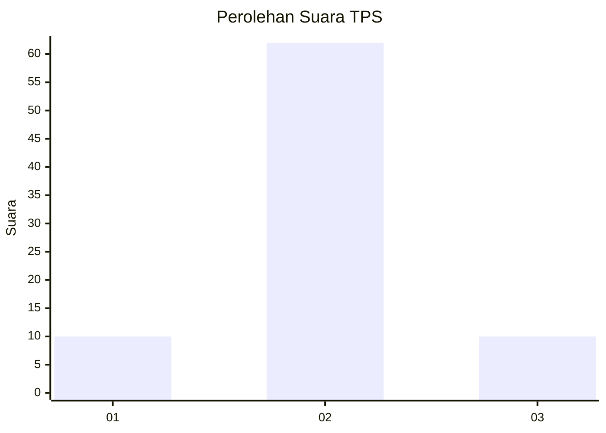
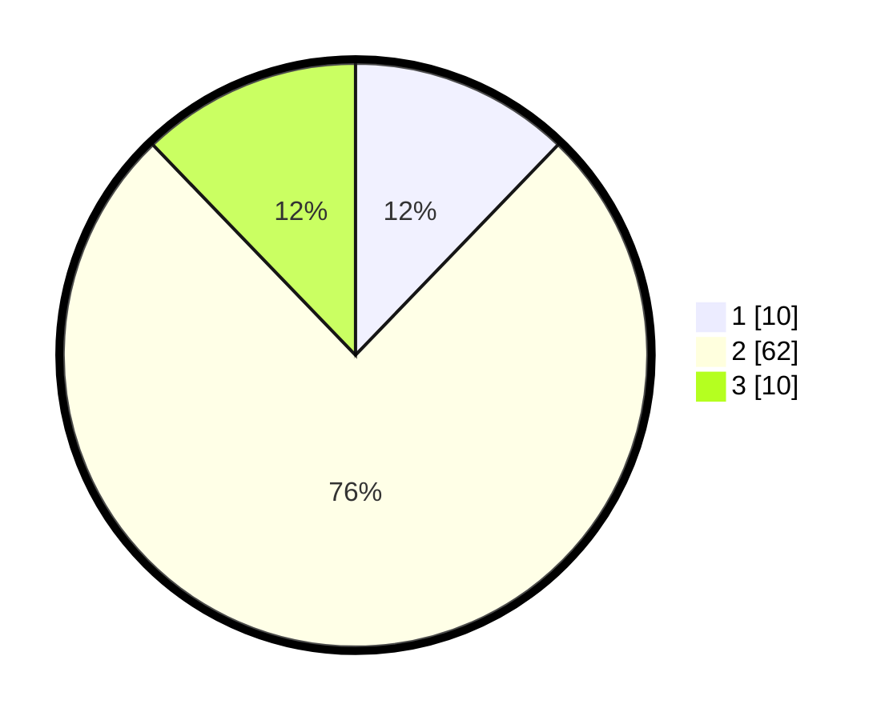

# Hasil

## Grafik

## Tabel

| No. | Nama Paslon    | Suara | Suara (raw) | Persentase |
|:--- |:-------------- | -----:| -----------:| ----------:|
| 1   | ANIES MUHAIMIN | 10    | [10][p-1]   | 12,20      |
| 2   | PRABOWO GIBRAN | 62    | [62][p-2]   | 75,61      |
| 3   | GANJAR MAHFUD  | 10    | [10][p-3]   | 12,20      |

[p-1]: https://github.com/gigit-pemilu/pemilu-2024-16-sumatera-selatan/blob/main/pilpres/hitung-suara/sub/16-sumatera-selatan/sub/11-empat-lawang/sub/06-talang-padang/sub/2013-lampar-baru/sub/007-tps/sub/paslon-1.txt
[p-2]: https://github.com/gigit-pemilu/pemilu-2024-16-sumatera-selatan/blob/main/pilpres/hitung-suara/sub/16-sumatera-selatan/sub/11-empat-lawang/sub/06-talang-padang/sub/2013-lampar-baru/sub/007-tps/sub/paslon-2.txt
[p-3]: https://github.com/gigit-pemilu/pemilu-2024-16-sumatera-selatan/blob/main/pilpres/hitung-suara/sub/16-sumatera-selatan/sub/11-empat-lawang/sub/06-talang-padang/sub/2013-lampar-baru/sub/007-tps/sub/paslon-3.txt

## Foto C Plano

https://sirekap-obj-formc.kpu.go.id/4dd6/pemilu/ppwp/16/11/06/20/13/1611062013007-20240215-074449--24738955-4f8b-497d-98e8-cf282a8210a3.jpg

https://sirekap-obj-formc.kpu.go.id/4dd6/pemilu/ppwp/16/11/06/20/13/1611062013007-20240215-011854--482bd3d0-4ebb-46f4-a78d-2e5829565189.jpg

https://sirekap-obj-formc.kpu.go.id/4dd6/pemilu/ppwp/16/11/06/20/13/1611062013007-20240215-074619--caf1343e-b0b7-4fb6-93f6-cb07eec65874.jpg

## Metadata

| Key        | Value               |
| ---------- | ------------------- |
| Time Stamp | 2024-02-25 21:00:00 |

