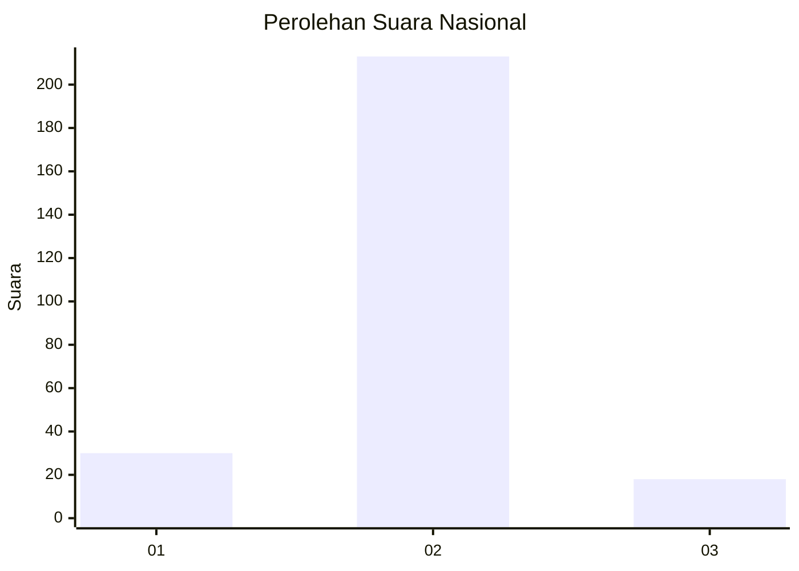
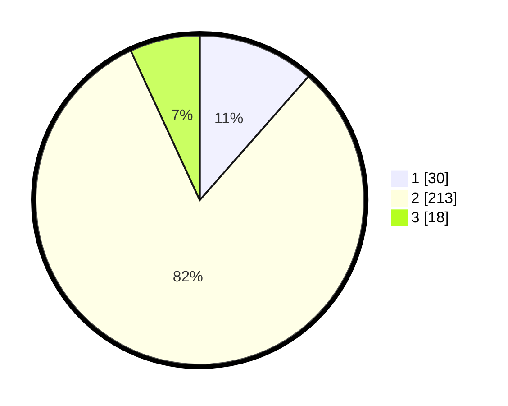

# Hasil

## Grafik

## Tabel

| No. | Nama Paslon    | Suara | Suara (raw) | Persentase |
|:--- |:-------------- | -----:| -----------:| ----------:|
| 1   | ANIES MUHAIMIN | 30    | [30][p-1]   | 11,49      |
| 2   | PRABOWO GIBRAN | 213   | [213][p-2]  | 81,61      |
| 3   | GANJAR MAHFUD  | 18    | [18][p-3]   | 6,90       |

[p-1]: https://github.com/gigit-pemilu/pemilu-2024/blob/main/pilpres/hitung-suara/sub/16-sumatera-selatan/sub/11-empat-lawang/sub/07-pasemah-air-keruh/sub/2001-talang-padang/sub/001-tps/sub/paslon-1.txt
[p-2]: https://github.com/gigit-pemilu/pemilu-2024/blob/main/pilpres/hitung-suara/sub/16-sumatera-selatan/sub/11-empat-lawang/sub/07-pasemah-air-keruh/sub/2001-talang-padang/sub/001-tps/sub/paslon-2.txt
[p-3]: https://github.com/gigit-pemilu/pemilu-2024/blob/main/pilpres/hitung-suara/sub/16-sumatera-selatan/sub/11-empat-lawang/sub/07-pasemah-air-keruh/sub/2001-talang-padang/sub/001-tps/sub/paslon-3.txt

## Foto C Plano

https://sirekap-obj-formc.kpu.go.id/97ae/pemilu/ppwp/16/11/07/20/01/1611072001001-20240215-073907--8c0ef377-909a-4067-9ce4-2cb8d022e41d.jpg

https://sirekap-obj-formc.kpu.go.id/97ae/pemilu/ppwp/16/11/07/20/01/1611072001001-20240215-074146--1c8f5e58-5633-4e11-a4dd-99adb1218d94.jpg

https://sirekap-obj-formc.kpu.go.id/97ae/pemilu/ppwp/16/11/07/20/01/1611072001001-20240215-074335--18bf7ed2-4046-444d-a666-850c55adf7f1.jpg

## Metadata

| Key        | Value               |
| ---------- | ------------------- |
| Time Stamp | 2024-02-25 20:00:00 |

