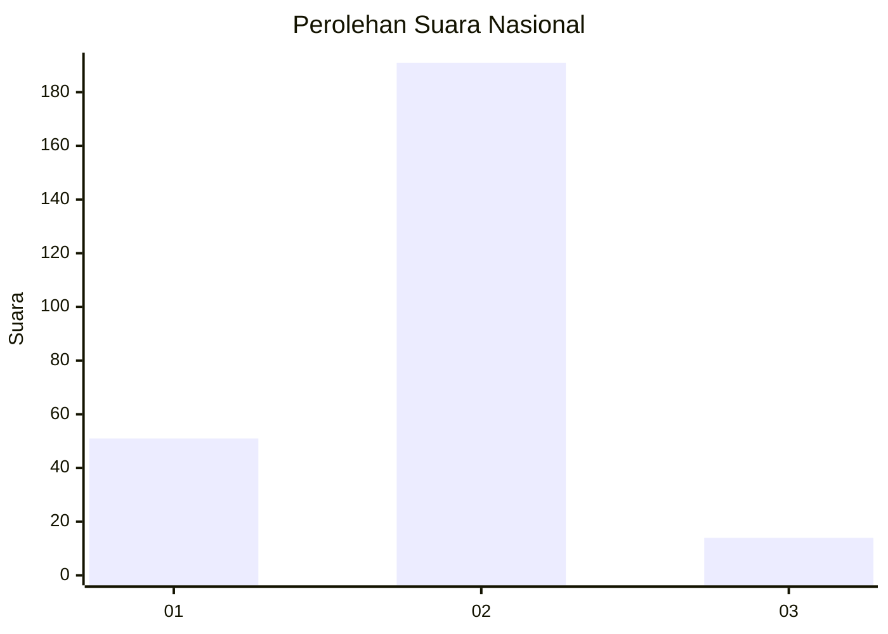
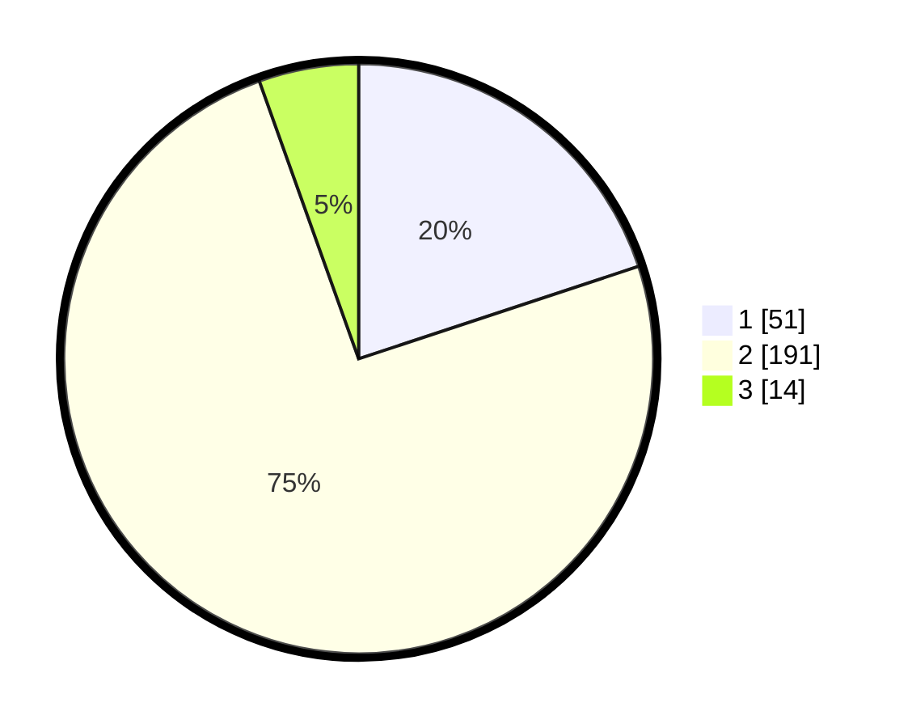

# Hasil

## Grafik

## Tabel

| No. | Nama Paslon    | Suara | Suara (raw) | Persentase |
|:--- |:-------------- | -----:| -----------:| ----------:|
| 1   | ANIES MUHAIMIN | 51    | [51][p-1]   | 19,92      |
| 2   | PRABOWO GIBRAN | 191   | [191][p-2]  | 74,61      |
| 3   | GANJAR MAHFUD  | 14    | [14][p-3]   | 5,47       |

[p-1]: https://github.com/gigit-pemilu/pemilu-2024/blob/main/pilpres/hitung-suara/sub/16-sumatera-selatan/sub/11-empat-lawang/sub/07-pasemah-air-keruh/sub/2001-talang-padang/sub/002-tps/sub/paslon-1.txt
[p-2]: https://github.com/gigit-pemilu/pemilu-2024/blob/main/pilpres/hitung-suara/sub/16-sumatera-selatan/sub/11-empat-lawang/sub/07-pasemah-air-keruh/sub/2001-talang-padang/sub/002-tps/sub/paslon-2.txt
[p-3]: https://github.com/gigit-pemilu/pemilu-2024/blob/main/pilpres/hitung-suara/sub/16-sumatera-selatan/sub/11-empat-lawang/sub/07-pasemah-air-keruh/sub/2001-talang-padang/sub/002-tps/sub/paslon-3.txt

## Foto C Plano

https://sirekap-obj-formc.kpu.go.id/905e/pemilu/ppwp/16/11/07/20/01/1611072001002-20240215-071747--35575ec3-8a9e-4f5b-80e8-14b5ff4e842c.jpg

https://sirekap-obj-formc.kpu.go.id/905e/pemilu/ppwp/16/11/07/20/01/1611072001002-20240215-071849--13444cc5-e906-4b26-8fcb-89aa823ada0d.jpg

https://sirekap-obj-formc.kpu.go.id/905e/pemilu/ppwp/16/11/07/20/01/1611072001002-20240215-071942--6f9044de-a27b-403a-9dff-df23b19e4a84.jpg

## Metadata

| Key        | Value               |
| ---------- | ------------------- |
| Time Stamp | 2024-02-26 12:00:00 |

