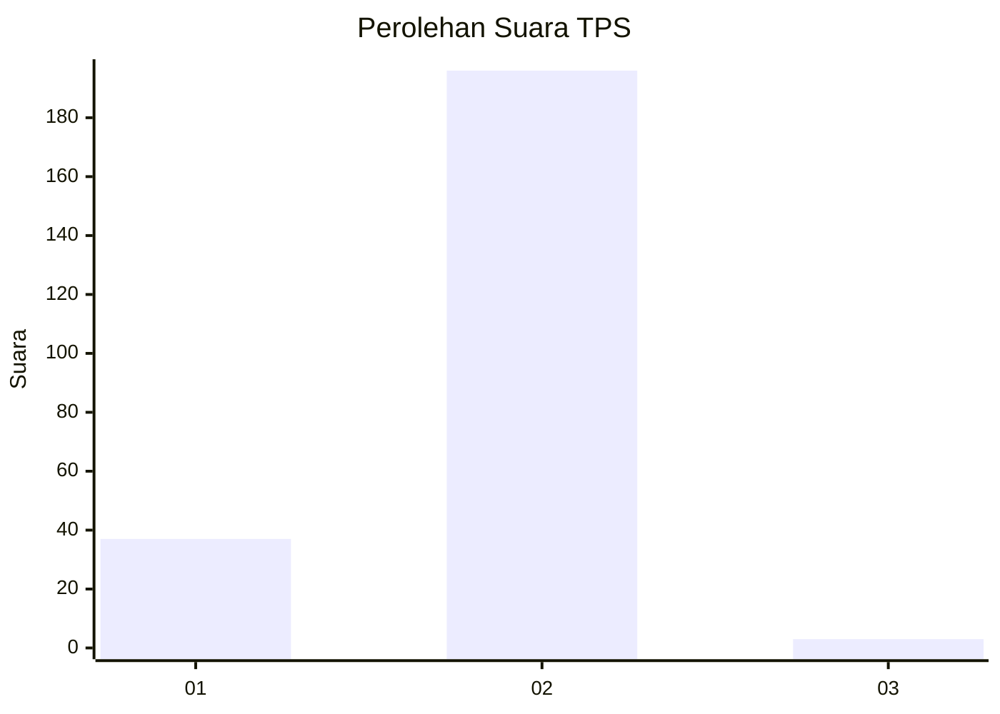
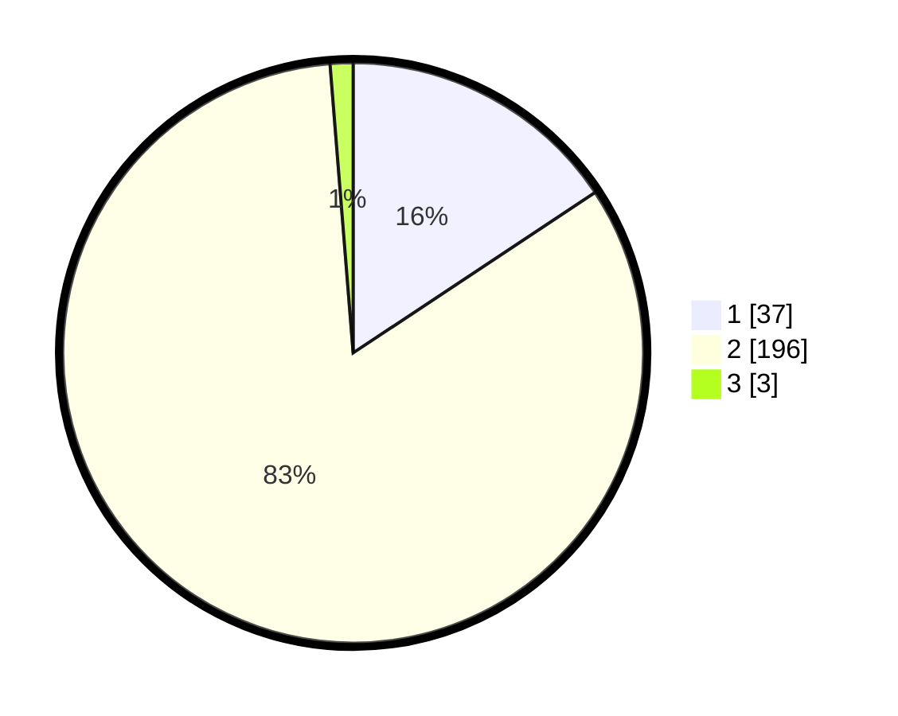

# Hasil

## Grafik

## Tabel

| No. | Nama Paslon    | Suara | Suara (raw) | Persentase |
|:--- |:-------------- | -----:| -----------:| ----------:|
| 1   | ANIES MUHAIMIN | 37    | [37][p-1]   | 15,68      |
| 2   | PRABOWO GIBRAN | 196   | [196][p-2]  | 83,05      |
| 3   | GANJAR MAHFUD  | 3     | [3][p-3]    | 1,27       |

[p-1]: https://github.com/gigit-pemilu/pemilu-2024-16-sumatera-selatan/blob/main/pilpres/hitung-suara/sub/16-sumatera-selatan/sub/11-empat-lawang/sub/07-pasemah-air-keruh/sub/2001-talang-padang/sub/005-tps/sub/paslon-1.txt
[p-2]: https://github.com/gigit-pemilu/pemilu-2024-16-sumatera-selatan/blob/main/pilpres/hitung-suara/sub/16-sumatera-selatan/sub/11-empat-lawang/sub/07-pasemah-air-keruh/sub/2001-talang-padang/sub/005-tps/sub/paslon-2.txt
[p-3]: https://github.com/gigit-pemilu/pemilu-2024-16-sumatera-selatan/blob/main/pilpres/hitung-suara/sub/16-sumatera-selatan/sub/11-empat-lawang/sub/07-pasemah-air-keruh/sub/2001-talang-padang/sub/005-tps/sub/paslon-3.txt

## Foto C Plano

https://sirekap-obj-formc.kpu.go.id/f596/pemilu/ppwp/16/11/07/20/01/1611072001005-20240215-000203--56f3620a-32d0-4faa-a911-0ee44d92595d.jpg

https://sirekap-obj-formc.kpu.go.id/f596/pemilu/ppwp/16/11/07/20/01/1611072001005-20240215-000813--ed9166f2-9abd-4509-abb4-35d8e2da88b8.jpg

https://sirekap-obj-formc.kpu.go.id/f596/pemilu/ppwp/16/11/07/20/01/1611072001005-20240215-091936--4e2ffe70-12ce-4d51-b358-c62d215cdbe0.jpg

## Metadata

| Key        | Value               |
| ---------- | ------------------- |
| Time Stamp | 2024-02-25 14:00:00 |

