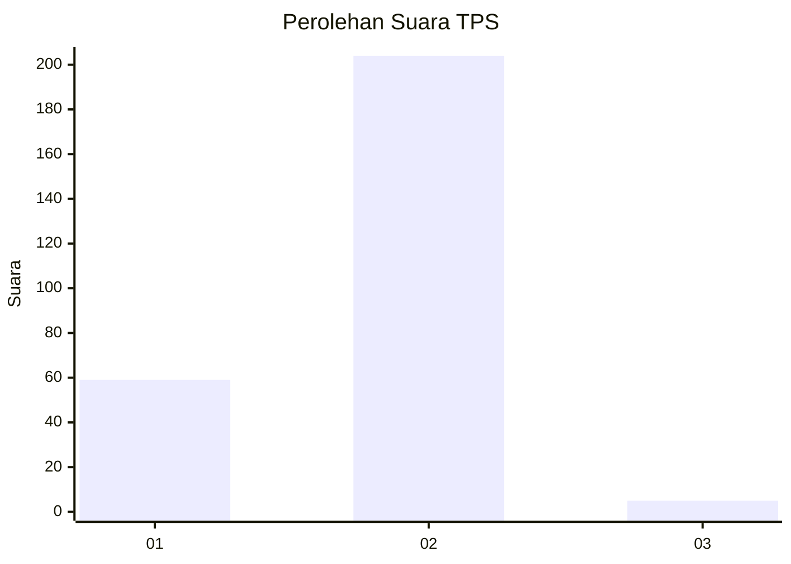
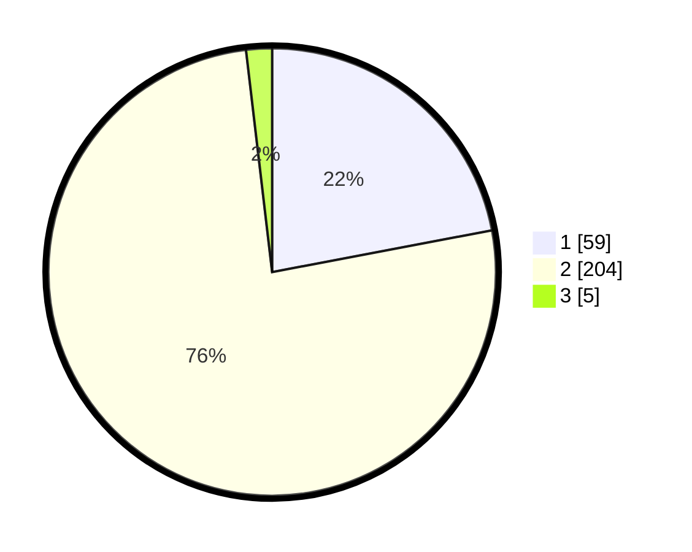

# Hasil

## Grafik

## Tabel

| No. | Nama Paslon    | Suara | Suara (raw) | Persentase |
|:--- |:-------------- | -----:| -----------:| ----------:|
| 1   | ANIES MUHAIMIN | 59    | [59][p-1]   | 22,01      |
| 2   | PRABOWO GIBRAN | 204   | [204][p-2]  | 76,12      |
| 3   | GANJAR MAHFUD  | 5     | [5][p-3]    | 1,87       |

[p-1]: https://github.com/gigit-pemilu/pemilu-2024-16-sumatera-selatan/blob/main/pilpres/hitung-suara/sub/16-sumatera-selatan/sub/11-empat-lawang/sub/07-pasemah-air-keruh/sub/2001-talang-padang/sub/007-tps/sub/paslon-1.txt
[p-2]: https://github.com/gigit-pemilu/pemilu-2024-16-sumatera-selatan/blob/main/pilpres/hitung-suara/sub/16-sumatera-selatan/sub/11-empat-lawang/sub/07-pasemah-air-keruh/sub/2001-talang-padang/sub/007-tps/sub/paslon-2.txt
[p-3]: https://github.com/gigit-pemilu/pemilu-2024-16-sumatera-selatan/blob/main/pilpres/hitung-suara/sub/16-sumatera-selatan/sub/11-empat-lawang/sub/07-pasemah-air-keruh/sub/2001-talang-padang/sub/007-tps/sub/paslon-3.txt

## Foto C Plano

https://sirekap-obj-formc.kpu.go.id/3525/pemilu/ppwp/16/11/07/20/01/1611072001007-20240215-151349--3eaa8d6f-fedf-460e-b11e-1f65b5a491e5.jpg

https://sirekap-obj-formc.kpu.go.id/3525/pemilu/ppwp/16/11/07/20/01/1611072001007-20240215-151408--1f88607f-cd6c-4bcf-bb14-387f362e8972.jpg

https://sirekap-obj-formc.kpu.go.id/3525/pemilu/ppwp/16/11/07/20/01/1611072001007-20240215-151424--ce40fbb9-ca86-496a-b899-7e1f7b0a64b5.jpg

## Metadata

| Key        | Value               |
| ---------- | ------------------- |
| Time Stamp | 2024-02-25 13:00:00 |

