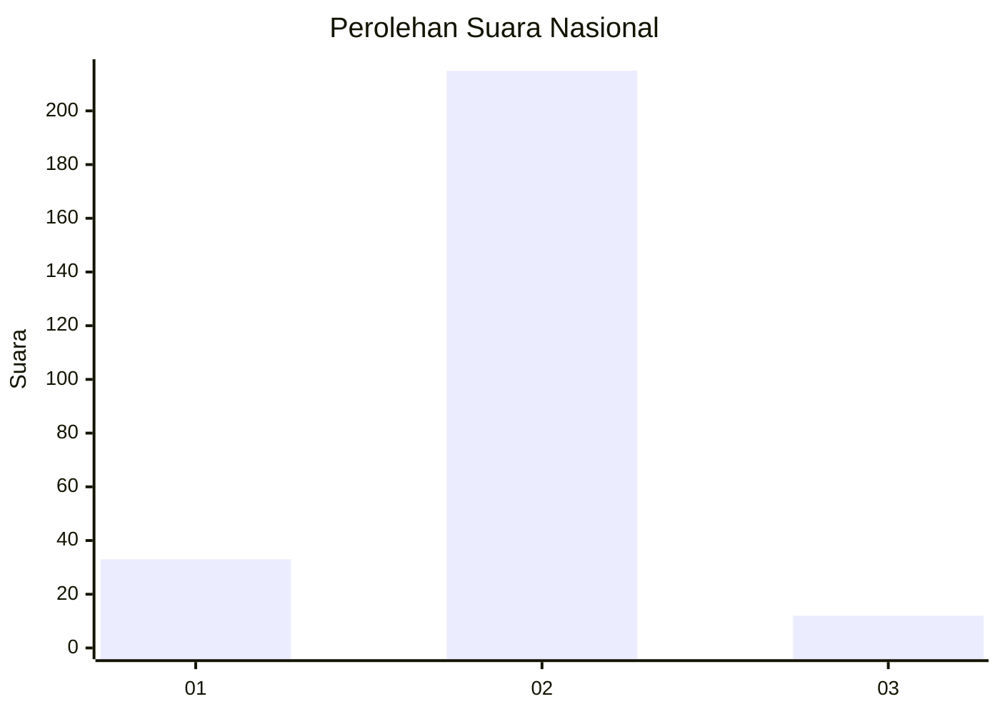
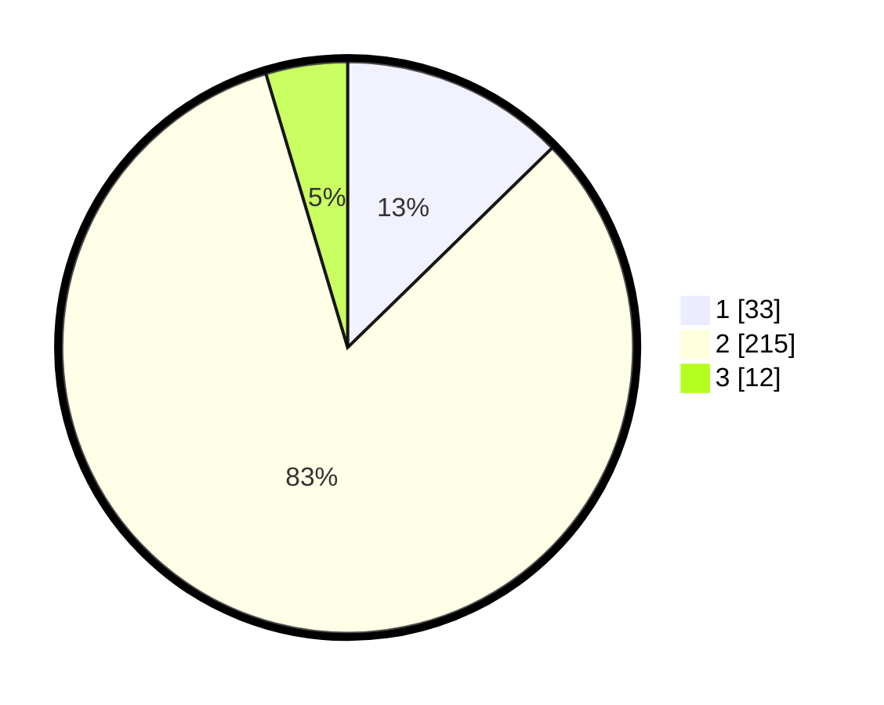

# Hasil

## Grafik

## Tabel

| No. | Nama Paslon    | Suara | Suara (raw) | Persentase |
|:--- |:-------------- | -----:| -----------:| ----------:|
| 1   | ANIES MUHAIMIN | 33    | [33][p-1]   | 12,69      |
| 2   | PRABOWO GIBRAN | 215   | [215][p-2]  | 82,69      |
| 3   | GANJAR MAHFUD  | 12    | [12][p-3]   | 4,62       |

[p-1]: https://github.com/gigit-pemilu/pemilu-2024/blob/main/pilpres/hitung-suara/sub/16-sumatera-selatan/sub/11-empat-lawang/sub/07-pasemah-air-keruh/sub/2002-tanjung-beringin/sub/002-tps/sub/paslon-1.txt
[p-2]: https://github.com/gigit-pemilu/pemilu-2024/blob/main/pilpres/hitung-suara/sub/16-sumatera-selatan/sub/11-empat-lawang/sub/07-pasemah-air-keruh/sub/2002-tanjung-beringin/sub/002-tps/sub/paslon-2.txt
[p-3]: https://github.com/gigit-pemilu/pemilu-2024/blob/main/pilpres/hitung-suara/sub/16-sumatera-selatan/sub/11-empat-lawang/sub/07-pasemah-air-keruh/sub/2002-tanjung-beringin/sub/002-tps/sub/paslon-3.txt

## Foto C Plano

https://sirekap-obj-formc.kpu.go.id/5175/pemilu/ppwp/16/11/07/20/02/1611072002002-20240215-072805--81ed5177-bedd-4692-b013-fb9d4c498d2d.jpg

https://sirekap-obj-formc.kpu.go.id/5175/pemilu/ppwp/16/11/07/20/02/1611072002002-20240215-073146--a15dbcda-10e4-4edb-9755-d7d043c6a5d9.jpg

https://sirekap-obj-formc.kpu.go.id/5175/pemilu/ppwp/16/11/07/20/02/1611072002002-20240215-073330--29a18dc9-61e6-4791-9ee1-d59fe2ec7ea3.jpg

## Metadata

| Key        | Value               |
| ---------- | ------------------- |
| Time Stamp | 2024-02-24 22:31:28 |

