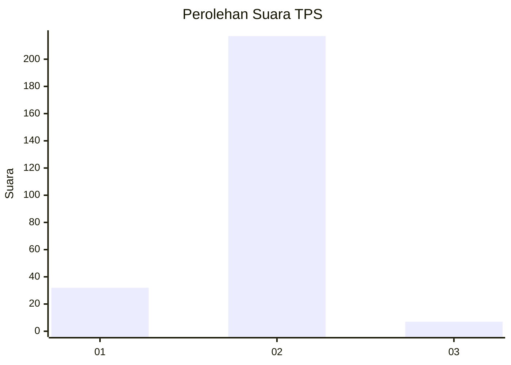
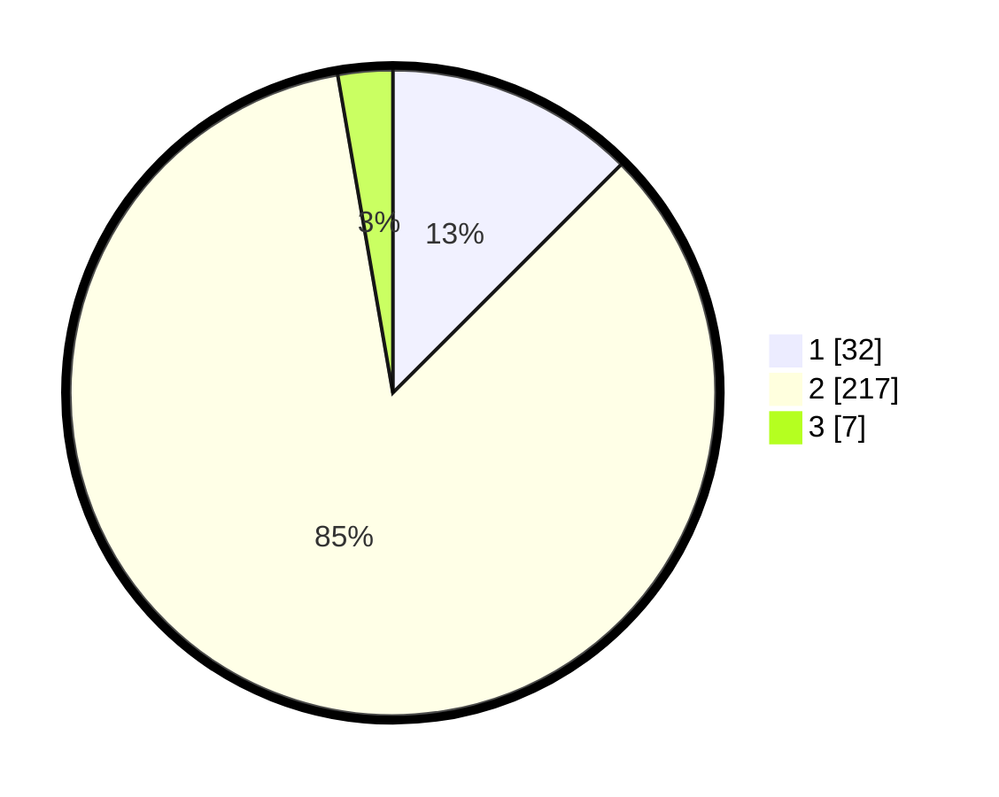

# Hasil

## Grafik

## Tabel

| No. | Nama Paslon    | Suara | Suara (raw) | Persentase |
|:--- |:-------------- | -----:| -----------:| ----------:|
| 1   | ANIES MUHAIMIN | 32    | [32][p-1]   | 12,50      |
| 2   | PRABOWO GIBRAN | 217   | [217][p-2]  | 84,77      |
| 3   | GANJAR MAHFUD  | 7     | [7][p-3]    | 2,73       |

[p-1]: https://github.com/gigit-pemilu/pemilu-2024-16-sumatera-selatan/blob/main/pilpres/hitung-suara/sub/16-sumatera-selatan/sub/11-empat-lawang/sub/07-pasemah-air-keruh/sub/2002-tanjung-beringin/sub/004-tps/sub/paslon-1.txt
[p-2]: https://github.com/gigit-pemilu/pemilu-2024-16-sumatera-selatan/blob/main/pilpres/hitung-suara/sub/16-sumatera-selatan/sub/11-empat-lawang/sub/07-pasemah-air-keruh/sub/2002-tanjung-beringin/sub/004-tps/sub/paslon-2.txt
[p-3]: https://github.com/gigit-pemilu/pemilu-2024-16-sumatera-selatan/blob/main/pilpres/hitung-suara/sub/16-sumatera-selatan/sub/11-empat-lawang/sub/07-pasemah-air-keruh/sub/2002-tanjung-beringin/sub/004-tps/sub/paslon-3.txt

## Foto C Plano

https://sirekap-obj-formc.kpu.go.id/981e/pemilu/ppwp/16/11/07/20/02/1611072002004-20240215-065511--f1550867-3968-4de0-97a7-42b96babf3c1.jpg

https://sirekap-obj-formc.kpu.go.id/981e/pemilu/ppwp/16/11/07/20/02/1611072002004-20240215-065241--bcd8934e-d30d-4b77-af84-fc69f7b6dd40.jpg

https://sirekap-obj-formc.kpu.go.id/981e/pemilu/ppwp/16/11/07/20/02/1611072002004-20240215-065436--986ad32a-8ea6-4c45-a170-fa64adb2e386.jpg

## Metadata

| Key        | Value               |
| ---------- | ------------------- |
| Time Stamp | 2024-02-24 22:31:28 |

