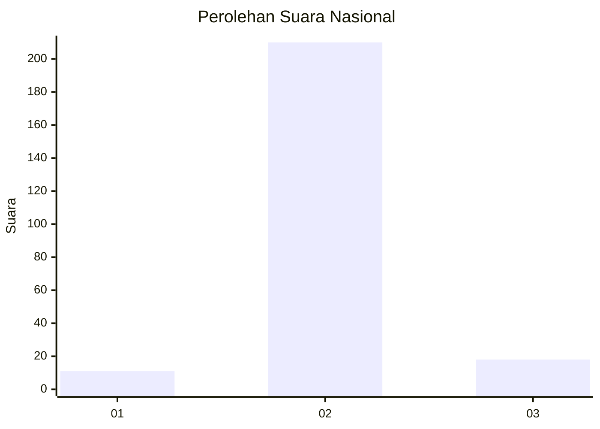
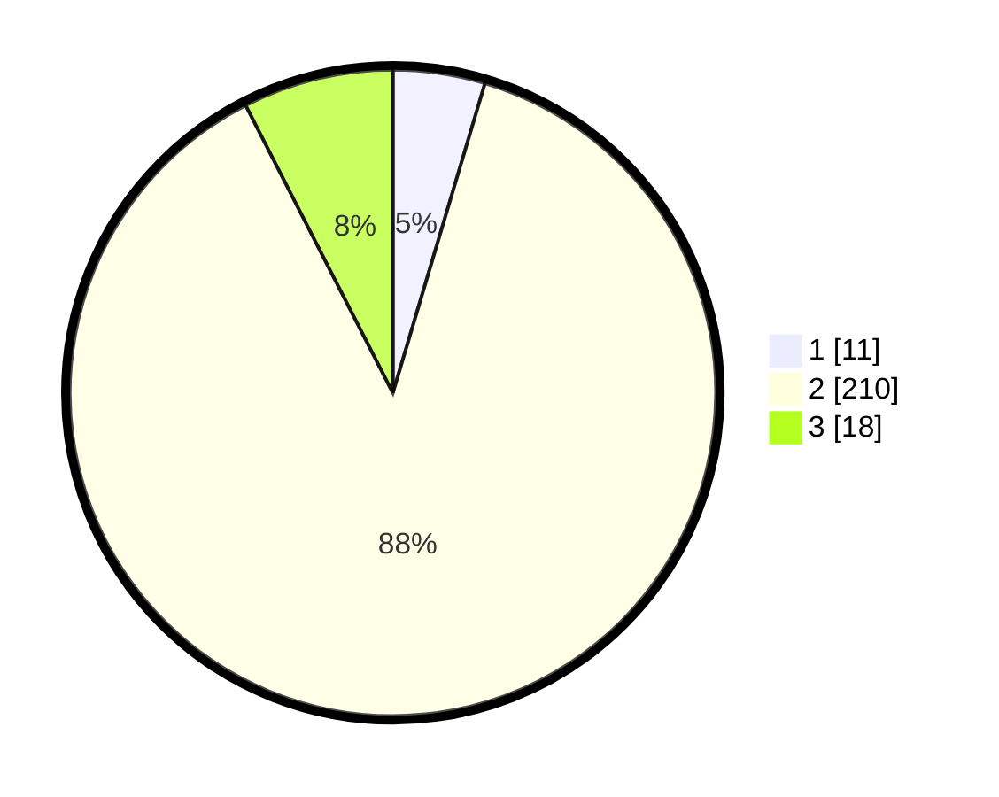

# Hasil

## Grafik

## Tabel

| No. | Nama Paslon    | Suara | Suara (raw) | Persentase |
|:--- |:-------------- | -----:| -----------:| ----------:|
| 1   | ANIES MUHAIMIN | 11    | [11][p-1]   | 4,60       |
| 2   | PRABOWO GIBRAN | 210   | [210][p-2]  | 87,87      |
| 3   | GANJAR MAHFUD  | 18    | [18][p-3]   | 7,53       |

[p-1]: https://github.com/gigit-pemilu/pemilu-2024/blob/main/pilpres/hitung-suara/sub/16-sumatera-selatan/sub/11-empat-lawang/sub/07-pasemah-air-keruh/sub/2010-air-mayam/sub/001-tps/sub/paslon-1.txt
[p-2]: https://github.com/gigit-pemilu/pemilu-2024/blob/main/pilpres/hitung-suara/sub/16-sumatera-selatan/sub/11-empat-lawang/sub/07-pasemah-air-keruh/sub/2010-air-mayam/sub/001-tps/sub/paslon-2.txt
[p-3]: https://github.com/gigit-pemilu/pemilu-2024/blob/main/pilpres/hitung-suara/sub/16-sumatera-selatan/sub/11-empat-lawang/sub/07-pasemah-air-keruh/sub/2010-air-mayam/sub/001-tps/sub/paslon-3.txt

## Foto C Plano

https://sirekap-obj-formc.kpu.go.id/af6f/pemilu/ppwp/16/11/07/20/10/1611072010001-20240215-121101--faf1ff8d-c156-4ba4-96ac-a64f82ebc9a2.jpg

https://sirekap-obj-formc.kpu.go.id/af6f/pemilu/ppwp/16/11/07/20/10/1611072010001-20240215-121202--af10fb39-5db4-4144-9164-d18c3ef8ab8c.jpg

https://sirekap-obj-formc.kpu.go.id/af6f/pemilu/ppwp/16/11/07/20/10/1611072010001-20240215-121236--c99d99ee-60f1-4983-bc05-0232d3c295a5.jpg

## Metadata

| Key        | Value               |
| ---------- | ------------------- |
| Time Stamp | 2024-02-25 14:00:00 |

