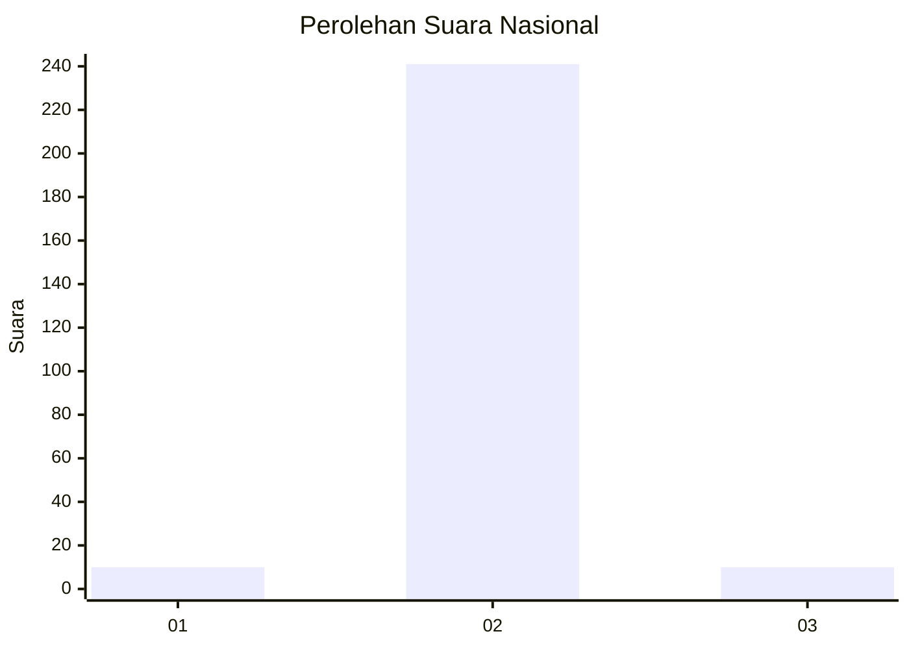
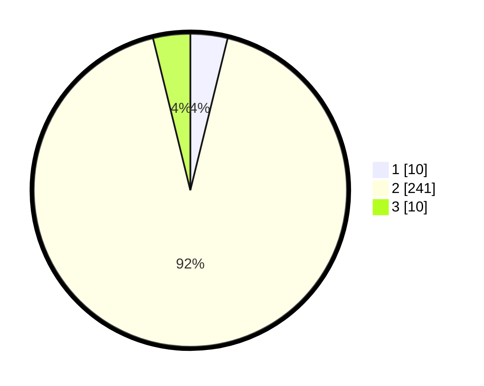

# Hasil

## Grafik

## Tabel

| No. | Nama Paslon    | Suara | Suara (raw) | Persentase |
|:--- |:-------------- | -----:| -----------:| ----------:|
| 1   | ANIES MUHAIMIN | 10    | [10][p-1]   | 3,83       |
| 2   | PRABOWO GIBRAN | 241   | [241][p-2]  | 92,34      |
| 3   | GANJAR MAHFUD  | 10    | [10][p-3]   | 3,83       |

[p-1]: https://github.com/gigit-pemilu/pemilu-2024/blob/main/pilpres/hitung-suara/sub/16-sumatera-selatan/sub/11-empat-lawang/sub/07-pasemah-air-keruh/sub/2010-air-mayam/sub/004-tps/sub/paslon-1.txt
[p-2]: https://github.com/gigit-pemilu/pemilu-2024/blob/main/pilpres/hitung-suara/sub/16-sumatera-selatan/sub/11-empat-lawang/sub/07-pasemah-air-keruh/sub/2010-air-mayam/sub/004-tps/sub/paslon-2.txt
[p-3]: https://github.com/gigit-pemilu/pemilu-2024/blob/main/pilpres/hitung-suara/sub/16-sumatera-selatan/sub/11-empat-lawang/sub/07-pasemah-air-keruh/sub/2010-air-mayam/sub/004-tps/sub/paslon-3.txt

## Foto C Plano

https://sirekap-obj-formc.kpu.go.id/8c95/pemilu/ppwp/16/11/07/20/10/1611072010004-20240215-010021--528358af-4318-429d-9543-8d7d5690d368.jpg

https://sirekap-obj-formc.kpu.go.id/8c95/pemilu/ppwp/16/11/07/20/10/1611072010004-20240215-010108--10e906c0-f0f5-4350-b579-893fb6f81483.jpg

https://sirekap-obj-formc.kpu.go.id/8c95/pemilu/ppwp/16/11/07/20/10/1611072010004-20240215-010153--d5d80cbf-4319-48ea-b1f9-00121695f6f3.jpg

## Metadata

| Key        | Value               |
| ---------- | ------------------- |
| Time Stamp | 2024-02-24 22:31:28 |

