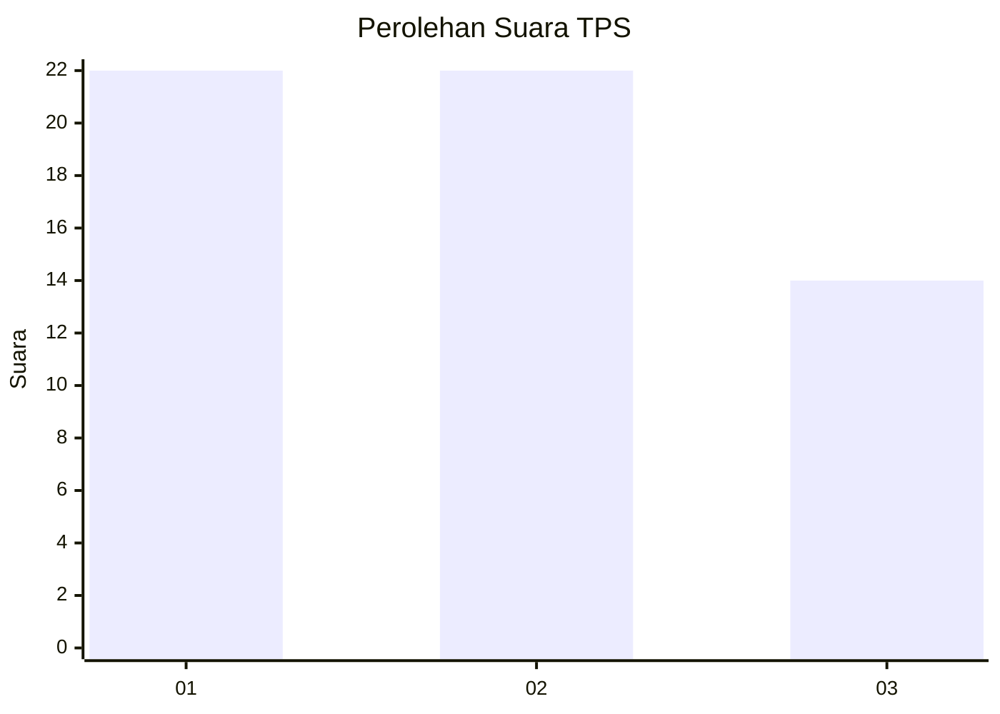
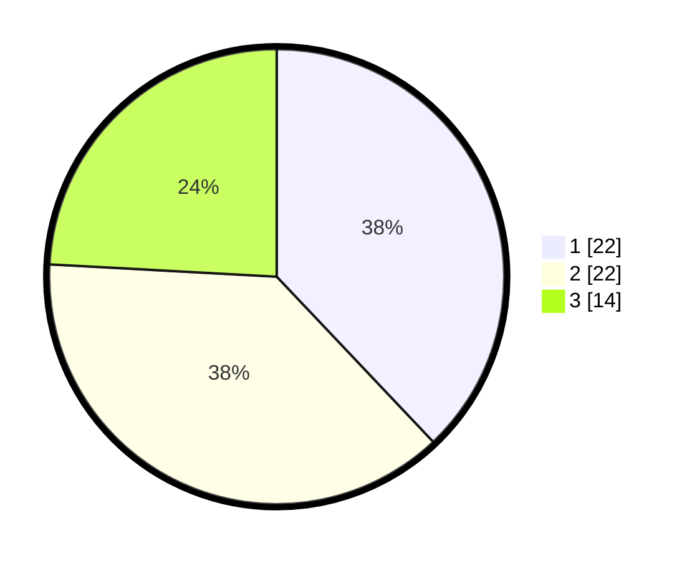

# Hasil

## Grafik

## Tabel

| No. | Nama Paslon    | Suara | Suara (raw) | Persentase |
|:--- |:-------------- | -----:| -----------:| ----------:|
| 1   | ANIES MUHAIMIN | 22    | [22][p-1]   | 37,93      |
| 2   | PRABOWO GIBRAN | 22    | [22][p-2]   | 37,93      |
| 3   | GANJAR MAHFUD  | 14    | [14][p-3]   | 24,14      |

[p-1]: https://github.com/gigit-pemilu/pemilu-2024-16-sumatera-selatan/blob/main/pilpres/hitung-suara/sub/16-sumatera-selatan/sub/11-empat-lawang/sub/07-pasemah-air-keruh/sub/2010-air-mayam/sub/008-tps/sub/paslon-1.txt
[p-2]: https://github.com/gigit-pemilu/pemilu-2024-16-sumatera-selatan/blob/main/pilpres/hitung-suara/sub/16-sumatera-selatan/sub/11-empat-lawang/sub/07-pasemah-air-keruh/sub/2010-air-mayam/sub/008-tps/sub/paslon-2.txt
[p-3]: https://github.com/gigit-pemilu/pemilu-2024-16-sumatera-selatan/blob/main/pilpres/hitung-suara/sub/16-sumatera-selatan/sub/11-empat-lawang/sub/07-pasemah-air-keruh/sub/2010-air-mayam/sub/008-tps/sub/paslon-3.txt

## Foto C Plano

https://sirekap-obj-formc.kpu.go.id/fb5e/pemilu/ppwp/16/11/07/20/10/1611072010008-20240214-190043--00550599-f33d-4c96-a249-f88f1b3606b7.jpg

https://sirekap-obj-formc.kpu.go.id/fb5e/pemilu/ppwp/16/11/07/20/10/1611072010008-20240214-190232--b1b4b757-d6da-4f3a-9ff5-b81643b6bec5.jpg

https://sirekap-obj-formc.kpu.go.id/fb5e/pemilu/ppwp/16/11/07/20/10/1611072010008-20240214-190336--976573d6-ae6a-45bd-ad2e-b37aebaaf00e.jpg

## Metadata

| Key        | Value               |
| ---------- | ------------------- |
| Time Stamp | 2024-02-24 22:31:28 |

