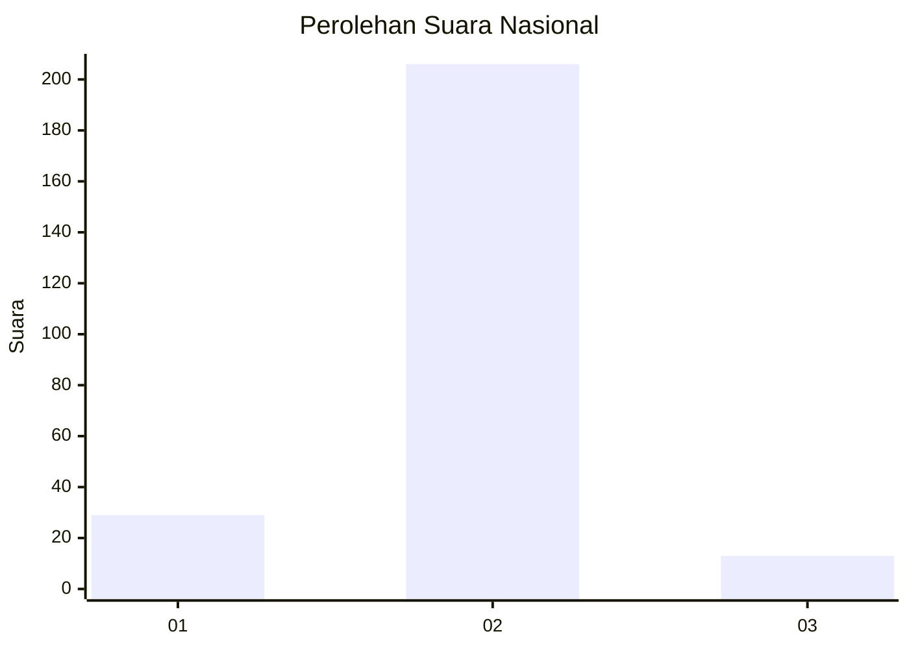
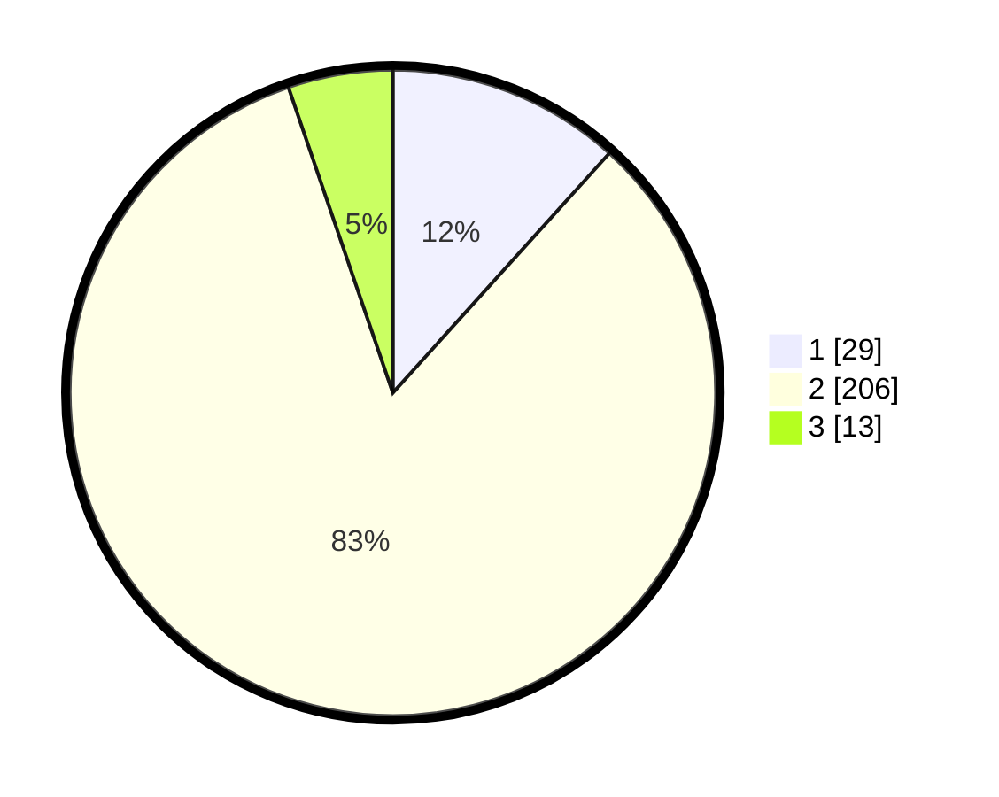

# Hasil

## Grafik

## Tabel

| No. | Nama Paslon    | Suara | Suara (raw) | Persentase |
|:--- |:-------------- | -----:| -----------:| ----------:|
| 1   | ANIES MUHAIMIN | 29    | [29][p-1]   | 11,69      |
| 2   | PRABOWO GIBRAN | 206   | [206][p-2]  | 83,06      |
| 3   | GANJAR MAHFUD  | 13    | [13][p-3]   | 5,24       |

[p-1]: https://github.com/gigit-pemilu/pemilu-2024/blob/main/pilpres/hitung-suara/sub/16-sumatera-selatan/sub/11-empat-lawang/sub/07-pasemah-air-keruh/sub/2012-padang-gelai/sub/001-tps/sub/paslon-1.txt
[p-2]: https://github.com/gigit-pemilu/pemilu-2024/blob/main/pilpres/hitung-suara/sub/16-sumatera-selatan/sub/11-empat-lawang/sub/07-pasemah-air-keruh/sub/2012-padang-gelai/sub/001-tps/sub/paslon-2.txt
[p-3]: https://github.com/gigit-pemilu/pemilu-2024/blob/main/pilpres/hitung-suara/sub/16-sumatera-selatan/sub/11-empat-lawang/sub/07-pasemah-air-keruh/sub/2012-padang-gelai/sub/001-tps/sub/paslon-3.txt

## Foto C Plano

https://sirekap-obj-formc.kpu.go.id/9226/pemilu/ppwp/16/11/07/20/12/1611072012001-20240215-052214--f2a28c06-50c7-42ba-a438-fe675250d387.jpg

https://sirekap-obj-formc.kpu.go.id/9226/pemilu/ppwp/16/11/07/20/12/1611072012001-20240215-052251--0403f50e-6c3e-4fe6-a84b-9f4f980d3f7b.jpg

https://sirekap-obj-formc.kpu.go.id/9226/pemilu/ppwp/16/11/07/20/12/1611072012001-20240215-052304--de033986-9cb4-4126-88bd-d68615cfa488.jpg

## Metadata

| Key        | Value               |
| ---------- | ------------------- |
| Time Stamp | 2024-02-25 21:00:00 |

