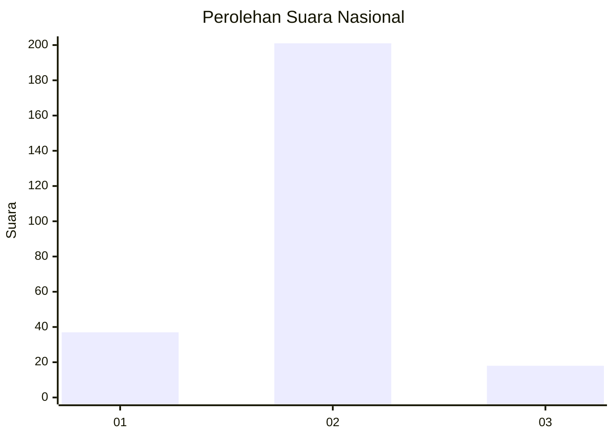
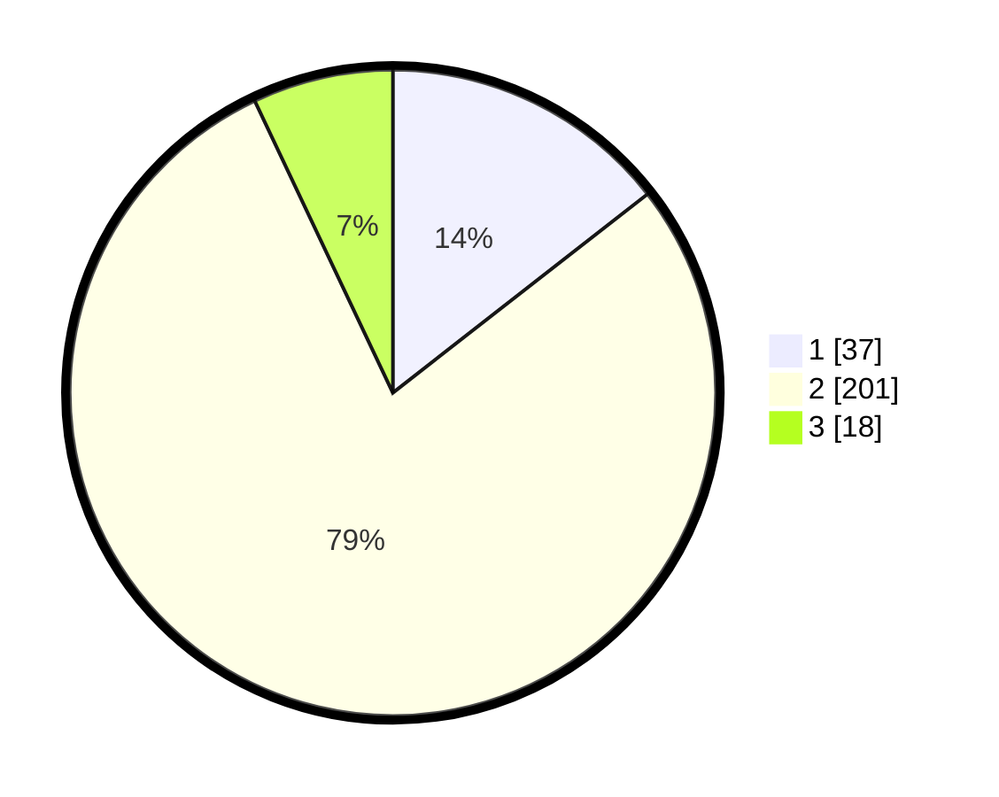

# Hasil

## Grafik

## Tabel

| No. | Nama Paslon    | Suara | Suara (raw) | Persentase |
|:--- |:-------------- | -----:| -----------:| ----------:|
| 1   | ANIES MUHAIMIN | 37    | [37][p-1]   | 14,45      |
| 2   | PRABOWO GIBRAN | 201   | [201][p-2]  | 78,52      |
| 3   | GANJAR MAHFUD  | 18    | [18][p-3]   | 7,03       |

[p-1]: https://github.com/gigit-pemilu/pemilu-2024/blob/main/pilpres/hitung-suara/sub/16-sumatera-selatan/sub/11-empat-lawang/sub/07-pasemah-air-keruh/sub/2015-muara-aman/sub/002-tps/sub/paslon-1.txt
[p-2]: https://github.com/gigit-pemilu/pemilu-2024/blob/main/pilpres/hitung-suara/sub/16-sumatera-selatan/sub/11-empat-lawang/sub/07-pasemah-air-keruh/sub/2015-muara-aman/sub/002-tps/sub/paslon-2.txt
[p-3]: https://github.com/gigit-pemilu/pemilu-2024/blob/main/pilpres/hitung-suara/sub/16-sumatera-selatan/sub/11-empat-lawang/sub/07-pasemah-air-keruh/sub/2015-muara-aman/sub/002-tps/sub/paslon-3.txt

## Foto C Plano

https://sirekap-obj-formc.kpu.go.id/cc8e/pemilu/ppwp/16/11/07/20/15/1611072015002-20240215-141949--29517e4b-3758-47c9-bd0a-03447bca923f.jpg

https://sirekap-obj-formc.kpu.go.id/cc8e/pemilu/ppwp/16/11/07/20/15/1611072015002-20240215-135117--39aacdee-2f49-4013-b52f-f8687f4ae773.jpg

https://sirekap-obj-formc.kpu.go.id/cc8e/pemilu/ppwp/16/11/07/20/15/1611072015002-20240215-140358--cfcda211-7a22-43ab-a9a5-bbd3c5176d5c.jpg

## Metadata

| Key        | Value               |
| ---------- | ------------------- |
| Time Stamp | 2024-02-25 13:00:00 |

