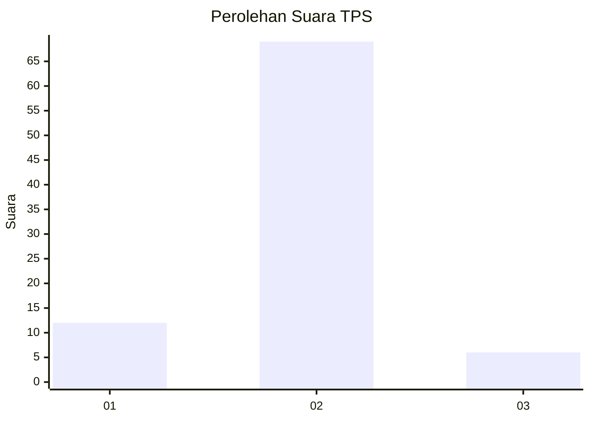
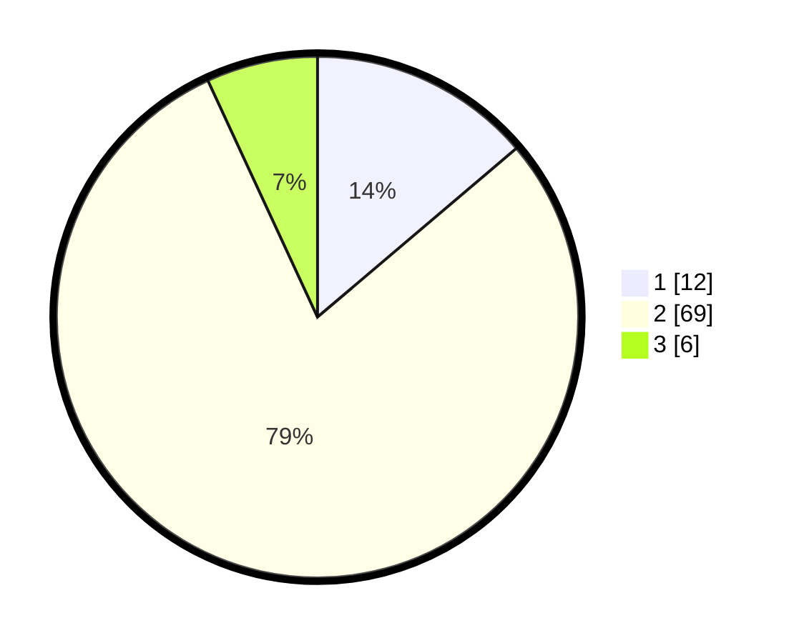

# Hasil

## Grafik

## Tabel

| No. | Nama Paslon    | Suara | Suara (raw) | Persentase |
|:--- |:-------------- | -----:| -----------:| ----------:|
| 1   | ANIES MUHAIMIN | 12    | [12][p-1]   | 13,79      |
| 2   | PRABOWO GIBRAN | 69    | [69][p-2]   | 79,31      |
| 3   | GANJAR MAHFUD  | 6     | [6][p-3]    | 6,90       |

[p-1]: https://github.com/gigit-pemilu/pemilu-2024-16-sumatera-selatan/blob/main/pilpres/hitung-suara/sub/16-sumatera-selatan/sub/11-empat-lawang/sub/09-saling/sub/2001-lubuk-kelumpang/sub/003-tps/sub/paslon-1.txt
[p-2]: https://github.com/gigit-pemilu/pemilu-2024-16-sumatera-selatan/blob/main/pilpres/hitung-suara/sub/16-sumatera-selatan/sub/11-empat-lawang/sub/09-saling/sub/2001-lubuk-kelumpang/sub/003-tps/sub/paslon-2.txt
[p-3]: https://github.com/gigit-pemilu/pemilu-2024-16-sumatera-selatan/blob/main/pilpres/hitung-suara/sub/16-sumatera-selatan/sub/11-empat-lawang/sub/09-saling/sub/2001-lubuk-kelumpang/sub/003-tps/sub/paslon-3.txt

## Foto C Plano

https://sirekap-obj-formc.kpu.go.id/dfe9/pemilu/ppwp/16/11/09/20/01/1611092001003-20240216-140246--23c42dfd-5e1c-4f56-b14f-4f8f7c973baf.jpg

https://sirekap-obj-formc.kpu.go.id/dfe9/pemilu/ppwp/16/11/09/20/01/1611092001003-20240216-140248--7719029b-c583-46ae-86b8-0a6b58726c22.jpg

https://sirekap-obj-formc.kpu.go.id/dfe9/pemilu/ppwp/16/11/09/20/01/1611092001003-20240216-140247--dbcff2b6-cb4d-4dbc-b8e0-39c9f58bc65e.jpg

## Metadata

| Key        | Value               |
| ---------- | ------------------- |
| Time Stamp | 2024-02-16 21:01:00 |

## DATA PEMILIH TETAP

Jumlah pemilih dalam DPT: **255**.
 * L: **114**.
 * P: **141**.

## DATA PENGGUNA HAK PILIH

Jumlah pengguna hak pilih dalam DPT: **255**.
 * L: **114**.
 * P: **141**.

Jumlah pengguna hak pilih dalam DPTb: **14**.
 * L: **5**.
 * P: **9**.

Jumlah pengguna hak pilih dalam DPK: **0**.
 * L: **0**.
 * P: **0**.

Jumlah pengguna hak pilih: **269**.
 * L: **119**.
 * P: **150**.

## JUMLAH SUARA SAH DAN TIDAK SAH

JUMLAH SELURUH SUARA SAH: **87**.

JUMLAH SUARA TIDAK SAH: **182**.

JUMLAH SELURUH SUARA SAH DAN SUARA TIDAK SAH: **269**.

