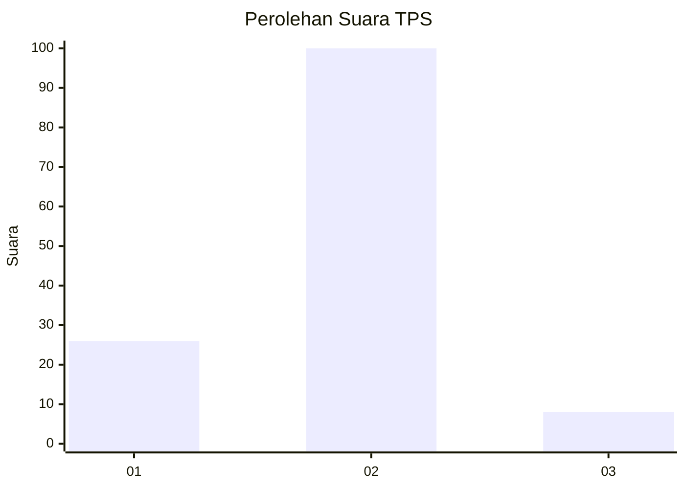
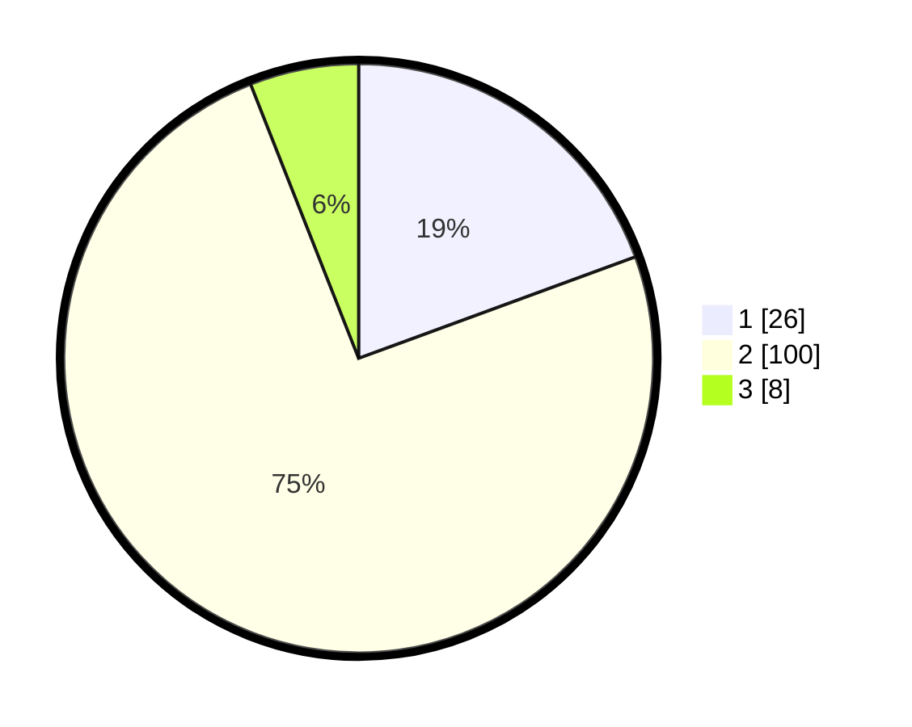

# Hasil

## Grafik

## Tabel

| No. | Nama Paslon    | Suara | Suara (raw) | Persentase |
|:--- |:-------------- | -----:| -----------:| ----------:|
| 1   | ANIES MUHAIMIN | 26    | [26][p-1]   | 19,40      |
| 2   | PRABOWO GIBRAN | 100   | [100][p-2]  | 74,63      |
| 3   | GANJAR MAHFUD  | 8     | [8][p-3]    | 5,97       |

[p-1]: https://github.com/gigit-pemilu/pemilu-2024-16-sumatera-selatan/blob/main/pilpres/hitung-suara/sub/16-sumatera-selatan/sub/11-empat-lawang/sub/09-saling/sub/2001-lubuk-kelumpang/sub/005-tps/sub/paslon-1.txt
[p-2]: https://github.com/gigit-pemilu/pemilu-2024-16-sumatera-selatan/blob/main/pilpres/hitung-suara/sub/16-sumatera-selatan/sub/11-empat-lawang/sub/09-saling/sub/2001-lubuk-kelumpang/sub/005-tps/sub/paslon-2.txt
[p-3]: https://github.com/gigit-pemilu/pemilu-2024-16-sumatera-selatan/blob/main/pilpres/hitung-suara/sub/16-sumatera-selatan/sub/11-empat-lawang/sub/09-saling/sub/2001-lubuk-kelumpang/sub/005-tps/sub/paslon-3.txt

## Foto C Plano

https://sirekap-obj-formc.kpu.go.id/a187/pemilu/ppwp/16/11/09/20/01/1611092001005-20240215-015709--968c5b5b-a2b2-4c5c-b68a-dd9f76c26a2f.jpg

https://sirekap-obj-formc.kpu.go.id/a187/pemilu/ppwp/16/11/09/20/01/1611092001005-20240215-020313--a9b3195f-69a8-4359-8caf-d16ff96dd363.jpg

https://sirekap-obj-formc.kpu.go.id/a187/pemilu/ppwp/16/11/09/20/01/1611092001005-20240215-010235--fadeb49d-af15-4e3c-88fb-8385203d8543.jpg

## Metadata

| Key        | Value               |
| ---------- | ------------------- |
| Time Stamp | 2024-02-16 21:01:00 |

## DATA PEMILIH TETAP

Jumlah pemilih dalam DPT: **247**.
 * L: **114**.
 * P: **133**.

## DATA PENGGUNA HAK PILIH

Jumlah pengguna hak pilih dalam DPT: **243**.
 * L: **112**.
 * P: **131**.

Jumlah pengguna hak pilih dalam DPTb: **0**.
 * L: **0**.
 * P: **0**.

Jumlah pengguna hak pilih dalam DPK: **0**.
 * L: **0**.
 * P: **0**.

Jumlah pengguna hak pilih: **243**.
 * L: **112**.
 * P: **131**.

## JUMLAH SUARA SAH DAN TIDAK SAH

JUMLAH SELURUH SUARA SAH: **151**.

JUMLAH SUARA TIDAK SAH: **92**.

JUMLAH SELURUH SUARA SAH DAN SUARA TIDAK SAH: **243**.

