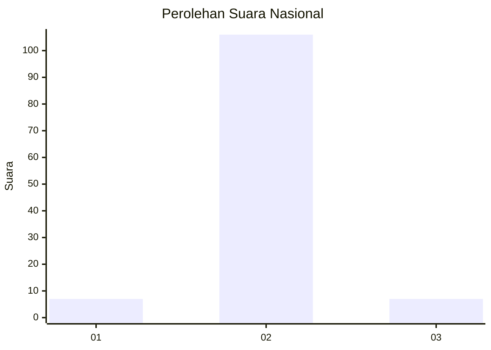
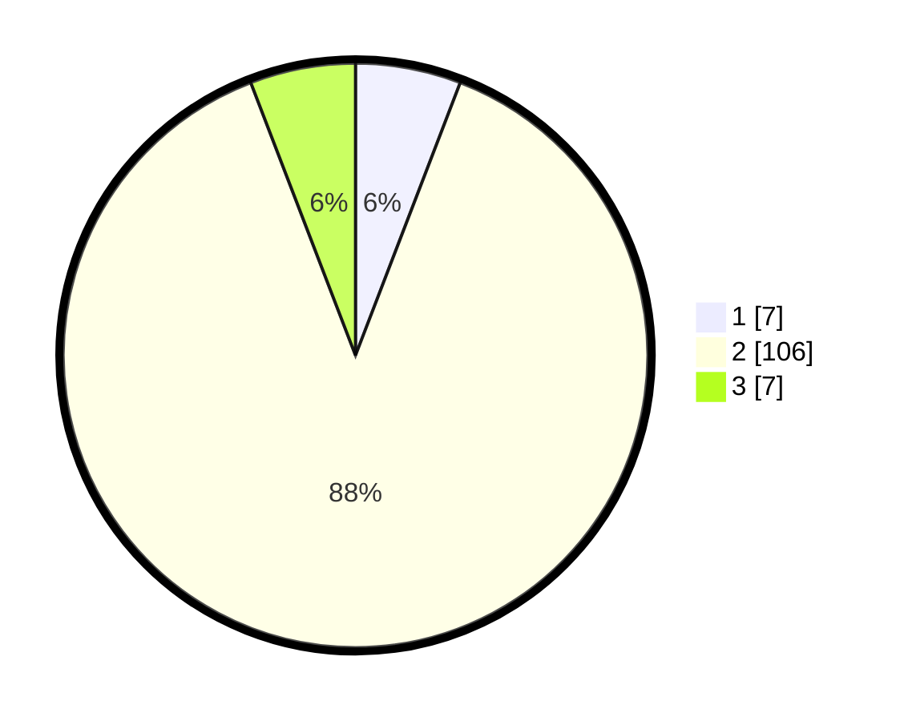

# Hasil

## Grafik

## Tabel

| No. | Nama Paslon    | Suara | Suara (raw) | Persentase |
|:--- |:-------------- | -----:| -----------:| ----------:|
| 1   | ANIES MUHAIMIN | 7     | [7][p-1]    | 5,83       |
| 2   | PRABOWO GIBRAN | 106   | [106][p-2]  | 88,33      |
| 3   | GANJAR MAHFUD  | 7     | [7][p-3]    | 5,83       |

[p-1]: https://github.com/gigit-pemilu/pemilu-2024/blob/main/pilpres/hitung-suara/sub/16-sumatera-selatan/sub/11-empat-lawang/sub/09-saling/sub/2006-sawah/sub/002-tps/sub/paslon-1.txt
[p-2]: https://github.com/gigit-pemilu/pemilu-2024/blob/main/pilpres/hitung-suara/sub/16-sumatera-selatan/sub/11-empat-lawang/sub/09-saling/sub/2006-sawah/sub/002-tps/sub/paslon-2.txt
[p-3]: https://github.com/gigit-pemilu/pemilu-2024/blob/main/pilpres/hitung-suara/sub/16-sumatera-selatan/sub/11-empat-lawang/sub/09-saling/sub/2006-sawah/sub/002-tps/sub/paslon-3.txt

## Foto C Plano

https://sirekap-obj-formc.kpu.go.id/00d8/pemilu/ppwp/16/11/09/20/06/1611092006002-20240214-193832--8c125188-1a55-45b0-897b-4619cde0f656.jpg

https://sirekap-obj-formc.kpu.go.id/00d8/pemilu/ppwp/16/11/09/20/06/1611092006002-20240214-193912--002411da-3ae2-49d7-b5eb-3eec69c579f6.jpg

https://sirekap-obj-formc.kpu.go.id/00d8/pemilu/ppwp/16/11/09/20/06/1611092006002-20240214-193957--d399657a-087e-437a-bcff-ffecad2d2f42.jpg

## Metadata

| Key        | Value               |
| ---------- | ------------------- |
| Time Stamp | 2024-02-16 21:01:00 |

