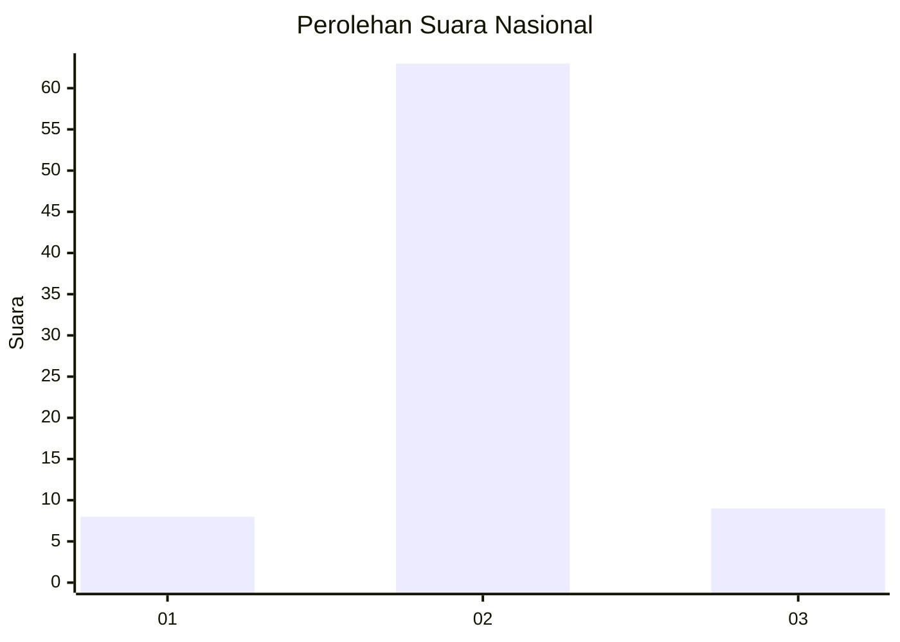
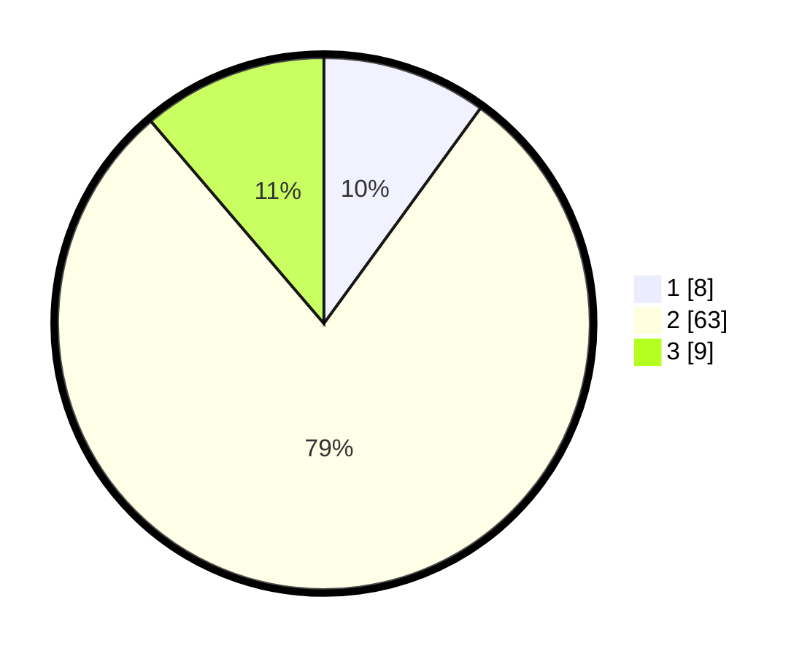

# Hasil

## Grafik

## Tabel

| No. | Nama Paslon    | Suara | Suara (raw) | Persentase |
|:--- |:-------------- | -----:| -----------:| ----------:|
| 1   | ANIES MUHAIMIN | 8     | [8][p-1]    | 10,00      |
| 2   | PRABOWO GIBRAN | 63    | [63][p-2]   | 78,75      |
| 3   | GANJAR MAHFUD  | 9     | [9][p-3]    | 11,25      |

[p-1]: https://github.com/gigit-pemilu/pemilu-2024/blob/main/pilpres/hitung-suara/sub/16-sumatera-selatan/sub/11-empat-lawang/sub/09-saling/sub/2006-sawah/sub/006-tps/sub/paslon-1.txt
[p-2]: https://github.com/gigit-pemilu/pemilu-2024/blob/main/pilpres/hitung-suara/sub/16-sumatera-selatan/sub/11-empat-lawang/sub/09-saling/sub/2006-sawah/sub/006-tps/sub/paslon-2.txt
[p-3]: https://github.com/gigit-pemilu/pemilu-2024/blob/main/pilpres/hitung-suara/sub/16-sumatera-selatan/sub/11-empat-lawang/sub/09-saling/sub/2006-sawah/sub/006-tps/sub/paslon-3.txt

## Foto C Plano

https://sirekap-obj-formc.kpu.go.id/49fa/pemilu/ppwp/16/11/09/20/06/1611092006006-20240214-141925--5eacd7ea-02e0-4dfb-a301-6a85f1f98a0f.jpg

https://sirekap-obj-formc.kpu.go.id/49fa/pemilu/ppwp/16/11/09/20/06/1611092006006-20240214-195904--a41a2419-fbfd-45ab-8ae1-87c532ce95bd.jpg

https://sirekap-obj-formc.kpu.go.id/49fa/pemilu/ppwp/16/11/09/20/06/1611092006006-20240214-195926--577cc0c4-abd7-4c00-99d3-09e313953158.jpg

## Metadata

| Key        | Value               |
| ---------- | ------------------- |
| Time Stamp | 2024-02-14 21:46:01 |

## DATA PEMILIH TETAP

Jumlah pemilih dalam DPT: **245**.
 * L: **115**.
 * P: **130**.

## DATA PENGGUNA HAK PILIH

Jumlah pengguna hak pilih dalam DPT: **167**.
 * L: **69**.
 * P: **98**.

Jumlah pengguna hak pilih dalam DPTb: **0**.
 * L: **0**.
 * P: **0**.

Jumlah pengguna hak pilih dalam DPK: **0**.
 * L: **0**.
 * P: **0**.

Jumlah pengguna hak pilih: **167**.
 * L: **69**.
 * P: **98**.

## JUMLAH SUARA SAH DAN TIDAK SAH

JUMLAH SELURUH SUARA SAH: **80**.

JUMLAH SUARA TIDAK SAH: **87**.

JUMLAH SELURUH SUARA SAH DAN SUARA TIDAK SAH: **167**.

