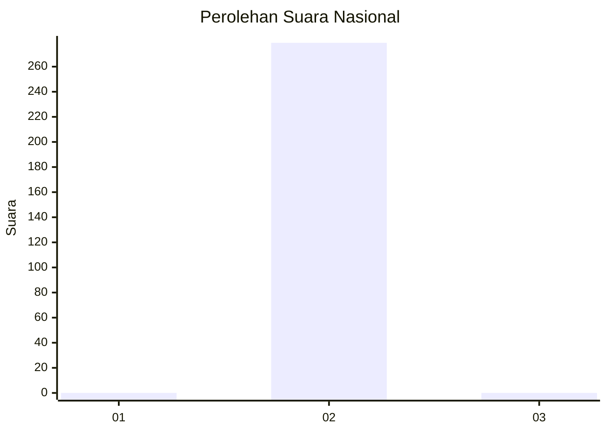
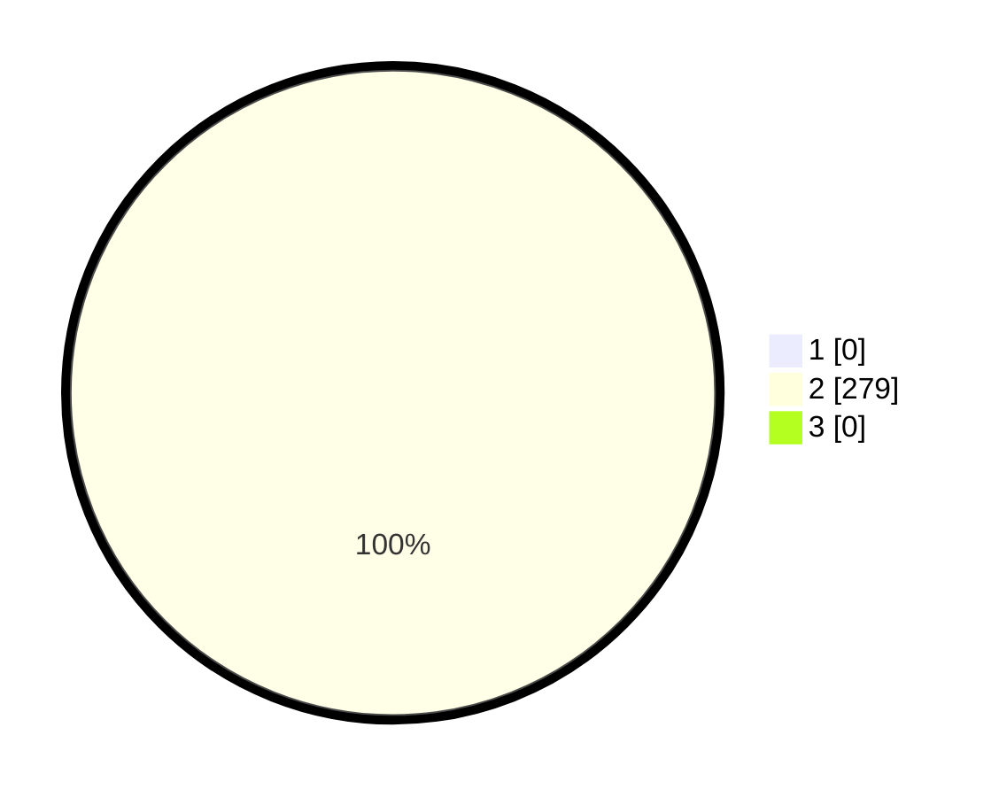

# Hasil

## Grafik

## Tabel

| No. | Nama Paslon    | Suara | Suara (raw) | Persentase |
|:--- |:-------------- | -----:| -----------:| ----------:|
| 1   | ANIES MUHAIMIN | 0     | [0][p-1]    | 0,00       |
| 2   | PRABOWO GIBRAN | 279   | [279][p-2]  | 100,00     |
| 3   | GANJAR MAHFUD  | 0     | [0][p-3]    | 0,00       |

[p-1]: https://github.com/gigit-pemilu/pemilu-2024/blob/main/pilpres/hitung-suara/sub/16-sumatera-selatan/sub/11-empat-lawang/sub/09-saling/sub/2008-suka-kaya/sub/006-tps/sub/paslon-1.txt
[p-2]: https://github.com/gigit-pemilu/pemilu-2024/blob/main/pilpres/hitung-suara/sub/16-sumatera-selatan/sub/11-empat-lawang/sub/09-saling/sub/2008-suka-kaya/sub/006-tps/sub/paslon-2.txt
[p-3]: https://github.com/gigit-pemilu/pemilu-2024/blob/main/pilpres/hitung-suara/sub/16-sumatera-selatan/sub/11-empat-lawang/sub/09-saling/sub/2008-suka-kaya/sub/006-tps/sub/paslon-3.txt

## Foto C Plano

https://sirekap-obj-formc.kpu.go.id/9173/pemilu/ppwp/16/11/09/20/08/1611092008006-20240214-194035--dbde7a9b-dbe9-4404-95cf-f0dfe68359b8.jpg

https://sirekap-obj-formc.kpu.go.id/9173/pemilu/ppwp/16/11/09/20/08/1611092008006-20240214-194051--391f0afe-c8de-4cc8-b875-70680b4c9e69.jpg

https://sirekap-obj-formc.kpu.go.id/9173/pemilu/ppwp/16/11/09/20/08/1611092008006-20240215-030243--bc33c4f7-7309-4a6d-9cb9-c85608b9f3bf.jpg

## Metadata

| Key        | Value               |
| ---------- | ------------------- |
| Time Stamp | 2024-02-21 12:00:00 |

