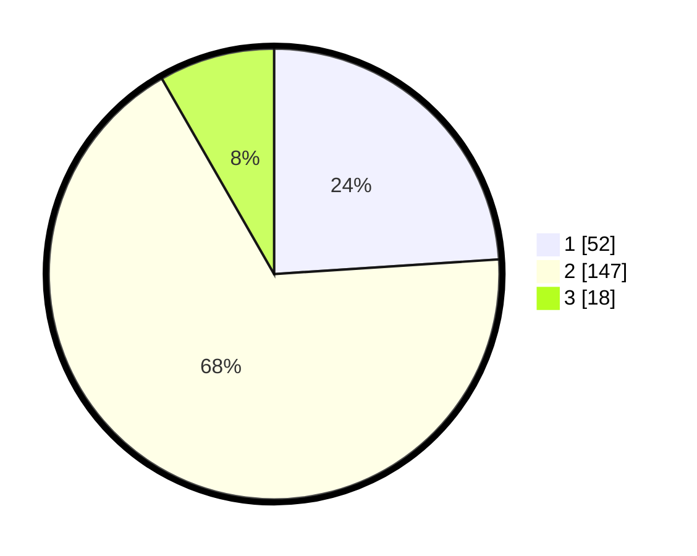

# Hasil

## Grafik

## Tabel

| No. | Nama Paslon    | Suara | Suara (raw) | Persentase |
|:--- |:-------------- | -----:| -----------:| ----------:|
| 1   | ANIES MUHAIMIN | 52    | [52][p-1]   | 23,96      |
| 2   | PRABOWO GIBRAN | 147   | [147][p-2]  | 67,74      |
| 3   | GANJAR MAHFUD  | 18    | [18][p-3]   | 8,29       |

[p-1]: https://github.com/gigit-pemilu/pemilu-2024-16-sumatera-selatan/blob/main/pilpres/hitung-suara/sub/16-sumatera-selatan/sub/11-empat-lawang/sub/10-pendopo-barat/sub/2001-muaralintang-lama/sub/001-tps/sub/paslon-1.txt
[p-2]: https://github.com/gigit-pemilu/pemilu-2024-16-sumatera-selatan/blob/main/pilpres/hitung-suara/sub/16-sumatera-selatan/sub/11-empat-lawang/sub/10-pendopo-barat/sub/2001-muaralintang-lama/sub/001-tps/sub/paslon-2.txt
[p-3]: https://github.com/gigit-pemilu/pemilu-2024-16-sumatera-selatan/blob/main/pilpres/hitung-suara/sub/16-sumatera-selatan/sub/11-empat-lawang/sub/10-pendopo-barat/sub/2001-muaralintang-lama/sub/001-tps/sub/paslon-3.txt

## Foto C Plano

https://sirekap-obj-formc.kpu.go.id/4d10/pemilu/ppwp/16/11/10/20/01/1611102001001-20240220-144919--36b985f0-422a-4e2c-a553-7cf1ae67848d.jpg

https://sirekap-obj-formc.kpu.go.id/4d10/pemilu/ppwp/16/11/10/20/01/1611102001001-20240220-145035--553ca4b7-55b3-4301-ad18-d11d59b82924.jpg

https://sirekap-obj-formc.kpu.go.id/4d10/pemilu/ppwp/16/11/10/20/01/1611102001001-20240220-145318--218d2268-b5f7-4e04-8c33-cbed31ab22fc.jpg

## Metadata

| Key        | Value               |
| ---------- | ------------------- |
| Time Stamp | 2024-02-21 12:00:00 |

